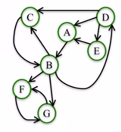

# 01. Degree and Closeness Centrality

Node Importance

Different ways of thinking about "importance".

- Degree: number of friends
- Average proximity to other nodes.
- Fraction of shortest paths that pass through node.

## Network Centrality

Centrality measures identify the most important nodes in a network.

### Centrality Measures

- Degree centrality
- Closeness centrality
- Betweenness centrality
- Load centrality
- Page Rank
- Katz centrality
- Percolation centrality

## Degree Centrality

**Assumption**: important nodes have many connections.

The most basic measure of centrality: number of neighbors.

### Undirected Networks

$$
\begin{aligned}
& C_{deg}(v)=\frac{d_v}{|N|-1} \\
& N = \text{the set of nodes in the network} \\
& d_v = \text{the degree of node}\ v
\end{aligned}
$$

, where N is the set of nodes in the network and dv is the degree of node v.

```pyhton
nx.degree_centrality(G)
```

### Directed Networks

$$
\begin{aligned}
& C_{indeg}(v)=\frac{d_v^{in}}{|N|-1} \\
& N = \text{the set of nodes in the network} \\
& d_v^{in} = \text{the in-degree of node}\ v
\end{aligned}
$$

```pyhton
nx.in_degree_centrality(G)
```

$$
\begin{aligned}
& C_{outdeg}(v)=\frac{d_v^{out}}{|N|-1} \\
& N = \text{the set of nodes in the network} \\
& d_v^{out} = \text{the out-degree of node}\ v
\end{aligned}
$$

```python
nx.out_degree_centrality(G)
```

## Closeness Centrality

**Assumption**: important nodes are close to other nodes.
$$
\begin{aligned}
& C_{close}(v)=\frac{|N|-1}{\sum_{u\in N\backslash\{v\}}d(v,u)} \\
& N = \text{the set of nodes in the network} \\
& d(v,u) = \text{length of shortest path from}\ v\ \text{to}\ u
\end{aligned}
$$

```python
nx.closeness_centrality(G)
```

### Disconnected Nodes

If a node can't reach all other nodes:

**Option 1**: Consider only nodes that L can reach
$$
\begin{aligned}
& C_{close}(L)=\frac{|R(L)|}{\sum_{u\in R(L)}d(L,u)} \\
& R(L) = \text{the set fo nodes L can reach}
\end{aligned}
$$
**Option 2**: Consider only nodes that L can reach and normalize by the fraction of nodes L can reach:
$$
\begin{aligned}
& C_{close}(L)= \left[\frac{|R(L)|}{|N-1|}\right]\frac{|R(L)|}{\sum_{u\in R(L)}d(L,u)} \\
\end{aligned}
$$

```python
nx.closeness_centrality(G, normalized=False)
nx.closeness_centrality(G, normalized=True)	# default: normalized=True
```

# 02. Betweenness Centrality

## Assumption

Important nodes connect other nodes.
$$
\begin{aligned}
& C_{btw}(v)=\sum\nolimits_{s,t\in N} \frac{\sigma_{s,t}(v)}{\sigma_{s,t}} \\
& \sigma_{s,t} = \text{the number of shortest paths between nodes s and t} \\
& \sigma_{s,t}(v) = \text{the number of shortest paths between nodes s and t that pass through node v}
\end{aligned}
$$

**Endpoints**: we can either include or exclude node v as node s and t in the computation of $C_{btw}$.

- include node v
- exclude node v

**Disconnected Nodes**: we only consider node s, t such that there is at least one path between them.

## Normalization

Betweenness centrality values will be larger in graphs with many nodes.

To control for this, we divide centrality values by the number of pairs of nodes in the graph (excluding v):

- in undirected graphs
  $$
  \frac{1}{2}(|N|-1)(|N|-2)
  $$

- in directed graphs

  Between two nodes, them can probably have two differently directed path.
  $$
  (|N|-1)(|N|-2)
  $$

```python
# default: normalized=True, endpoints=False
nx.betweenness_centrality(G, normalized=True, endpoints=False)
```

## Approximation

**Complexity**: Depending on the algorithm, this computation can take up to $O(|N|^3)$ time.

**Approximation**: rather than computing betweenness centrality based on all pairs of nodes s, t, we can approximate it based on a sample of nodes.

```python
nx.betweenness_centrality(G, normalized=True, endpoints=False, k=10)
```

## Subsets

To find out what are the most important nodes in this network between a group of source nodes and a group of target nodes.

```python
nx.betweenness_centrality_subset(G, [34, 33, 21], [1, 4, 13, 11])
```

## Edge Betweenness Centrality

To find important edges instead of nodes:
$$
\begin{aligned}
& C_{btw}(e)=\sum\nolimits_{s,t\in N} \frac{\sigma_{s,t}(e)}{\sigma_{s,t}} \\
& \sigma_{s,t} = \text{the number of shortest paths between nodes s and t} \\
& \sigma_{s,t}(e) = \text{the number of shortest paths between nodes s and t that pass through edge e}
\end{aligned}
$$


```python
nx.edge_betweenness_centrality(G, normalized=True)
nx.edge_betweenness_centrality_subset(G, [34, 33, 21], [1, 4, 13, 11], normalized=True)
```

# 03. Basic Page Rank

Developed by Google founders to measure the importance of webpages from the hyperlink network structure.

PageRank assigns a score of importance to each node. Important nodes are those with many in-link from important pages.

PageRank is mainly useful for directed networks.

## Steps of Basic PageRank

n = number of nodes in the network

k = number of steps

1. All nodes start with PageRank of 1/n.
2. Perform the **Basic PageRank Update Rule** k times.

## Basic PageRank Update Rule

Each node gives an equal share of its current PageRank to all the nodes it links to.

The new PageRank of each node is the sum of all the PageRank it received from other nodes.

**For most networks PageRank Values converge as k get larger (k -> ∞)**

# 04. Scaled Page Rank

## Interpreting PageRank

The PageRank of a node at step k is the probability that a random walker lands on the node after taking k steps.

**Random walk of k steps**:

- Start on a random node.
- Then choose an outgoing edge at random and follow it to the next node. Repeat k times.

## PageRank Problem

In some networks, a few nodes can "stuck up" all the PageRank from the network.



**Random walk of k steps with damping parameter α**:

- Start on a random node.

- Then:

  - With probability α: choose an outgoing edge at random and follow it to the next node.
  - With probability 1 - α: choose a node at random and go to it.

  Repeat k times.

## Scaled PageRank

The Scaled PageRank of k steps and damping factor α of a node n is the probability that a random walk with damping factor  α lands on a n after k steps.

For most networks, as k gets larger, Scaled PageRank converges to a unique value, which depends on α.

Typically we use α between 0.8 and 0.9.

Damping factor works better in very large networks like the web or large social networks.

```python
nx.pagerank(G, alpha=0.8)
```
