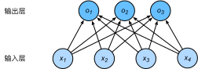

# 3. 深度学习基础

> [3.1 线性回归 - Dive-into-DL-PyTorch (tangshusen.me)](https://tangshusen.me/Dive-into-DL-PyTorch/#/chapter03_DL-basics/3.1_linear-regression)

## 3.1 线性回归

### 3.1.1 线性回归的基本要素

#### 3.1.1.1 模型定义

模型（model）

模型的参数（parameter）

- 权重（weight）

- 偏差（bias）
- etc

#### 3.1.1.2 训练模型

##### (1) 训练数据

训练数据集（training data set）或训练集（training set）

样本（sample）

标签（label）

特征（feature）

##### (2) 损失函数

损失函数（loss function）

- 平方损失（square loss）。常数1/2使求导后的常数系数为1。
  $$
  \ell^{(i)}(w_1,w_2,b) = \frac{1}{2}(\hat{y}^{(i)}-y^{(i)})^2
  $$

在模型训练中，我们希望找出一组模型参数，来使训练样本平均损失最小。

##### (3) 优化算法

解析解（analytical solution）

数值解（numerical solution）

大多数深度学习模型并没有解析解，只能通过优化算法有限次迭代模型参数来尽可能降低损失函数的值。

小批量随机梯度下降（mini-batch stochastic gradient descent）：

- 先选取一组模型参数的初始值，如随机选取；接下来对参数进行多次迭代，使每次迭代都可能降低损失函数的值。在每次迭代中，先随机均匀采样一个由固定数目训练数据样本所组成的小批量（mini-batch）$\mathcal{B}$，然后求小批量中数据样本的平均损失有关模型参数的导数（梯度），最后用此结果与预先设定的一个正数的乘积作为模型参数在本次迭代的减小量。

超参数（hyperparameter）：

- 批量大小（batch size）$\vert\mathcal{B}\vert$
- 学习率（learning rate）$\eta$

- etc

我们通常所说的“调参”指的正是调节超参数，例如通过反复试错来找到超参数合适的值。在少数情况下，超参数也可以通过模型训练学出。

#### 3.1.1.3 模型预测

模型训练完成后，得到模型参数在优化算法停止时的值，用学出的模型来估算训练数据集以外结果，这里的估算也叫作模型预测、模型推断或模型测试。

### 3.1.2 线性回归的表示方法

#### 3.1.2.1 神经网络图

在深度学习中，我们可以使用神经网络图直观地表现模型结构。图3.1使用神经网络图表示本节中介绍的线性回归模型。神经网络图隐去了模型参数权重和偏差。


在图3.1所示的神经网络中，输入层的输入个数为2。输入个数也叫**特征数**或**特征向量维度**。

由于输入层并不涉及计算，按照惯例，图3.1所示的神经网络的层数为1。

输出层中负责计算*o*的单元又叫神经元。

在线性回归中，*o* 的计算依赖于 x1 和 x2 。也就是说，输出层中的神经元和输入层中各个输入完全连接。因此，这里的输出层又叫**全连接层（fully-connected layer）**或**稠密层（dense layer）**。

#### 3.1.2.2 矢量计算表达式

当样本数为 n，特征数为 d 时，线性回归的矢量计算表达式为
$$
\boldsymbol{\hat{y}}=\boldsymbol{X}\boldsymbol{\omega}+b
$$
其中模型输出 $\boldsymbol{\hat{y}}\in\R^{n\times1}$，批量数据样本特征 $\boldsymbol{X}\in\R^{n\times d}$，权重 $\boldsymbol\omega\in\R^{d\times1}$，偏差$b\in\R$。相应地，批量数据样本标签 $\boldsymbol{y}\in\R^{n\times1}$。

设模型参数 $\theta$，我们可以重写损失函数为
$$
\ell(\boldsymbol{\theta})=\frac{1}{2n}(\hat{\boldsymbol{y}}-\boldsymbol{y})^\text{T}(\hat{\boldsymbol{y}}-\boldsymbol{y})
$$
小批量随机梯度下降的迭代步骤将相应地改写为
$$
\boldsymbol{\theta} \gets \boldsymbol{\theta}-\frac{\eta}{\vert\mathcal{B}\vert}\Sigma_{i\in\mathcal{B}}\nabla_\boldsymbol{\theta}\ell^{(i)}(\boldsymbol{\theta})
$$

## 3.2  线性回归从零开始实现

3.2.1 生成数据集

`features`

`labels`

3.2.2 读取数据

`batch_size`

3.2.3 初始化模型参数

参数的`requires_grad=True`

3.2.4 定义模型

用`torch.mm`函数做矩阵乘法

3.2.5 定义损失函数

3.2.6 定义优化算法

自动求梯度模块计算得来的梯度是一个批量样本的梯度和。我们将它除以批量大小来得到平均值。

3.2.7 训练模型

```python
lr = 0.03
num_epochs = 3
net = linreg
loss = squared_loss

for epoch in range(num_epochs):  # 训练模型一共需要num_epochs个迭代周期
    # 在每一个迭代周期中，会使用训练数据集中所有样本一次（假设样本数能够被批量大小整除）。X
    # 和y分别是小批量样本的特征和标签
    for X, y in data_iter(batch_size, features, labels):
        l = loss(net(X, w, b), y).sum()  # l是有关小批量X和y的损失
        l.backward()  # 小批量的损失对模型参数求梯度
        sgd([w, b], lr, batch_size)  # 使用小批量随机梯度下降迭代模型参数

        # 不要忘了梯度清零
        w.grad.data.zero_()
        b.grad.data.zero_()
    train_l = loss(net(features, w, b), labels)
    print('epoch %d, loss %f' % (epoch + 1, train_l.mean().item()))
```

## 3.3 线性回归的简洁实现

### 3.3.1 生成数据集

`features`

`labels`

### 3.3.2 读取数据

Pytorch提供了`torch.utils.data`包用来读取数据

```python
import torch.utils.data as Data

batch_size = 10
# 将训练数据的特征和标签组合
dataset = Data.TensorDataset(features, labels)
# 随机读取小批量
data_iter = Data.DataLoader(dataset, batch_size, shuffle=True)
```

### 3.3.3 定义模型

`torch.nn`模块定义了大量神经网络的层。

继承`nn.Module`，撰写自己的网络/层。一个`nn.Module`实例应该包含一些层以及返回输出的前向传播（forward）方法。

```python
class LinearNet(nn.Module):
    def __init__(self, n_feature):
        super(LinearNet, self).__init__()
        self.linear = nn.Linear(n_feature, 1)
    # forward 定义前向传播
    def forward(self, x):
        y = self.linear(x)
        return y
```

`nn.Sequential`将网络按照传入顺序依次添加到计算图中。

```python
# 写法一
net = nn.Sequential(
    nn.Linear(num_inputs, 1)
    # 此处还可以传入其他层
    )

# 写法二
net = nn.Sequential()
net.add_module('linear', nn.Linear(num_inputs, 1))
# net.add_module ......

# 写法三
from collections import OrderedDict
net = nn.Sequential(OrderedDict([
          ('linear', nn.Linear(num_inputs, 1))
          # ......
        ]))

print(net)
print(net[0])
```

可以通过`net.parameters()`来查看模型所有的可学习参数，此函数将返回一个生成器。

### 3.3.4 初始化参数模型

PyTorch在`torch.nn.init`模块中提供了多种参数初始化方法。

```python
from torch.nn import init

init.normal_(net[0].weight, mean=0, std=0.01)
init.constant_(net[0].bias, val=0)  # 也可以直接修改bias的data: net[0].bias.data.fill_(0)
```

### 3.3.5 定义损失函数

PyTorch在`torch.nn`模块中提供了各种损失函数，这些损失函数可看作是一种特殊的层，PyTorch也将这些损失函数实现为`nn.Module`的子类。

如均方误差损失`loss = nn.MSELoss()`

### 3.3.6 定义优化算法

`torch.optim`模块提供了很多常用的优化算法比如SGD、Adam和RMSProp等。

```python
import torch.optim as optim

optimizer = optim.SGD(net.parameters(), lr=0.03)

# 还可以为不同子网络设置不同的学习率，这在finetune时经常用到
optimizer =optim.SGD([
                # 如果对某个参数不指定学习率，就使用最外层的默认学习率
                {'params': net.subnet1.parameters()}, # lr=0.03
                {'params': net.subnet2.parameters(), 'lr': 0.01}
            ], lr=0.03)
```

动态调整学习率，主要有两种做法：

- 修改`optimizer.param_groups`中对应的学习率。

  ```python
  # 调整学习率
  for param_group in optimizer.param_groups:
      param_group['lr'] *= 0.1 # 学习率为之前的0.1倍
  ```

- 新建优化器，由于optimizer十分轻量级，构建开销很小，故而可以构建新的optimizer。但是对于使用动量的优化器（如Adam），会丢失动量等状态信息。

### 3.3.7 训练模型

调用`optim`实例的`step`函数来迭代模型参数。

按照小批量随机梯度下降的定义，我们在`step`函数中指明批量大小，从而对批量中样本梯度求平均。

```python
num_epochs = 3
for epoch in range(1, num_epochs + 1):
    for X, y in data_iter:
        output = net(X)
        l = loss(output, y.view(-1, 1))
        optimizer.zero_grad() # 梯度清零，等价于net.zero_grad()
        l.backward()
        optimizer.step()
    print('epoch %d, loss: %f' % (epoch, l.item()))
```

## 3.4 softmax 回归

对于离散值预测问题，我们可以使用诸如softmax回归在内的分类模型。和线性回归不同，softmax回归的输出单元从一个变成了多个，且引入了softmax运算使输出更适合离散值的预测和训练。

### 3.4.1 分类问题

虽然我们仍然可以使用回归模型来进行建模，并将预测值就近定点化到某个离散值，但这种连续值到离散值的转化通常会影响到分类质量。因此我们一般使用更加适合离散值输出的模型来解决分类问题。

### 3.4.2 softmax回归模型

softmax回归跟线性回归一样将输入特征与权重做线性叠加。与线性回归的一个主要不同在于，softmax回归的输出值个数等于标签里的类别数。



既然分类问题需要得到离散的预测输出，一个简单的办法是将输出值 $o_i$ 当作预测类别是*i*的置信度，并将值最大的输出所对应的类作为预测输出，即输出 $\underset{i}{\arg\max}\ o_i$。

然而，直接使用输出层的输出有两个问题。

- 一方面，由于输出层的输出值的范围不确定，我们难以直观上判断这些值的意义。例如，输出值10表示“很置信”图像类别为猫，因为该输出值是其他两类的输出值的100倍。但如果$o_1=o_3=10^3$，那么输出值10却又表示图像类别为猫的概率很低。
- 另一方面，由于真实标签是离散值，这些离散值与不确定范围的输出值之间的误差难以衡量。

**softmax运算符（softmax operator）**解决了以上两个问题。它通过下式将输出值变换成值为正且和为1的概率分布：
$$
\hat{y}_1,\hat{y}_2,\hat{y}_3=\text{softmax}(o_1,o_2,o_3)
$$
其中
$$
\hat{y}_1 = \frac{\exp(o_1)}{\Sigma^3_{i=1}\exp(o_i)},\ \hat{y}_2 = \frac{\exp(o_2)}{\Sigma^3_{i=1}\exp(o_i)},\ \hat{y}_3 = \frac{\exp(o_3)}{\Sigma^3_{i=1}\exp(o_i)}
$$
softmax运算不改变预测类别输出：
$$
\underset{i}{\arg\max}\ o_i = \underset{i}{\arg\max}\ \hat{y}_i
$$

### 3.4.3 单样本分类的矢量计算表达式

$$
\begin{aligned}
\boldsymbol{o}^{(i)} &=\boldsymbol{x}^{(i)}\boldsymbol{W}+\boldsymbol{b} \\
\hat{\boldsymbol{y}}^{(i)} &= \text{softmax}(\boldsymbol{o}^{(i)})
\end{aligned}
$$

### 3.4.4 小批量样本分类的矢量计算表达式

$$
\begin{aligned}
\boldsymbol{O} &=\boldsymbol{X}\boldsymbol{W}+\boldsymbol{b} \\
\hat{\boldsymbol{Y}} &= \text{softmax}(\boldsymbol{O})
\end{aligned}
$$

### 3.4.5 交叉熵损失

我们的训练目标可以设为使预测概率分布尽可能接近真实的标签概率分布。

想要预测分类结果正确，我们其实并不需要预测概率完全等于标签概率。而平方损失则过于严格。

改善上述问题的一个方法是使用更适合衡量两个概率分布差异的测量函数。其中，交叉熵（cross entropy）是一个常用的衡量方法：
$$
H(\boldsymbol{y}^{(i)}, \hat{\boldsymbol{y}}^{(i)})=-\sum^q_{j=1}y_j^{(i)}\log\hat{y}_j^{(i)}
$$
交叉熵只关心对正确类别的预测概率，因为只要其值足够大，就可以确保分类结果正确。

假设训练数据集的样本数为*n*，交叉熵损失函数定义为
$$
\ell(\Theta)=\frac{1}{n}\sum^n_{i=1}H(\boldsymbol{y}^{(i)}, \hat{\boldsymbol{y}}^{(i)})
$$

### 3.4.6 模型预测及评价

通常，我们把预测概率最大的类别作为输出类别。如果它与真实类别（标签）一致，说明这次预测是正确的。

**准确率（accuracy）**：正确预测数量与总预测数量只比。

## 3.5 图像分类数据集（Fashion-MMIST）

3.5.1 获取数据集

通过torchvision的`torchvision.datasets`来下载这个数据集。我们通过参数`train`来指定获取训练数据集或测试数据集（testing data set）。测试数据集也叫测试集（testing set）。

指定参数`transform = transforms.ToTensor()`使所有数据转换为`Tensor`，如果不进行转换则返回的是PIL图片。

3.5.2 读取小批量

将其传入`torch.utils.data.DataLoader`来创建一个读取小批量数据样本的DataLoader实例。

在实践中，数据读取经常是训练的性能瓶颈。PyTorch的`DataLoader`允许使用多进程来加速数据读取。这里我们通过参数`num_workers`来设置进程数量。

## 3.6 softmax回归的从零开始实现

3.6.1 获取和读取数据

3.6.2 初始化模型参数

3.6.3 实现softmax运算

对多维`Tensor`按维度操作。在结果中保留维度（`keepdim=True`）。

```python
def softmax(X):
    X_exp = X.exp()
    partition = X_exp.sum(dim=1, keepdim=True)
    return X_exp / partition
```

3.6.4 定义模型

```python
def net(X):
    return softmax(torch.mm(X.view((-1, num_inputs)), W) + b)
```

3.6.5 定义损失函数

为了得到标签的预测概率，我们可以使用`gather`函数。

```python
def cross_entropy(y_hat, y):
    return - torch.log(y_hat.gather(1, y.view(-1, 1)))
```

3.6.6 计算分类准确率

```python
def accuracy(y_hat, y):
    return (y_hat.argmax(dim=1) == y).float().mean().item()
```

3.6.7 训练模型

3.6.8 预测

## 3.7 softmax回归的简洁实现

3.7.1 获取和读取数据

```python
batch_size = 256
train_iter, test_iter = d2l.load_data_fashion_mnist(batch_size)
```

3.7.2 定义和初始化模型

softmax回归的输出层是一个全连接层，所以我们用一个线性模块就可以了。因为前面我们数据返回的每个batch样本`x`的形状为(batch_size, 1, 28, 28), 所以我们要先用`view()`将`x`的形状转换成(batch_size, 784)才送入全连接层。

```python
num_inputs = 784
num_outputs = 10

class LinearNet(nn.Module):
    def __init__(self, num_inputs, num_outputs):
        super(LinearNet, self).__init__()
        self.linear = nn.Linear(num_inputs, num_outputs)
    def forward(self, x): # x shape: (batch, 1, 28, 28)
        y = self.linear(x.view(x.shape[0], -1))
        return y

net = LinearNet(num_inputs, num_outputs)
```

我们将对`x`的形状转换的这个功能自定义一个`FlattenLayer`。

```python
# 本函数已保存在d2lzh_pytorch包中方便以后使用
class FlattenLayer(nn.Module):
    def __init__(self):
        super(FlattenLayer, self).__init__()
    def forward(self, x): # x shape: (batch, *, *, ...)
        return x.view(x.shape[0], -1)
```

这样我们就可以更方便地定义我们的模型：

```python
from collections import OrderedDict

net = nn.Sequential(
    # FlattenLayer(),
    # nn.Linear(num_inputs, num_outputs)
    OrderedDict([
        ('flatten', FlattenLayer()),
        ('linear', nn.Linear(num_inputs, num_outputs))
    ])
)
```

3.7.3 softmax和交叉熵损失函数

分开定义softmax运算和交叉熵损失函数可能会造成数值不稳定。因此，PyTorch提供了一个包括softmax运算和交叉熵损失计算的函数。它的数值稳定性更好。

```python
loss = nn.CrossEntropyLoss()
```

3.7.4 定义优化算法

```python
optimizer = torch.optim.SGD(net.parameters(), lr=0.1)
```

3.7.5 训练模型

## 3.8 多层感知机

深度学习主要关注多层模型。本节将以多层感知机（multilayer perceptron，MLP）为例，介绍多层神经网络的概念。

### 3.8.1 隐藏层

多层感知机在单层神经网络的基础上引入了一到多个隐藏层（hidden layer）。隐藏层位于输入层和输出层之间。


由于输入层不涉及计算，图中的多层感知机的层数为2。隐藏层中的神经元和输入层中各个输入完全连接，输出层中的神经元和隐藏层中的各个神经元也完全连接。因此，多层感知机中的隐藏层和输出层都是全连接层。

具体来说，给定一个小批量样本 $\boldsymbol{X}\in\R^{n\times d}$，其批量大小为 $n$，输入个数为 $d$。假设多层感知机只有一个隐藏层，其中隐藏单元个数为 $h$。记隐藏层的输出（也称为隐藏层变量或隐藏变量）为 $\boldsymbol{H}$，有 $\boldsymbol{H}\in\R^{n\times h}$。因为隐藏层和输出层均是全连接层，可以设隐藏层的权重参数和偏差参数分别为 $\boldsymbol{W}_h\in\R^{d\times h}$ 和 $\boldsymbol{b}_h \in \R^{1\times h}$，输出层的权重和偏差参数分别为 $\boldsymbol{W}_o\in\R^{h\times d}$ 和 $\boldsymbol{b}_o\in\R^{1\times d}$ 。

### 3.8.2 激活函数

如果将隐藏层的输出直接作为输出层的输入，依然等价于一个单层神经网络。

上述问题的根源在于全连接层只是对数据做仿射变换（affine transformation），而多个仿射变换的叠加仍然是一个仿射变换。解决问题的一个方法是引入非线性变换，例如对隐藏变量使用按元素运算的非线性函数进行变换，然后再作为下一个全连接层的输入。这个非线性函数被称为激活函数（activation function）。下面我们介绍几个常用的激活函数。

#### 3.8.2.1 ReLU函数

ReLU（rectified linear unit）函数提供了一个很简单的非线性变换，只保留正数元素，并将负数元素清零：
$$
\text{ReLU}(x) = \max(x, 0)
$$


当输入为负数时，ReLU函数的导数为0；当输入为正数时，ReLU函数的导数为1。尽管输入为0时ReLU函数不可导，但是我们可以取此处的导数为0。


#### 3.8.2.2 sigmoid函数

sigmoid函数可以将元素的值变换到0和1之间：
$$
\text{sigmoid}(x)=\frac{1}{1+\exp(-x)}
$$
sigmoid函数在早期的神经网络中较为普遍，但它目前逐渐被更简单的ReLU函数取代。在后面“循环神经网络”一章中我们会介绍如何利用它值域在0到1之间这一特性来控制信息在神经网络中的流动。


当输入为0时，sigmoid函数的导数达到最大值0.25；当输入越偏离0时，sigmoid函数的导数越接近0。
$$
\text{sigmoid}'(x)=\text{sigmoid}(x)(1-\text{sigmoid}(x))
$$


#### 3.8.2.3 tanh函数

tanh（双曲正切）函数可以将元素的值变换到-1和1之间：
$$
\text{tanh}(x) = \frac{1-\exp(-2x)}{1+\exp(-2x)}
$$
虽然该函数的形状和sigmoid函数的形状很像，但tanh函数在坐标系的原点上对称。


当输入为0时，tanh函数的导数达到最大值1；当输入越偏离0时，tanh函数的导数越接近0。
$$
\text{tanh}'(x)=1-\text{tanh}^2(x)
$$


### 3.8.3 多层感知机

 多层感知机就是含有至少一个隐藏层的由全连接层组成的神经网络，且每个隐藏层的输出通过激活函数进行变换。多层感知机的层数和各隐藏层中隐藏单元个数都是超参数。以单隐藏层为例并沿用本节之前定义的符号，多层感知机按以下方式计算输出：
$$
\begin{aligned}
\boldsymbol{H} &= \phi(\boldsymbol{X}\boldsymbol{W}_h + \boldsymbol{b}_h) \\
\boldsymbol{O} &= \boldsymbol{H}\boldsymbol{W}_o + \boldsymbol{b}_o
\end{aligned}
$$
其中 $\phi$ 表示激活函数。

在分类问题中，我们可以对输出 $\boldsymbol{O}$ 做softmax运算，并使用softmax回归中的交叉熵损失函数。 在回归问题中，我们将输出层的输出个数设为1，并将输出 $\boldsymbol{O}$ 直接提供给线性回归中使用的平方损失函数。

## 3.9 多层感知机的从零开始实现

3.9.1 获取和读取数据

3.9.2 定义模型参数

3.9.3 定义激活函数

```python
def relu(X):
    return torch.max(input=X, other=torch.tensor(0.0))
```

3.9.4 定义模型

```python
def net(X):
    X = X.view((-1, num_inputs))
    H = relu(torch.matmul(X, W1) + b1)
    return torch.matmul(H, W2) + b2
```

3.9.5 定义损失函数

为了得到更好的数值稳定性，我们直接使用PyTorch提供的包括softmax运算和交叉熵损失计算的函数。

```python
loss = torch.nn.CrossEntropyLoss()
```

3.9.6 训练模型

## 3.10 多层感知机的简洁实现

### 3.10.1 定义模型

和softmax回归唯一的不同在于，我们多加了一个全连接层作为隐藏层。它的隐藏单元个数为256，并使用ReLU函数作为激活函数。

```python
num_inputs, num_outputs, num_hiddens = 784, 10, 256

net = nn.Sequential(
        d2l.FlattenLayer(),
        nn.Linear(num_inputs, num_hiddens),
        nn.ReLU(),
        nn.Linear(num_hiddens, num_outputs),
        )

for params in net.parameters():
    init.normal_(params, mean=0, std=0.01)
```

### 3.10.2 读取数据并训练模型

```python
batch_size = 256
train_iter, test_iter = d2l.load_data_fashion_mnist(batch_size)
loss = torch.nn.CrossEntropyLoss()

optimizer = torch.optim.SGD(net.parameters(), lr=0.5)

num_epochs = 5
d2l.train_ch3(net, train_iter, test_iter, loss, num_epochs, batch_size, None, None, optimizer)
```

## 3.11 模型选择、欠拟合和过拟合

### 3.11.1 训练误差和泛化误差

训练误差（training error）

泛化误差（generalization error）

由于无法从训练误差估计泛化误差，一味地降低训练误差并不意味着泛化误差一定会降低。机器学习模型应关注降低泛化误差。

### 3.11.2 模型选择

在机器学习中，通常需要评估若干候选模型的表现并从中选择模型。这一过程称为模型选择（model selection）。可供选择的候选模型可以是有着不同超参数的同类模型。

为了得到有效的模型，我们通常要在模型选择上下一番功夫。下面，我们来描述模型选择中经常使用的验证数据集（validation data set）。

3.11.2.1 验证数据集

我们可以预留一部分在训练数据集和测试数据集以外的数据来进行模型选择。这部分数据被称为验证数据集，简称验证集（validation set）。

3.11.2.2 K折交叉验证

由于验证数据集不参与模型训练，当训练数据不够用时，预留大量的验证数据显得太奢侈。一种改善的方法是 K 折交叉验证（K-fold cross-validation）。在 K 折交叉验证中，我们把原始训练数据集分割成 K 个不重合的子数据集，然后我们做K次模型训练和验证。每一次，我们使用一个子数据集验证模型，并使用其他 K−1 个子数据集来训练模型。在这 K 次训练和验证中，每次用来验证模型的子数据集都不同。最后，我们对这 K 次训练误差和验证误差分别求平均。

### 3.11.3 欠拟合和过拟合

模型训练中经常出现的两类典型问题：

- 一类是模型无法得到较低的训练误差，我们将这一现象称作欠拟合（underfitting）；
- 另一类是模型的训练误差远小于它在测试数据集上的误差，我们称该现象为过拟合（overfitting）。

虽然有很多因素可能导致这两种拟合问题，在这里我们重点讨论两个因素：模型复杂度和训练数据集大小。

> [统计学习理论之VC维究竟是什么 | TangShusen](https://tangshusen.me/2018/12/09/vc-dimension/)

3.11.3.1 模型复杂度

给定训练数据集，如果模型的复杂度过低，很容易出现欠拟合；如果模型复杂度过高，很容易出现过拟合。应对欠拟合和过拟合的一个办法是针对数据集选择合适复杂度的模型。

3.11.3.2 训练数据集大小

一般来说，如果训练数据集中样本数过少，特别是比模型参数数量（按元素计）更少时，过拟合更容易发生。

此外，泛化误差不会随训练数据集里样本数量增加而增大。

因此，在计算资源允许的范围之内，我们通常希望训练数据集大一些，特别是在模型复杂度较高时。

## 3.12 权重衰减

本节介绍应对过拟合问题的常用方法：权重衰减（weight decay）。

### 3.12.1 方法

权重衰减等价于 $L_2$ 范数正则化（regularization）。正则化通过为模型损失函数添加惩罚项使学出的模型参数值较小，是应对过拟合的常用手段。

$L_2$ 范数正则化在模型原损失函数基础上添加 $L_2$ 范数惩罚项，从而得到训练所需要最小化的函数。$L_2$ 范数惩罚项指的是模型权重参数每个元素的平方和与一个正的常数的乘积。

以3.1节线性回归中的线性回归损失函数
$$
\ell(w_1, w_2, b) = \frac{1}{n}\sum_{i=1}^{n}\frac{1}{2}\left(x_1^{(i)}w_1+x_2^{(i)}w_2+b-y^{(i)}\right)^2
$$
为例，将权重参数用向量 $\boldsymbol{w}=[w_1,w_2]$ 表示，带有 $L_2$ 范数惩罚项的新损失函数为
$$
\ell(w_1, w_2, b)+\frac{\lambda}{2n}\Vert\boldsymbol{w}\Vert^2
$$
其中超参数 $\lambda>0$ 。当权重参数均为0时，惩罚项最小。当 $\lambda$ 较大时，惩罚项在损失函数中的比重较大，这通常会使学到的权重参数的元素较接近0。当 $\lambda$ 设为0时，惩罚项完全不起作用。

有了 $L_2$ 范数惩罚项后，在小批量随机梯度下降中，我们将线性回归一节中权重 $w_1$ 和的 $w_2$ 迭代方式更改为
$$
\begin{aligned}
w_1 &\gets \left(1-\frac{\eta\lambda}{\vert\mathcal{B}\vert}\right)w_1 - \frac{\eta}{\vert\mathcal{B}\vert}\sum_{i\in\mathcal{B}}x_1^{(i)}\left(x_1^{(i)}w_1+x_2^{(i)}w_2+b-y^{(i)}\right) \\
w_2 &\gets \left(1-\frac{\eta\lambda}{\vert\mathcal{B}\vert}\right)w_2 - \frac{\eta}{\vert\mathcal{B}\vert}\sum_{i\in\mathcal{B}}x_2^{(i)}\left(x_1^{(i)}w_1+x_2^{(i)}w_2+b-y^{(i)}\right) \\
\end{aligned}
$$
可见，$L_2$ 范数正则化令权重 $w_1$ 和 $w_2$ 先自乘小于1的数，再减去不含惩罚项的梯度。因此，$L_2$ 范数正则化又叫权重衰减。权重衰减通过惩罚绝对值较大的模型参数为需要学习的模型增加了限制，这可能对过拟合有效。实际场景中，我们有时也在惩罚项中添加偏差元素的平方和。

### 3.12.2 高位线性回归实验

**3.12.3 从零开始实现**

3.12.3.1 初始化模型参数

3.12.3.2 定义 $L_2$ 范数惩罚项

```python
def l2_penalty(w):
    return (w**2).sum() / 2
```

3.12.3.3 定义训练和测试

在计算最终的损失函数时添加 $L_2$ 范数惩罚项。

3.12.3.4 观察过拟合

3.12.3.5 使用权重衰减

**3.12.4 简洁实现**

直接在构造优化器实例时通过`weight_decay`参数来指定权重衰减超参数。默认下，PyTorch会对权重和偏差同时衰减。我们可以分别对权重和偏差构造优化器实例，从而只对权重衰减。

## 3.13 丢弃法

除了前一节介绍的权重衰减以外，深度学习模型常常使用丢弃法（dropout）[1] 来应对过拟合问题。丢弃法有一些不同的变体。本节中提到的丢弃法特指倒置丢弃法（inverted dropout）。

### 3.13.1 方法

当对隐藏层使用丢弃法时，该层的隐藏单元将有一定概率被丢弃掉。设丢弃概率为 $p$，那么有 $p$ 的概率 $h_i$ 会被清零，有 $1-p$ 的概率 $h_i$ 会除以 $1-p$ 做拉伸。丢弃概率是丢弃法的超参数。

设随机变量 $\xi_i$ 为0和1的概率分别为 $p$ 和 $1-p$。使用丢弃法时我们计算新的隐藏单元 $h'_i$
$$
h'_i=\frac{\xi_i}{1-p}h_i
$$
由于 $E(\xi_i)=1-p$，因此
$$
E(h'_i)=\frac{E(\xi_i)}{1-p}h_i=h_i
$$
即**丢弃法不改变其输入的期望值**。

由于在训练中隐藏层神经元的丢弃是随机的，即 $h_1,...,h_5$ 都有可能被清零，输出层的计算无法过度依赖其中的任一个，从而在训练模型时起到正则化的作用，并可以用来应对过拟合。在测试模型时，我们为了拿到更加确定性的结果，一般不使用丢弃法。

### 3.13.2 从零开始实现

下面的`dropout`函数将以`drop_prob`的概率丢弃`X`中的元素。

```python
def dropout(X, drop_prob):
    X = X.float()
    assert 0 <= drop_prob <= 1
    keep_prob = 1 - drop_prob
    # 这种情况下把全部元素都丢弃
    if keep_prob == 0:
        return torch.zeros_like(X)
    mask = (torch.rand(X.shape) < keep_prob).float()

    return mask * X / keep_prob
```

3.13.2.1 定义模型参数

3.13.2.2 定义模型

下面定义的模型将全连接层和激活函数ReLU串起来，并对每个激活函数的输出使用丢弃法。我们可以分别设置各个层的丢弃概率。通常的建议是把靠近输入层的丢弃概率设得小一点。我们可以通过参数`is_training`来判断运行模式为训练还是测试，并只需在训练模式下使用丢弃法。

```python
drop_prob1, drop_prob2 = 0.2, 0.5

def net(X, is_training=True):
    X = X.view(-1, num_inputs)
    H1 = (torch.matmul(X, W1) + b1).relu()
    if is_training:  # 只在训练模型时使用丢弃法
        H1 = dropout(H1, drop_prob1)  # 在第一层全连接后添加丢弃层
    H2 = (torch.matmul(H1, W2) + b2).relu()
    if is_training:
        H2 = dropout(H2, drop_prob2)  # 在第二层全连接后添加丢弃层
    return torch.matmul(H2, W3) + b3
```

3.13.2.3 训练和测试模型

### 3.13.3 简洁实现

在PyTorch中，我们只需要在全连接层后添加`Dropout`层并指定丢弃概率。在训练模型时，`Dropout`层将以指定的丢弃概率随机丢弃上一层的输出元素；在测试模型时（即`model.eval()`后），`Dropout`层并不发挥作用。

```python
net = nn.Sequential(
        d2l.FlattenLayer(),
        nn.Linear(num_inputs, num_hiddens1),
        nn.ReLU(),
        nn.Dropout(drop_prob1),
        nn.Linear(num_hiddens1, num_hiddens2),
        nn.ReLU(),
        nn.Dropout(drop_prob2),
        nn.Linear(num_hiddens2, 10)
        )

for param in net.parameters():
    nn.init.normal_(param, mean=0, std=0.01)
```

## 3.14 正向传播、反向传播和计算图

在实现中，我们只提供了模型的正向传播（forward propagation）的计算，即对输入计算模型输出，然后通过`autograd`模块来调用系统自动生成的`backward`函数计算梯度。基于反向传播（back-propagation）算法的自动求梯度极大简化了深度学习模型训练算法的实现。

本节我们将使用数学和计算图（computational graph）两个方式来描述正向传播和反向传播。

### 3.14.1 正向传播

正向传播是指对神经网络**沿着从输入层到输出层的顺序，依次计算并存储模型的中间变量（包括输出）**。

假设输入是一个特征为$\boldsymbol{x} \in \mathbb{R}^d$的样本，且不考虑偏差项，那么中间变量
$$
\boldsymbol{z}=\boldsymbol{W}^{(1)}\boldsymbol{x}
$$
其中 $\boldsymbol{W}^{(1)}\in\R^{h\times d}$ 是隐藏层的权重参数。把中间变量 $\boldsymbol{z}\in\R^{h}$ 输入按元素运算的激活函数 $\phi$ 后，将得到长度为 $h$ 的隐藏层变量
$$
\boldsymbol{h} = \phi(\boldsymbol{z})
$$
隐藏层变量 $\boldsymbol{h}$ 也是一个中间变量。假设输出层参数只有权重 $\boldsymbol{W}^{(2)} \in \mathbb{R}^{q \times h}$，可以得到向量长度为 $q$ 的输出层变量
$$
\boldsymbol{o}=\boldsymbol{W}^{(2)}\boldsymbol{h}
$$
假设损失函数为 $\ell$，且样本标签为 $y$，可以计算出单个数据样本的损失项
$$
L=\ell(\boldsymbol{o},y)
$$

根据 $L_2$ 范数正则化的定义，给定超参数 $\lambda$，正则化项即
$$
s=\frac{\lambda}{2}\left(\Vert\boldsymbol{W}^{(1)}\Vert^2_F + \Vert\boldsymbol{W}^{(2)}\Vert^2_F \right)
$$
其中矩阵的Frobenius范数等价于将矩阵变平为向量后计算 $L_2$ 范数。最终，模型在给定的数据样本上带正则化的损失为
$$
J=L+s
$$
我们将 $J$ 称为有关给定数据样本的目标函数，并在以下的讨论中简称目标函数。

### 3.14.2 正向传播的计算图

我们通常绘制计算图来可视化运算符和变量在计算中的依赖关系。下图绘制了本节中样例模型正向传播的计算图，其中左下角是输入，右上角是输出。可以看到，图中箭头方向大多是向右和向上，其中方框代表变量，圆圈代表运算符，箭头表示从输入到输出之间的依赖关系。


### 3.14.3 反向传播

反向传播指的是计算神经网络参数梯度的方法。总的来说，反向传播依据微积分中的链式法则，**沿着从输出层到输入层的顺序，依次计算并存储目标函数有关神经网络各层的中间变量以及参数的梯度。**

对输入或输出 $\mathsf{X}, \mathsf{Y}, \mathsf{Z}$ 为任意形状张量的函数 $\mathsf{Y}=f(\mathsf{X})$ 和 $\mathsf{Z}=g(\mathsf{Y})$ ，通过链式法则，我们有
$$
\frac{\partial \mathsf{Z}}{\partial \mathsf{X}} = \text{prod}\left(\frac{\partial \mathsf{Z}}{\partial \mathsf{Y}}, \frac{\partial \mathsf{Y}}{\partial \mathsf{X}}\right)
$$
其中 $\text{prod}$ 运算符将根据两个输入的形状，在必要的操作（如转置和互换输入位置）后对两个输入做乘法。

回顾一下本节中样例模型，它的参数是 $\boldsymbol{W}^{(1)}$ 和 $\boldsymbol{W}^{(2)}$，因此反向传播的目标是计算 $\partial J/\partial \boldsymbol{W}^{(1)}$ 和 $\partial J/\partial \boldsymbol{W}^{(2)}$。我们将应用链式法则依次计算各中间变量和参数的梯度，其计算次序与前向传播中相应中间变量的计算次序恰恰相反。首先，分别计算目标函数 $J=L+s$ 有关损失项 $L$ 和正则项 $s$ 的梯度


$$
\frac{\partial J}{\partial L} = 1, \quad \frac{\partial J}{\partial s} = 1
$$

其次，依据链式法则计算目标函数有关输出层变量的梯度 $\partial J/\partial \boldsymbol{o} \in \mathbb{R}^q$：

$$
\frac{\partial J}{\partial \boldsymbol{o}}= \text{prod}\left(\frac{\partial J}{\partial L}, \frac{\partial L}{\partial \boldsymbol{o}}\right)= \frac{\partial L}{\partial \boldsymbol{o}}
$$

接下来，计算正则项有关两个参数的梯度：

$$
\frac{\partial s}{\partial \boldsymbol{W}^{(1)}} = \lambda \boldsymbol{W}^{(1)},\quad\frac{\partial s}{\partial \boldsymbol{W}^{(2)}} = \lambda \boldsymbol{W}^{(2)}
$$

现在，我们可以计算最靠近输出层的模型参数的梯度 $\partial J/\partial \boldsymbol{W}^{(2)} \in \mathbb{R}^{q \times h}$。依据链式法则，得到

$$
frac{\partial J}{\partial \boldsymbol{W}^{(2)}}= \text{prod}\left(\frac{\partial J}{\partial \boldsymbol{o}}, \frac{\partial \boldsymbol{o}}{\partial \boldsymbol{W}^{(2)}}\right) + \text{prod}\left(\frac{\partial J}{\partial s}, \frac{\partial s}{\partial \boldsymbol{W}^{(2)}}\right)= \frac{\partial J}{\partial \boldsymbol{o}} \boldsymbol{h}^\top + \lambda \boldsymbol{W}^{(2)}
$$

沿着输出层向隐藏层继续反向传播，隐藏层变量的梯度 $\partial J/\partial \boldsymbol{h} \in \mathbb{R}^h$ 可以这样计算：

$$
\frac{\partial J}{\partial \boldsymbol{h}}= \text{prod}\left(\frac{\partial J}{\partial \boldsymbol{o}}, \frac{\partial \boldsymbol{o}}{\partial \boldsymbol{h}}\right)= {\boldsymbol{W}^{(2)}}^\top \frac{\partial J}{\partial \boldsymbol{o}}
$$

由于激活函数 $\phi$ 是按元素运算的，中间变量 $\boldsymbol{z}$ 的梯度 $\partial J/\partial \boldsymbol{z} \in \mathbb{R}^h$ 的计算需要使用按元素乘法符 $\odot$：

$$
\frac{\partial J}{\partial \boldsymbol{z}}= \text{prod}\left(\frac{\partial J}{\partial \boldsymbol{h}}, \frac{\partial \boldsymbol{h}}{\partial \boldsymbol{z}}\right)= \frac{\partial J}{\partial \boldsymbol{h}} \odot \phi'\left(\boldsymbol{z}\right)
$$

最终，我们可以得到最靠近输入层的模型参数的梯度 $\partial J/\partial \boldsymbol{W}^{(1)} \in \mathbb{R}^{h \times d}$。依据链式法则，得到

$$
\frac{\partial J}{\partial \boldsymbol{W}^{(1)}}= \text{prod}\left(\frac{\partial J}{\partial \boldsymbol{z}}, \frac{\partial \boldsymbol{z}}{\partial \boldsymbol{W}^{(1)}}\right) + \text{prod}\left(\frac{\partial J}{\partial s}, \frac{\partial s}{\partial \boldsymbol{W}^{(1)}}\right)= \frac{\partial J}{\partial \boldsymbol{z}} \boldsymbol{x}^\top + \lambda \boldsymbol{W}^{(1)}
$$

### 3.14.4 训练深度学习模型

**在训练深度学习模型时，正向传播和反向传播之间相互依赖。**

- 一方面，正向传播的计算可能依赖于模型参数的当前值，而这些模型参数是在反向传播的梯度计算后通过优化算法迭代的。

- 另一方面，反向传播的梯度计算可能依赖于各变量的当前值，而这些变量的当前值是通过正向传播计算得到的。

因此，在模型参数初始化完成后，我们交替地进行正向传播和反向传播，并根据反向传播计算的梯度迭代模型参数。既然我们在反向传播中使用了正向传播中计算得到的中间变量来避免重复计算，那么这个复用也导致正向传播结束后不能立即释放中间变量内存。**这也是训练要比预测占用更多内存的一个重要原因。**另外需要指出的是，这些中间变量的个数大体上与网络层数线性相关，每个变量的大小跟批量大小和输入个数也是线性相关的，**它们是导致较深的神经网络使用较大批量训练时更容易超内存的主要原因。**

## 3.15 数值稳定性和模型初始化

深度模型有关数值稳定性的典型问题是衰减（vanishing）和爆炸（explosion）。

### 3.15.1 衰减和爆炸

当神经网络的层数较多时，模型的数值稳定性容易变差。

### 3.15.2 随机初始化参数模型

在神经网络中，通常需要随机初始化模型参数。

假设多层感知机的输出层只保留一个输出单元，且隐藏层使用相同的激活函数。如果将每个隐藏单元的参数都初始化为相等的值，那么在正向传播时每个隐藏单元将根据相同的输入计算出相同的值，并传递至输出层。在反向传播中，每个隐藏单元的参数梯度值相等。因此，这些参数在使用基于梯度的优化算法迭代后值依然相等。之后的迭代也是如此。在这种情况下，无论隐藏单元有多少，隐藏层本质上只有1个隐藏单元在发挥作用。因此，正如在前面的实验中所做的那样，我们通常将神经网络的模型参数，特别是权重参数，进行随机初始化。

3.15.2.1 PyTorch的默认随机初始化

PyTorch中`nn.Module`的模块参数都采取了较为合理的初始化策略（不同类型的layer具体采用的哪一种初始化方法的可参考[源代码](https://github.com/pytorch/pytorch/tree/master/torch/nn/modules)），因此一般不用我们考虑。

3.15.2.2 Xavier随机初始化

还有一种比较常用的随机初始化方法叫作Xavier随机初始化[1]。 假设某全连接层的输入个数为 $a$，输出个数为 $b$，Xavier随机初始化将使该层中权重参数的每个元素都随机采样于均匀分布
$$
U\left(-\sqrt{\frac{6}{a+b}},\sqrt{\frac{6}{a+b}}\right)
$$
它的设计主要考虑到，模型参数初始化后，每层输出的方差不该受该层输入个数影响，且每层梯度的方差也不该受该层输出个数影响。

> [1] Glorot, X., & Bengio, Y. (2010, March). Understanding the difficulty of training deep feedforward neural networks. In Proceedings of the thirteenth international conference on artificial intelligence and statistics (pp. 249-256).
