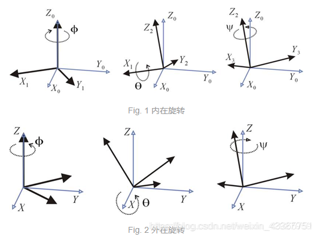
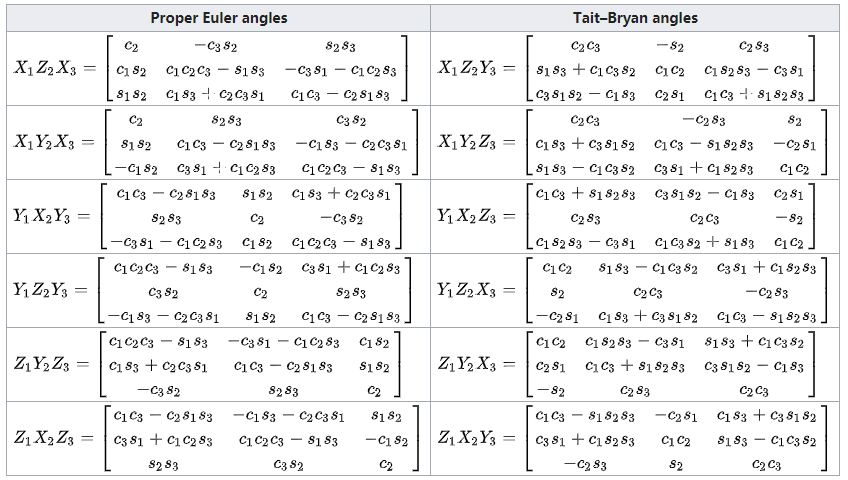

# 旋转的4种表示方式

## 一. 姿态角

即RPY角（Roll、Pitch、Yaw）。

- 俯仰角$\theta$（pitch）：围绕Y轴旋转的角度。

- 偏航角$\psi$（yaw）：围绕Z轴旋转的角度。

- 滚转角$\phi$（roll）：围绕X轴旋转的角度。

是一种绕固定坐标系（外旋）的欧拉角，详见下一节。

## 二. 欧拉角

欧拉角是由[Leonhard Euler](https://en.wikipedia.org/wiki/Leonhard_Euler" \o "Leonhard Euler) 提出的概念,用来描述刚体/移动坐标系在一个固定坐标系中的姿态.简单的说是使用XYZ三个轴的旋转分量,来描述一个6自由度的旋转。

欧拉角一般具有两大类表示方式,每类按照旋转次序的不同分为6小类:

- Proper Euler angles (z-x-z, x-y-x, y-z-y, z-y-z, x-z-x, y-x-y)

- Tait–Bryan angles (x-y-z, y-z-x, z-x-y, x-z-y, z-y-x, y-x-z)

每个大类都使用了3个变量描述三次旋转过程中的旋转角度, 差别在于Proper Euler angles只涉及两个转轴.而Tait–Bryan angles涉及三个转轴。

Tait–Bryan angles 也被称为Cardan angles, nautical angles, (heading, elevation, and bank), (yaw, pitch, and roll). 我们接触的比较多的是yaw(偏航), pitch(俯仰), roll(横滚).三个变量一般对应(车体,飞行器的)z,y,x三个坐标轴。

### 1. 欧拉角描述旋转

如果给出一组欧拉角（后面都是指 Tait–Bryan angles），绕x,y,z三个轴的转角分别为(α,β,γ)，我们不能能确定一个明确的姿态。需要再追加两个属性：(1)旋转顺序 (2)内旋/外旋。才能确定的给出这组欧拉角对应的姿态。

#### (1) 旋转顺序

旋转顺序就是我们上文提到的 Tait–Bryan angles (x-y-z, y-z-x, z-x-y, x-z-y, z-y-x, y-x-z)。

对于x,y,z三个轴的不同旋转顺序一共有六种组合。我们需要明确旋转顺序,才能确定欧拉角所指的姿态。

#### (2) 内旋与外旋

按旋转的坐标系分为**内旋**（intrinsic rotation）和**外旋**（extrinsic rotation）。

- 内旋：绕物体自身的坐标系（object-space）旋转。每次旋转都会改变下一次旋转的轴。这种情况下旋转的轴是动态的（moving axis）。

  内旋(intrinsic rotations) = 旋转轴(rotated axis)

- 外旋：绕惯性系（upright-space）旋转。upright space 指基向量平行于 world-space 或 parent-space，原点与 object-space 的原点重合的空间）。无论是三步旋转中的哪一步，轴都是固定的。

  外旋(extrinsic rotations) = 固定轴(static/fixed axis)

内在旋转与外在旋转的转换关系：互换第一次和第三次旋转的位置则两者结果相同。例如Z-Y-X旋转的内部旋转和X-Y-Z旋转的外部旋转的旋转矩阵相同。  

##### (a) 绕定轴X-Y-Z旋转（RPY角）（外旋）

假设两个坐标系A和B，二者初始时完全重合。 过程如下：B绕A的X轴旋转$\gamma$角，再绕A的Y轴旋转$\beta$角，最后绕A的Z轴旋转$\alpha$角，完成旋转。整个过程，A不动B动。 

每个旋转都是绕着固定参考坐标系{A}的轴。我们规定这种姿态表示法为X-Y-Z固定角坐标系。又是把它们定义为**回转角/滚转角（roll）**、**俯仰角（pitch）**和**偏转角/偏航角（yaw）**。

可直接推导等价旋转矩阵${^A_B}R_{XYZ}(\gamma,\beta,\alpha)$，因为所有旋转都是围绕着参考坐标系各轴的，即
$$
\begin{align}
{^A_B}R_{XYZ}(\gamma,\beta,\alpha) &= R_Z(\alpha)R_Y(\beta)R_X(\gamma) \\
	&=	\begin{bmatrix}
            c(\alpha) &-s(\alpha) &0 \\
            s(\alpha) &c(\alpha) &0 \\
            0 &0 &1 \\
        \end{bmatrix}
        \begin{bmatrix}
            c(\beta) &0 &s(\beta) \\
            0 &1 &0 \\
            -s(\beta) &0 &c(\beta) \\
        \end{bmatrix}
        \begin{bmatrix}
            1 &0 &0 \\
            0 &c(\gamma) &-s(\gamma) \\
            0 &s(\gamma) &c(\gamma) \\
        \end{bmatrix} \\
	&=	\begin{bmatrix}
            c(\alpha)c(\beta) &c(\alpha)s(\beta)s(\gamma)-s(\alpha)c(\gamma) &c(\alpha)s(\beta)c(\gamma)+s(\alpha)s(\gamma) \\
            s(\alpha)c(\beta) &s(\alpha)s(\beta)s(\gamma)+c(\alpha)c(\gamma) &s(\alpha)s(\beta)c(\gamma)-c(\alpha)s(\gamma) \\
            -s(\beta) &c(\beta)s(\gamma) &c(\beta)c(\gamma) \\
        \end{bmatrix}
\end{align}
$$

其中 $c(\alpha)=\cos(\alpha)$，$s(\alpha)=\sin(\alpha)$

##### (b) 绕动轴Z-Y-X旋转（Euler角）（内旋）

过程如下：B绕B的Z轴旋转$\alpha$角，再绕B的Y轴旋转$\beta$角，最后绕B的X轴旋转$\gamma$角，完成旋转。整个过程，A不动B动。
$$
{^A_B}R={^A_{B'}}R {^{B'}_{B''}}R {^{B''}_B}R
$$
{B}相对于A的最终姿态为
$$
\begin{align}
{^A_B}R_{Z'Y'X'}(\gamma,\beta,\alpha) &= R_Z(\alpha)R_Y(\beta)R_X(\gamma) \\
	&=	\begin{bmatrix}
            c(\alpha) &-s(\alpha) &0 \\
            s(\alpha) &c(\alpha) &0 \\
            0 &0 &1 \\
        \end{bmatrix}
        \begin{bmatrix}
            c(\beta) &0 &s(\beta) \\
            0 &1 &0 \\
            -s(\beta) &0 &c(\beta) \\
        \end{bmatrix}
        \begin{bmatrix}
            1 &0 &0 \\
            0 &c(\gamma) &-s(\gamma) \\
            0 &s(\gamma) &c(\gamma) \\
        \end{bmatrix} \\
	&=	\begin{bmatrix}
            c(\alpha)c(\beta) &c(\alpha)s(\beta)s(\gamma)-s(\alpha)c(\gamma) &c(\alpha)s(\beta)c(\gamma)+s(\alpha)s(\gamma) \\
            s(\alpha)c(\beta) &s(\alpha)s(\beta)s(\gamma)+c(\alpha)c(\gamma) &s(\alpha)s(\beta)c(\gamma)-c(\alpha)s(\gamma) \\
            -s(\beta) &c(\beta)s(\gamma) &c(\beta)c(\gamma) \\
        \end{bmatrix}
\end{align}
$$
这个结果与绕定轴X-Y-Z旋转的结果完全相同。也就是说：**三次绕固定值旋转的最终姿态和以相反顺序三次绕运动坐标轴旋转的最终姿态相同。**

### 2. 欧拉角表示方式的缺点

欧拉角的表示方式比较直观，但是有几个缺点：

1. 欧拉角的表示方式不唯一。

   给定某个起始朝向和目标朝向，即使给定yaw、pitch、roll的顺序，也可以通过不同的yaw/pitch/roll的角度组合来表示所需的旋转。比如，同样的yaw-pitch-roll顺序，(0,90,0)和(90,90,90)会将刚体转到相同的位置。这其实主要是由于万向锁（Gimbal Lock）引起的。

2. 欧拉角的插值比较难。

3. 计算旋转变换时，一般需要转换成旋转矩阵，这时候需要计算很多sin, cos，计算量较大。

### 3. 欧拉角->旋转矩阵

> [Euler angles - Wikipedia](https://en.wikipedia.org/wiki/Euler_angles)

以外旋方式按如下旋转顺序旋转对应的旋转矩阵为：

## 三. 旋转矩阵

### 1. 旋转矩阵转欧拉角

## 四. 四元数

> 参考：
>
> 1. 四元数与三维旋转 [https://krasjet.github.io/quaternion/quaternion.pdf](https://krasjet.github.io/quaternion/quaternion.pdf)
> 2. 四元数的可视化 [https://www.bilibili.com/video/av33385105](https://www.bilibili.com/video/av33385105)

### 1. 3D旋转公式（向量型，一般情况）

也叫做 **Rodrigue's Rotation Formula**：

> 3D空间中任意一个 $\mathbf v$ 沿着单位向量 $\mathbf u$ 旋转 $\theta$ 角度之后的 $\mathbf v'$ 为:
> $$
> V' = \cos(\theta)\mathbf{v} + (1-\cos(\theta))(\mathbf{u} \cdot \mathbf{v})\mathbf{u} + \sin(\theta)(\mathbf{u} \times \mathbf{v})
> $$

证明略。

### 2. 四元数（quaternion）

四元数有三个虚部，所有四元数 $q\in\H$ （H代表四元数的发现者William Rowan Hamilton）可以写成以下形式：
$$
q = a + bi + cj + dk,\ (a,b,c,d \in \R)
$$
其中：
$$
i^2 = j^2 = k^2 = ijk = -1
$$
向量形式：
$$
p = \left[\begin{array}{1}
			a \\ b \\ c \\ d
	\end{array}\right]
$$
此外，我们经常将四元数的实部与虚部分开，并用一个三维向量来表示虚部，将它表示为标量与向量的有序对形式
$$
q = [s, \mathbf{v}].\ (\mathbf{v} = [x, y, z]^T,\ s, x, y, z \in \R)
$$

#### (1) 性质

##### 模长（范数）

> $$
> \Vert q \Vert = \sqrt{a^2 + b^2 + c^2 + d^2}
> $$
>
> 标量向量有序对形式：
> $$
> \Vert q \Vert = \sqrt{s^2 + {\Vert \mathbf v \Vert}^2} = \sqrt{s^2 + \mathbf v \cdot \mathbf v}
> $$

##### 加减法

> 将分量相加减

##### 标量乘法

> $$
> \begin{align}
> sq &= s(a + bi + cj + dk) \\
> 	 &= sa + sbi + scj + sdk
> \end{align}
> $$
>
> 满足交换律：$ sq = qs $

##### 四元数乘法

> 不满足交换律，一般 $ q_1q_2 \ne q_2q_1 $，有左乘与右乘的区别。
>
> - $ q_1q_2 $：「$q_2$左乘以$q_1$」或「$q_1$右乘以$q_2$」
>
> 满足结合律和分配律。
>
> 如果有两个四元数 $q_1 = a + bi + cj + dk$ 和 $q_2 = e + fi + gj + hk$，它们的乘积为：
> $$
> \begin{array}{111}
> q_1q_2 &=	&(a + bi + cj + dk)(e + fi + gj + hk) \\
>		&=	&ae + afi + agj + ahk + \\
>		&	&bei + bfi^2 + bgij + bhik + \\
>		&	&cej + cfji + cgj^2 + chjk + \\
>		&	&dek + dfik + dgjk + dhk^2 \\
> \end{array}
> $$
>
> 由于有 $i^2 = j^2 = k^2 = ijk = -1$，可得如下表格：
>
> | $\times$ | $1$  | $i$  | $j$  | $k$  |
> | -------- | ---- | ---- | ---- | ---- |
> | $1$      | $1$     | $i$     | $j$     | $k$     |
> | $i$      | $i$     | $-1$     | $k$     | $-j$     |
> | $j$      | $j$     | $-k$     | $-1$     | $i$     |
> | $k$      | $k$  | $j$     | $-i$     | $-1$     |
>
>
> $$
> \begin{array}{111}
> q_1q_2	&=	&ae + afi + agj + ahk + \\
>		&	&bei - bf + bgk - bhj + \\
>		&	&cej - cfk - cg + chi + \\
>		&	&dek + dfj - dgi - dh \\
>		&=	&(ae - bf - cg - dh) + \\
>		&	&(be + af - dg + ch)i + \\
>		&	&(ce + df + ag - bh)j + \\
>		&	&(de -cf + bg + ah)k \\
> \end{array}
> $$

###### 矩阵形式

$q_2$左乘以$q_1$：

> $$
> q_1q_2 = \begin{bmatrix}
>	&a &-b &-c &-d \\ &b &a &-d &c \\ &c &d &a &-b \\ &d &-c &b &a
> \end{bmatrix}
> \begin{bmatrix}
>	e \\ f \\ g \\ h
> \end{bmatrix}
> $$

$q_2$右乘以$q_1$（用相同方法推导可得）：

> $$
> q_2q_1 = \begin{bmatrix}
>	a &-b &-c &-d \\ b &a &d &-c \\ c &-d &a &b \\ d &c &-b &a
> \end{bmatrix}
> \begin{bmatrix}
>	e \\ f \\ g \\ h
> \end{bmatrix}
> $$

#### (2) Graßmann积

如果令 $\mathbf v = [b, c, d]^T$, $\mathbf u = [f, g, h]^T$，那么
$$
\begin{align}
\mathbf{v}\cdot\mathbf{u}
	&= bf + cg +dh \\
\mathbf{v}\times\mathbf{u}
	&= \begin{vmatrix}
		\mathbf{i} & \mathbf{j} & \mathbf{k} \\
		b &c &d \\
		f &g &h \\
		\end{vmatrix} \\
	&= (ch-dg)\mathbf{i} - (bh-df)\mathbf{j} - (bg-cf)\mathbf{k}
\end{align}
$$

$q_1q_2$的结果可以用向量点乘和叉乘的形式表示出来（按历史来说，叉乘是在这里被定义的）

$$
q_1q_2 = [ae - \mathbf{v}\cdot\mathbf{u}, a\mathbf{u} + e\mathbf{v} + \mathbf{v}\times\mathbf{u}]
$$

**定理： Graßmann积**

> 对任意四元数 $q_1 = [s, \mathbf{v}]$, $q_2 = [t, \mathbf{u}]$
> $$
> q_1q_2 = [st - \mathbf{v}\cdot\mathbf{u}, s\mathbf{u} + t\mathbf{v} + \mathbf{v}\times\mathbf{u}]
> $$

该定理是将四元数与3D旋转联系起来的关键。

#### (3) 纯四元数（Pure Quaternion）

如果一个四元数能写成 $v = [0, \mathbf{v}]$ 的形式，那么我们称 $v$ 为一个**纯四元数**，即仅有虚部的四元数。任意3D向量都可转换为纯四元数。

纯四元数有一个重要特性：
> $$
> \begin{align}
> vu &= [0-\mathbf{v}\cdot\mathbf{u}, 0+\mathbf{v}\times\mathbf{u}] \\
> 	 &= [-\mathbf{v}\cdot\mathbf{u}, \mathbf{v}\times\mathbf{u}]
> \end{align}
> $$

#### (4) 逆（Inverse）与共轭

$q^{-1}$ 是 $q$ 的**逆**，规定
$$
qq^{-1}=q^{-1}q=1\ (q\ne0)
$$
右乘 $q$ 的逆运算为右乘 $q^{-1}$，左乘 $q$ 的逆运算为左乘 $q^{-1}$，这与矩阵性质非常相似。

可以利用四元数共轭的一些性质来获得 $q^{-1}$。

定义 $q=a+bi+cj+dk$ 的**共轭**为 $q^*=a-bi-cj-dk$ （读作“q star”）。用标量向量有序对的形式定义的话，$q=[s, \mathbf{v}]$ 的共轭为 $q^*=[s, -\mathbf{v}]$。

共轭的性质：
$$
\begin{align}
qq^*&= [s, \mathbf{v}]\cdot[s, -\mathbf{v}] \\
	&= [s^2 - \mathbf{v}\cdot(-\mathbf{v}), s(-\mathbf{v}) + s\mathbf{v} + \mathbf{v}\times(-\mathbf{v})] \\
	&= [s^2 + \mathbf{v}\cdot\mathbf{v}, \mathbf{0}] \\
	&= s^2 + x^2 + y^2 + z^2 \\
	&= {\Vert q \Vert}^2 \\
q^*q&= (q^*)(q^*)^* \\
	&= {\Vert q^* \Vert}^2 \\
	&= s^2 + x^2 + y^2 + z^2 \\
	&= {\Vert q \Vert}^2 \\
	&= qq^*
\end{align}
$$

这个特殊的乘法 $qq^* = q^*q$ 是遵守交换律的，利用它可以求四元数的逆：
$$
\begin{align}
qq^{-1}					&= 1 \\
q^*qq^{-1}				&= q^* \\
(q^*q)q^{-1}			&= q^* \\
{\Vert q \Vert}^2q^{-1}	&= q^* \\
q^{-1}					&= \frac{q^*}{{\Vert q \Vert}^2}
\end{align}
$$

如果 $\Vert q \Vert = 1$，也就是说 $q$ 是一个**单位四元数** (Unit Quaternion)，那么
> $$
> q^{-1} = \frac{q^*}{1^2} = q^*
> $$

### 3. 四元数与3D旋转

如果我们需要将一个向量 $\mathbf v$ 沿着一个用 单位向量所定义的旋转轴 $\mathbf u$ 旋转 $\theta$ 度，那么我们可以将这个向量 $\mathbf v$ 拆分为正交于旋转轴的 $\mathbf{v_⊥}$ 以及平行于旋转轴的 $\mathbf{v_∥}$．我们可以对这两个分向量分别进行旋转，获得 $\mathbf{v'_⊥}$ 和 $\mathbf{v'_∥}$．将它们相加就是 $\mathbf{v}$ 旋转之后的结果 $\mathbf{v'} = \mathbf{v'_∥} + \mathbf{v'_⊥}$

我们可以将这些向量定义为纯四元数
$$
\begin{gathered}
\begin{array}{1}
    v	&= [0, \mathbf{v}] \\
    v_⊥ &= [0, \mathbf{v_⊥}] \\
    v_∥ &= [0, \mathbf{v_∥}] \\
    u	&= [0, \mathbf{u}]
\end{array}
\qquad\qquad
\begin{array}{2}
    v'	&= [0, \mathbf{v'}] \\
    v'_⊥ &= [0, \mathbf{v'_⊥}] \\
    v'_∥ &= [0, \mathbf{v'_∥}] \\
    	&
\end{array}
\end{gathered}
$$

这样我们就能得到

$$
v = v_⊥ + v_∥ \qquad\qquad v' = v'_⊥ + v'_∥
$$

#### (1) $v_⊥$ 的旋转

如果一个向量 $\mathbf{v_⊥}$ 正交于旋转轴 $\mathbf{u}$，那么

$$
\mathbf{v'_⊥} = \cos(\theta)\mathbf{v_⊥} + \sin(\theta)(\mathbf{u}\times\mathbf{v_⊥})
$$

我们将它表示成四元数形式。

如果有两个纯四元数 $v_⊥=[0, \mathbf{v_⊥}]$ 和 $u=[0, \mathbf{u}]$，那么
$$
\begin{align}
uv_⊥ &= [-\mathbf{u}\cdot\mathbf{v_⊥}, \mathbf{u}\times\mathbf{v_⊥}] \\
	&= [0, \mathbf{u}\times\mathbf{v_⊥}] \\
	&= \mathbf{u}\times\mathbf{v_⊥}
\end{align}
$$
将其代入得到
$$
\begin{align}
v'_⊥ &= \cos(\theta)v_⊥ + \sin(\theta)(uv_⊥) \\
	&= (\cos(\theta)+\sin(\theta)u)v_⊥
\end{align}
$$
如果我们将 $(\cos(\theta) + \sin(\theta)u)$ 看做是一个四元数，我们就能将旋转写成四元数的乘积了。令 $q = \cos(\theta) + \sin(\theta)u$，可得
$$
v'_⊥ = qv_⊥
$$

如果能构造一个 $q$, 那么我们就能完成这个旋转了。对 $q$ 继续变形
$$
\begin{align}
q 	&= \cos(\theta) + \sin(\theta)u \\
	&= [\cos(\theta), \mathbf{0}] + [0, \sin(\theta)\mathbf{u}] \\
	&= [\cos(\theta), \sin(\theta)\mathbf{u}]
\end{align}
$$
也就是说，如果旋转轴 $\mathbf{u}$ 的坐标为 $[u_x, u_y, u_z]^T$，旋转角为 $\theta$，那么完成这一旋转所需要的四元数 $q$ 可以构造为
$$
q = \cos(\theta) + \sin(\theta)u_xi + \sin(\theta)u_yj + \sin(\theta)u_zk
$$
##### **3D旋转公式**（四元数型，正交情况）

> 当 $\mathbf{v_⊥}$ 正交于旋转轴 $\mathbf{u}$ 时，旋转 $\theta$ 角度之后的 $\mathbf{v'_⊥} $ 可以使用四元数乘法来获得. 令 $v_⊥=[0, \mathbf{v_⊥}]$, $q=[\cos(\theta), \sin(\theta)\mathbf{u}]$, 那么
> $$
> v'_⊥ = qv_⊥
> $$

这个四元数 $q$ 还有一个性质
$$
\begin{align}
\Vert q \Vert &= \sqrt{\cos^2(\theta) + (\sin(\theta)\mathbf{u}\cdot\sin(\theta)\mathbf{u})} \\
	&= \sqrt{\cos^2(\theta) + \sin^2(\theta)(\mathbf{u}\cdot\mathbf{u})} \\
	&= \sqrt{\cos^2(\theta) + \sin^2(\theta)({\Vert \mathbf{u} \Vert}^2)} \\
	&= \sqrt{\cos^2(\theta) + \sin^2(\theta)} \\
	&= 1
\end{align}
$$
也就是说，我们构造出来的这个 $q$ 其实是一个单位四元数。复数乘法的几何意义可以理解为缩放与旋转的复合，这个性质类比到四元数，因为 $\Vert q \Vert = 1$，它所代表的变化不会对原向量进行缩放，是一个纯旋转。

#### (2) $v_∥$ 的旋转

如果一个向量 $\mathbf{v_∥}$ 平行于 $\mathbf{u}$， 那么旋转不会对它做出任何变换，也就是说：

##### 3D旋转公式（四元数型，平行情况）

> 当 $\mathbf{v_∥}$ 平行于旋转轴 $\mathbf{u}$ 时, 旋转 $\theta$ 角度之后的 $\mathbf{v'_∥}$ 用四元数可以写为：
> $$
> v'_∥ = v_∥
> $$

#### (3) $v$ 的旋转

$$
\begin{align}
v' &= v'_∥ + v'_⊥ \\
	&= v_∥ + qv_⊥ \qquad	(q = [\cos(\theta), \sin(\theta)\mathbf{u}])
\end{align}
$$

我们有更好的办法进一步化简它：

##### 引理1

> 如果 $q = [\cos(\theta), \sin(\theta)\mathbf{u}]$, 且 $\mathbf{u}$ 为单位向量, 那么
> $$
> q^2 = [\cos(2\theta), sin(2\theta)\mathbf{u}]
> $$

证明略(使用Graßmann积和一些三角恒等式即可)。

几何意义：如果绕同一个轴连续旋转 $\theta$ 度两次，那么所做出的变换等同于直接绕该轴旋转 $2\theta$ 度。

有了这个引理，加上四元数逆的定义 $qq^{-1}=1$，可以对原本的旋转公式进行变形

$$
\begin{align}
v' &= v_∥ + qv_⊥	&(q = [\cos(\theta), \sin(\theta)\mathbf{u}])	\\
	&= 1\cdot v_∥+ qv_⊥ \\
	&= pp^{-1}v_∥ + ppv_⊥	&(p = [\cos(\frac{1}{2}\theta), \sin(\frac{1}{2}\theta)\mathbf{u}], q=p^2) \\
	&= pp^*v_∥ + ppv_⊥
\end{align}
$$

我们还能进一步化简这个公式：

##### 引理2

> 假设 $v_∥ = [0, \mathbf{v_∥}]$ 是一个纯四元数, 而 $q=[\alpha, \beta\mathbf{u}]$, 其中 $\mathbf{u}$ 是一个单位向量, $\alpha, \beta \in \R$. 在这种条件下, 如果 $\mathbf{v_∥}$ 平行于 $\mathbf{u}$, 那么 $qv_∥ = v_∥q $

证明：

等式左边
$$
\begin{align}
LHS &= qv_∥ \\
	&= [\alpha, \beta\mathbf{u}]\cdot[0, \mathbf{v_∥}] \\
	&= [0-\beta\mathbf{u}\cdot\mathbf{v_∥}, \alpha\mathbf{v_∥} + \mathbf{0} + \beta\mathbf{u}\times\mathbf{v_∥}] \\
	&= [-\beta\mathbf{u}\cdot\mathbf{v_∥}, \alpha\mathbf{v_∥}] \\
\end{align}
$$

等式右边
$$
\begin{align}
RHS &= v_∥q \\
	&= [0, \mathbf{v_∥}]\cdot[\alpha, \beta\mathbf{u}] \\
	&= [0-\mathbf{v_∥}\cdot\beta\mathbf{u}, \mathbf{0} + \alpha\mathbf{v_∥} + \mathbf{v_∥}\times\beta\mathbf{u}] \\
	&= [-\mathbf{v_∥}\cdot\beta\mathbf{u}, \alpha\mathbf{v_∥}] \\
	&= [-\beta\mathbf{u}\cdot\mathbf{v_∥}, \alpha\mathbf{v_∥}] = LHS \\
\end{align}
$$

##### 引理3

> 假设 $v_⊥ = [0, \mathbf{v_⊥}]$ 是一个纯四元数, 而 $q=[\alpha, \beta\mathbf{u}]$, 其中 $\mathbf{u}$ 是一个单位向量, $\alpha, \beta \in \R$. 在这种条件下, 如果 $\mathbf{v_⊥}$ 正交于 $\mathbf{u}$, 那么 $qv_⊥ = v_⊥q^* $

证明：

等式左边
$$
\begin{align}
LHS &= qv_⊥ \\
	&= [\alpha, \beta\mathbf{u}]\cdot[0, \mathbf{v_⊥}] \\
	&= [0-\beta\mathbf{u}\cdot\mathbf{v_⊥}, \alpha\mathbf{v_⊥} + \mathbf{0} + \beta\mathbf{u}\times\mathbf{v_⊥}] \\
	&= [0, \alpha\mathbf{v_⊥} + \beta\mathbf{u}\times\mathbf{v_⊥}] \\
\end{align}
$$

等式右边
$$
\begin{align}
RHS &= v_⊥q^* \\
	&= [0, \mathbf{v_⊥}]\cdot[\alpha, -\beta\mathbf{u}] \\
	&= [0+\mathbf{v_⊥}\cdot\beta\mathbf{u}, \mathbf{0} + \alpha\mathbf{v_⊥} + \mathbf{v_⊥}\times(-\beta\mathbf{u})] \\
	&= [0, \alpha\mathbf{v_⊥} + \mathbf{v_⊥}\times(-\beta\mathbf{u})] \\
	&= [0, \alpha\mathbf{v_⊥} - (-\beta\mathbf{u})\times\mathbf{v_⊥}] \\
    &= [0, \alpha\mathbf{v_⊥} + \beta\mathbf{u}\times\mathbf{v_⊥}] = LHS \\
\end{align}
$$

对之前的公式做出最后的变形

$$
\begin{align}
v' &= pp^*v_∥ + ppv_⊥ \\
	&= pv_∥p^* + pv_⊥p^* \\
	&= p(v_∥+v_⊥)p^*
	&= pvp^*
\end{align}
$$

##### 3D旋转公式（四元数型，一般情况）

> 任意向量 $\mathbf{v}$ 沿着以单位向量定义的旋转轴 $\mathbf{u}$ 旋转 $\theta$ 度之后的 $\mathbf{v'}$ 可以使用四元数乘法来获得。令 $v=[0, \mathbf{v}]$, $q=[\cos(\frac{1}{2}\theta), \sin(\frac{1}{2}\theta)\mathbf{u}]$, 那么：
> $$
> v' = qvq^* = qvq^{-1}
> $$

它与 **Rodrigues' Rotation Formula** 完全等价：
$$
qvq^* = [0, \cos(\theta)\mathbf{v} + (1-\cos(\theta))(\mathbf{u} \cdot \mathbf{v})\mathbf{u} + \sin(\theta)(\mathbf{u} \times \mathbf{v})]
$$
证明略（可能会用到 $\mathbf{a}\times(\mathbf{b}\times\mathbf{c})=(\mathbf{a}\cdot\mathbf{c})\mathbf{b}-(\mathbf{a}\cdot\mathbf{b})\mathbf{c}$ 这个公式）。

因为所有的旋转四元数的实部都只是一个角度的余弦值，假设有一个单位四元数 $q=[a, \mathbf{b}]$，如果我们想获取它所对应旋转的角度，那么我们可以直接得到
$$
\frac{\theta}{2} = \cos^{-1}(a)
$$
如果想要再获得旋转轴，那么只需要将 $\mathbf{b}$ 的每一项都除以 $\sin(\frac{\theta}{2})$ 即可
$$
\mathbf{u} = \frac{\mathbf{b}}{\sin(\cos^{-1}(a))}
$$

### 4. 3D旋转的矩阵形式

在实际的应用中，我们可能会需要将旋转与平移和缩放进行复合，所以需要用到四元数旋转的矩阵形式。

前面讨论过左乘四元数 $q = a + bi + cj + dk$ 等同于如下矩阵
$$
L(q) = \begin{bmatrix}
	&a &-b &-c &-d \\ &b &a &-d &c \\ &c &d &a &-b \\ &d &-c &b &a
\end{bmatrix}
$$
右乘 $q$ 等同于如下矩阵

$$
R(q) = \begin{bmatrix}
	a &-b &-c &-d \\ b &a &d &-c \\ c &-d &a &b \\ d &c &-b &a
\end{bmatrix}
$$
我们可以利用这两个公式将 $v'=qvq^*$ 写成矩阵形式。

假设
$$
\begin{align}
a &= \cos(\frac{1}{2}\theta) \\
b &= \sin(\frac{1}{2}\theta)u_x \\
c &= \sin(\frac{1}{2}\theta)u_y \\
d &= \sin(\frac{1}{2}\theta)u_z \\
q &= a + bi + cj + dk
\end{align}
$$
我们就能得到
$$
\begin{align}
qvq^* &= L(q)R(q^*)v	&(等价于 R(q^*)L(q)v) \\
	&= \begin{bmatrix} &a &-b &-c &-d \\ &b &a &-d &c \\ &c &d &a &-b \\ &d &-c &b &a \end{bmatrix}
	\begin{bmatrix} &a &b &c &d \\ &-b &a &d &-c \\ &-c &d &a &-b \\ &-d &-c &b &a \end{bmatrix} &(注意R(q^*)=R(q)^T) v \\
	&= \begin{bmatrix}
        &a^2+b^2+c^2+d^2 &ab-ab-cd+cd &ac+bd-ac-bd &ad-bc+bc-ad \\
        &ab-ab+cd-cd &b^2+a^2-d^2-c^2 &bc-ad-ad+bc &bd+ac+bd+ac \\
        &ac-bd-ac+bd &bc+ad+ad+bc &c^2-d^2+a^2-b^2 &cd+cd-ab-ab \\
        &ad+bc-bc-ad &bd-ac+bd-ac &cd+cd+ab+ab &d^2-c^2-b^2+a^2
		\end{bmatrix} v \\
	&= \begin{bmatrix}
		1 &0 &0 &0 \\
		0 &1-2c^2-2d^2 &2bc-ad &2ac+2bd \\
		0 &2bc+ad &1-2b^2-2d^2 &2cd-2ab \\
		0 &2bd-2ac &2ab+2cd &1-2b^2-2c^2
		\end{bmatrix} v
\end{align}
$$
因为 $a^2+b^2+c^2+d^2=1$，这个式子可以化简为
$$
qvq^* = \begin{bmatrix}
		1 &0 &0 &0 \\
		0 &1-2c^2-2d^2 &2bc-ad &2ac+2bd \\
		0 &2bc+ad &1-2b^2-2d^2 &2cd-2ab \\
		0 &2bd-2ac &2ab+2cd &1-2b^2-2c^2
		\end{bmatrix} v
$$
因为矩阵的最外圈不会对 $v$ 进行任何变换，我们可以将它压缩成 $3\times3$ 矩阵（用作3D向量的变换）：

#### 3D旋转公式（矩阵型）

> 任意向量 $\mathbf{v}$ 沿着以单位向量定义的旋转轴 $\mathbf{u}$ 旋转 $\theta$ 度之后的 $\mathbf{v'}$ 可以使用矩阵乘法来获得. 令 $a = \cos(\frac{1}{2}\theta)$, $b = \sin(\frac{1}{2}\theta)u_x$, $c = \sin(\frac{1}{2}\theta)u_y$, $d = \sin(\frac{1}{2}\theta)u_z$, 那么:
> $$
> \mathbf{v'} = \begin{bmatrix}
> 1-2c^2-2d^2 &2bc-ad &2ac+2bd \\
> 2bc+ad &1-2b^2-2d^2 &2cd-2ab \\
> 2bd-2ac &2ab+2cd &1-2b^2-2c^2
> \end{bmatrix} \mathbf{v}
> $$

虽然3D旋转的矩阵形式不如四元数形式简单，而且占用更多的空间，但是对大批量的变换，使用**预计算**好的矩阵是比四元数乘法更有效率的。

### 5. 旋转的复合

### 6. 双倍覆盖

### 7. 指数形式

### 8. 四元数插值

假设有两个旋转变换 $q_0=[\cos(\theta_0), \sin(\theta_0)\mathbf{u_0}]$ 和 $q_1=[\cos(\theta_1), sin(\theta_1)\mathbf{u_1}]$, 希望找出一些中间变换 $q_t$, 让初始变换 $q_0$ 能够平滑地过渡到最终变换 $q_1$，$t\in [0,1]$。