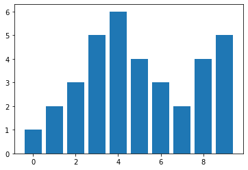

## 题目

> [162] 寻找峰值
> 
> https://leetcode-cn.com/problems/find-peak-element/description/
> 
> algorithms
> Medium (43.09%)
> Likes:    129
> Dislikes: 0
> Total Accepted:    23.7K
> Total Submissions: 54.5K
> Testcase Example:  '[1,2,3,1]'
> 
> 峰值元素是指其值大于左右相邻值的元素。
> 
> 给定一个输入数组 nums，其中 nums[i] ≠ nums[i+1]，找到峰值元素并返回其索引。
> 
> 数组可能包含多个峰值，在这种情况下，返回任何一个峰值所在位置即可。
> 
> 你可以假设 nums[-1] = nums[n] = -∞。
> 
> 示例 1:
> 
> 输入: nums = [1,2,3,1]
> 输出: 2
> 解释: 3 是峰值元素，你的函数应该返回其索引 2。
> 
> 示例 2:
> 
> 输入: nums = [1,2,1,3,5,6,4]
> 输出: 1 或 5 
> 解释: 你的函数可以返回索引 1，其峰值元素为 2；
> 或者返回索引 5， 其峰值元素为 6。
> 
> 
> 说明:
> 
> 你的解法应该是 O(logN) 时间复杂度的。

## 思路

### O(n)解法

可以很容易地想到，遍历一遍数组，当找到某个值比它的前一个值大，且比后一个值小，则这个值就是峰值。这个算法的时间复杂度为`O(n)`。

```python
class Solution:
    def findPeakElement(self, nums: List[int]) -> int:
        """
        59/59 cases passed (32 ms)
        Your runtime beats 98.4 % of python3 submissions
        Your memory usage beats 57.91 % of python3 submissions (13.1 MB)
        """
        n = len(nums)
        res = 0
        for i in range(1, n):
            a = nums[i - 1]
            b = nums[i]
            if a < b:
                if i + 1 >= n or nums[i+1] < b:
                    res = i
                    break
        return res
```

### O(logn)解法

题目要求的算法时间复杂度为`O(logn)`，不能采用遍历的方式求解。

分析一下峰值位置在整个序列中的特点：

- 如图，数组`[1,2,3,5,6,4,3,2,4,5]`在位置4和9各有一个峰值（序列外的元素视为-∞）



- 峰值将数组切分：
  - 元素0~4构成一个单调上升序列
  - 元素4~7构成一个单调下降序列
  - 元素7~9构成一个调度上升序列

- 数组中的任意元素都处于至少一个单调子序列中，顺着上升的方向就可以找到数组的一个峰值。

因此，可以用二分搜索的方式去求解，算法步骤如下：

1. 找到数组首元素位置a，尾元素位置b，中点位置`mid=⌊(a+b)÷2⌋`
2. 如果`b-a <= 1`，即数组元素数量不超过2个，返回a、b位置中较大的那个元素的位置；
3. 比较中点位置元素值x与它的前一个元素值y：
   - 如果 `x < y`，则在mid位置左侧继续搜索峰值，令b = mid；
   - 否则，在mid位置右侧继续搜索峰值，令a = mid；
4. 回到第一步。

```python
class Solution:
    def findPeakElement(self, nums: List[int]) -> int:
        """
        59/59 cases passed (28 ms)
        Your runtime beats 99.4 % of python3 submissions
        Your memory usage beats 57.34 % of python3 submissions (13.3 MB)
        """
        a = 0
        b = len(nums) - 1
        while True:
            if (b - a) <= 1:
                return a if nums[a] > nums[b] else b
            mid = (b + a) // 2
            if nums[mid - 1] > nums[mid]:
                b = mid
            else:
                a = mid
```


