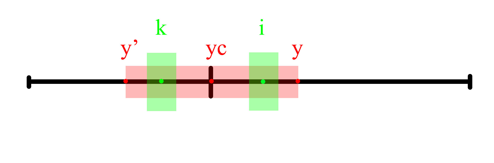
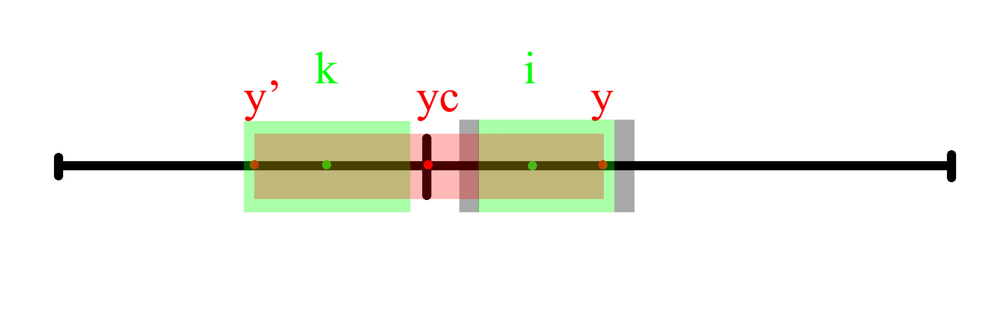

## 题目

[5] 最长回文子串

https://leetcode-cn.com/problems/longest-palindromic-substring/description/

algorithms
Medium (28.59%)
Likes:    1775
Dislikes: 0
Total Accepted:    186.6K
Total Submissions: 652.8K
Testcase Example:  '"babad"'

给定一个字符串 s，找到 s 中最长的回文子串。你可以假设 s 的最大长度为 1000。

示例 1：

输入: "babad"
输出: "bab"
注意: "aba" 也是一个有效答案。


示例 2：

输入: "cbbd"
输出: "bb"

## 动态规划法

### 思路

回文子串有奇数长度和偶数长度两种情况，需要用不同的规则进行判断，如
- 'bcbcb'
- 'bccb'

我们可以对字符串进行预处理，在字符串首尾和每个字符中间插入一个相同的元素，这样新的回文子串就一定是奇数长度了，上述回文子串可以改写为：
- 0, 'b', 0, 'c', 0, 'b', 0, 'c', 0, 'b', 0
- 0, 'b', 0, 'c', 0, 'c', 0, 'b', 0

依次取新字符串的第i个字符，按如下步骤判断以该字符为中心构成的回文子串最大长度：

- 初始状态，该字符自身构成一个回文子串。
- 如果该回文子串的左右边界外如果还有字符，且是左边界外第一个字符与右边界外第一个字符相同，则该回文子串可以向左右各扩展一个字符。
- 如果该回文子串的左右边界任意一侧外没有字符了，或者左右边界外的第一字符不相同，则结束扩展。当前子串就是以i为中心构成的最长回文子串。

遍历完整个字符串后，就可以得到最长的回文子串。

### 代码实现

```python
class Solution:
    def longestPalindrome(self, s: str) -> str:
        """
        动态规划方法
        103/103 cases passed (3684 ms)
        Your runtime beats 38.25 % of python3 submissions
        Your memory usage beats 43.29 % of python3 submissions (13.5 MB)
        """
        if not s:
            return ''

        # 在字符中间插入0，将字符串转成奇数长度的列表,
        # 插入的算上0后，回文子串一定是奇数长度。
        sl = []
        for x in s:
            sl.append(0)
            sl.append(x)
        sl.append(0)
        n = len(sl)

        n_longest = 1
        longest = [sl[1]]
        for i in range(1, n-1):
            # 判断以i位置为中心的，向左右延展j个字符的子串是否是回文子串
            j = 1
            while 0 <= i - j and i + j < n:
                if sl[i-j] == sl[i+j]:
                    if 2*j+1 > n_longest:
                        n_longest = 2*j+1
                        longest = sl[i-j:i+j+1]
                else:
                    break
                j += 1

        res = [x for x in longest if x != 0]
        return ''.join(res)
```

## Manacher算法

### 思路

利用已经判断过的回文子串的对称性，减少比较的次数，从而加速求解。

`y`为当前已经找到的可构成回文子串的最右侧的点，`yc`为`y`所在回文子串的中心元素位置。`k`是元素`i`关于`yc`的对称点。

##### (1) 以`k`为中心的回文子串不超过`y'`到`y`范围

根据对称性，以`i`为中心的回文子串长度与`k`相同




##### (2) 以`k`为中心的回文子串超过了`y'`到`y`范围



因为`y`右侧元素关于`yc`的没有对称性，所以需要从`y`右侧开始逐个元素判断是否构成以`i`为中心的回文子串。

### 时间复杂度

Manacher算法仅需要对`y`右侧的元素进行比较

- 在任意位置`i`，如果进行了`x+1`次比较（最后一次比较时，该元素不能构成回文子串），`y`将右移`x`；

- 当`y`右移到最右边元素位置时，剩余未比较的所有元素都可以在至多`1`次比较内确定以它为中心的回文子串长度。
- 因此，所有位置`i`需要的比较次数之和至多为`2n`

Manacher算法的时间复杂度不超过`O(n)`

### 空间复杂度

需要一个数组记录以每个字符为中心的回文子串的长度，空间复杂度为`O(n)`

### 代码实现


```python
class Solution:
    def longestPalindrome(self, s: str) -> str:
        """
        Manacher算法
        103/103 cases passed (92 ms)
        Your runtime beats 94.76 % of python3 submissions
        Your memory usage beats 42.86 % of python3 submissions (13.6 MB)
        """
        if not s:
            return ''

        # 在字符中间插入0，将字符串转成奇数长度的列表,
        # 插入的算上0后，回文子串一定是奇数长度。
        sl = []
        for x in s:
            sl.append(0)
            sl.append(x)
        sl.append(0)
        n = len(sl)

        # i位置的最长回文子串半径(从i-r[i]到i+r[i]的子串是回文)
        r = [0]*n
        i_longest = 0
        r_longest = 0

        # 当前已找出的可以构成回文子串的元素中，位置最后的元素的索引y
        #   以及该子串的中心元素位置i_y
        i_y = 0
        i_yc = 0
        for i in range(1, n-1):
            # 利用回文子串的对称性，判断半径的最小值，从而减少判断次数
            k_r = r[2*i_yc - i]
            if i + k_r < i_y:
                r[i] = k_r
                continue

            j = i_y - i
            # 判断以i位置为中心的，向左右延展j个字符的子串是否是回文子串
            while 0 <= i - j and i + j < n:
                if sl[i-j] == sl[i+j]:
                    r[i] = j
                    if j > r_longest:
                        i_longest = i
                        r_longest = j
                    if i+j > i_y:
                        i_y = i+j
                        i_yc = i
                else:
                    break
                j += 1

        res = [
            x
            for x in sl[i_longest-r[i_longest]:i_longest+r[i_longest]+1]
            if x != 0
        ]
        return ''.join(res)
```
