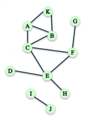
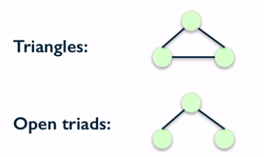

# 01. Clustering Coefficient

## Clustering Coefficient

Measuring the degree to which nodes in a network tend to "cluster" or form triangles.

### Triadic Closure

The tendency for people who share connections in a social network to become connected. 


### Local Clustering Coefficient

Fraction of pairs of the node's friends that are friends with each other.

Compute the local clustering coefficient of node C:


$$
\rm \frac
{\#\ of\ pairs\ of\ C's\ friends\ who\ are\ friends}
{\#\ of\ pairs\ of\ C's\ friends}
$$
\# of pairs of C's friends = $C_4^2$

> Assume that the local clustering coefficient of a node of degree less than 2 to be 0.

```python
nx.clustering(G, 'F')
```

### Global Clustering Coefficient

#### 1) Average Local Clustering Coefficient

Average local clustering coefficient over all nodes in the graph.

```python
nx.average_clustering(G)
```

#### 2) Transitivity

Ratio of number of triangles and number of "open triads".

- Triangles

- Open triads



**Puts larger weight on high degree nodes**
$$
\rm Transitivity = \frac
{3 \times \#\ of\ closed\ triads}
{\#\ of\ open\ triads}
$$

```python
nx.transitivity(G)
```

### Transitivity vs Average Clustering Coefficient

- Both measure the tendency for edges to form triangles.
- Transitivity weights nodes with large degree higher.


# 02. Distance Measures

## Distance

### Path

A sequence of nodes connected by an edge.

### Distance between two nodes

The length of the shortest path between them.

```python
nx.shortest_path(G, 'A', 'H')
nx.shortest_path_length(G, 'A', 'H')
```

### Finding the distance from node A to every other node.

Breadth-First Search

```python
T = nx.bfs_tree(G, 'A')
T.edges()

nx.shortest_path_length(G, 'A')
```

## Distance Measures

### Characterizing distance in a graph

#### Average distance

Average distance between every pair of nodes.

```python
nx.average_shortest_path_length(G)
```

#### Diameter

Maximum distance between any pair of nodes.

```python
nx.diameter(G)
```

#### Eccentricity

The eccentricity of a node *n* is the largest distance **from** *n* **to** all other nodes.

```python
nx.eccentricity(G)
```

#### Radius

The minimum eccentricity in the graph.

```python
nx.radius(G)
```

### Identifying central and peripheral nodes

#### Periphery

The set of nodes with eccentricity = diameter

```python
nx.periphery(G)
```

#### Center

The set of nodes with eccentricity = radius

```python
nx.center(G)
```

## Example: Karate Club Network

```python
G = nx.karate_club_graph()
G = nx.convert_node_labels_to_integers(G, first_label=1)
```

# 03. Connected Components

## Connectivity in Undirected Graph

### Connected Graph

For every pair nodes, there is a path between them.

```python
nx.is_connected(G)
```

### Connected Components

A subset of nodes such as:

1. Every node in the subset has a path to every other node.
2. No other node has a path to any node in the subset.

```python
nx.number_connected_components(G)
sorted(nx.connected_components(G))
nx.node_connected_componenet(G, 'M')
```

## Connectivity in Directed Graph

### Strongly connected

For every pair nodes *u* and *v*, there is a directed path from *u* to *v* and a directed path from *v* to *u*.

```python
nx.is_strongly_connected(G)
```

### Weakly connected

A directed graph is weakly connected if replacing all directed edges with undirected edges produces a connected undirected graph.

```python
nx.is_weakly_connected(G)
```

### Strongly connected components

A subset of nodes such as:

1. Every node in the subset has a **directed** path to every other node.
2. No other node has a **directed** path to and from every node in the subset.

```python
sorted(x.strongly_connected_components(G))
```

### Weakly connected components

The connected components of the graph after replacing all directed edges with undirected edges.

```python
sorted(nx.weakly_connected_components(G))
```

# 04. Network Robustness

## Connectivity and Robustness in Network

### Network Robustness

The ability of a network to maintain its general structural properties when it faces failure or attacks.

**Type of attacks**: removal of nodes or edges.

**Structural properties** connectivity.

## Disconnecting a Graph

What is the smallest number of nodes that can be removed from this graph in order to disconnect it.

```python
nx.node_connectivity(G_un)
```

Which nodes?

```python
nx.minimum_node_cut(G_un)
```

What is the smallest number of edges that can be removed from this graph in order to disconnect it.

```python
nx.edge_connectivity(G_un)
```

Which edges?

```python
nx.minimum_edge_cut(G_un)
```

**Robust networks have large minimum node and edge cuts.**

## Simple Paths

Options for messages from G to L

```python
sorted(nx.all_simple_paths(G, 'G', 'L'))
```

## Node Connectivity

If we wanted to block the message from G to L by removing nodes from the network, how many nodes would we need to remove?

```python
nx.node_connectivity(G_un, 'G', 'L')
```

Which nodes?

```python
nx.minimum_node_cut(G_un, 'G', 'L')
```

## Edge Connectivity

If we wanted to block the message from G to L by removing edges from the network, how many nodes would we need to remove?

```python
nx.edge_connectivity(G_un, 'G', 'L')
```

Which edges ?

```python
nx.minimum_edge_cut(G_un, 'G', 'L')
```

**Graphs with large node and edge connectivity are more robust to the loss of nodes and edges.**