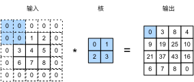
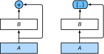

# 5. 卷积神经网络

> [5.1 二维卷积层 - Dive-into-DL-PyTorch (tangshusen.me)](https://tangshusen.me/Dive-into-DL-PyTorch/#/chapter05_CNN/5.1_conv-layer)

卷积神经网络（convolutional neural network）是含有卷积层（convolutional layer）的神经网络。二维卷积层有高和宽两个空间维度，常用来处理图像数据。

## 5.1 二维卷积层

### 5.1.1 二维互相关运算

虽然卷积层得名于卷积（convolution）运算，但我们通常在卷积层中使用更加直观的互相关（cross-correlation）运算。

卷积核或过滤器（filter）。

卷积核窗口（又称卷积窗口）的形状取决于卷积核的高和宽。


### 5.1.2 二维卷积层

二维卷积层将输入和卷积核做互相关运算，并加上一个标量偏差来得到输出。卷积层的模型参数包括了卷积核和标量偏差。在训练模型的时候，通常我们先对卷积核随机初始化，然后不断迭代卷积核和偏差。

### 5.1.3 图像中的边缘检验

卷积层可通过重复使用卷积核有效地表征局部空间。

### 5.1.4 通过数据学习核数组

### 5.1.5 互相关运算和卷积运算

在深度学习中核数组都是学出来的：卷积层无论使用互相关运算或卷积运算都不影响模型预测时的输出。

### 5.1.6 特征图和感受野

二维卷积层输出的二维数组可以看作是输入在空间维度（宽和高）上某一级的表征，也叫特征图（feature map）。

影响元素$x$的前向计算的所有可能输入区域（可能大于输入的实际尺寸）叫做$x$的感受野（receptive field）。

## 5.2 填充和步幅

### 5.2.1 填充

填充（padding）是指在输入高和宽的两侧填充元素（通常是0元素）。



在很多情况下，我们会设置 $p_h=k_h-1$ 和 $p_w=k_w-1$ 来使输入和输出具有相同的高和宽。这样会方便在构造网络时推测每个层的输出形状。

卷积神经网络经常使用奇数高宽的卷积核，如1、3、5和7，所以两端上的填充个数相等。

当卷积核的高和宽不同时，我们也可以通过设置高和宽上不同的填充数使输出和输入具有相同的高和宽。

### 5.2.2 步幅

卷积窗口从输入数组的最左上方开始，按从左往右、从上往下的顺序，依次在输入数组上滑动。我们将每次滑动的行数和列数称为步幅（stride）。

步幅可以减小输出的高和宽。

为了表述简洁，当输入的高和宽两侧的填充数分别为 $p_h$ 和 $p_w$ 时，我们称填充为 $(p_h, p_w)$ 。特别地，当 $p_h = p_w = p$ 时，填充为 $p$ 。当在高和宽上的步幅分别为 $s_h$ 和 $s_w$ 时，我们称步幅为 $(s_h, s_w)$ 。特别地，当 $s_h = s_w = s$ 时，步幅为 $s$。在默认情况下，填充为0，步幅为1。

## 5.3 多输入通道和多输出通道

使用多通道可以拓展卷积层的模型参数。

### 5.3.1 多输入通道

当输入数据含多个通道时，我们需要构造一个输入通道数与输入数据的通道数相同的卷积核，从而能够与含多通道的输入数据做互相关运算。

假设输入数据的通道数为 $c_i$ ，那么卷积核的输入通道数同样为 $c_i$ 。设卷积核窗口形状为 $k_h\times k_w$ 。当 $c_i > 1$ 时，我们将会为每个输入通道各分配一个形状为 $k_h\times k_w$ 的核数组。把这 $c_i$ 个数组在输入通道维上连结，即得到一个形状为 $c_i\times k_h\times k_w$ 的卷积核。由于输入和卷积核各有 $c_i$ 个通道，我们可以在各个通道上对输入的二维数组和卷积核的二维核数组做互相关运算，再将这 $c_i$ 个互相关运算的二维输出按通道相加，得到一个二维数组。


### 5.3.2 多输出通道

当输入通道有多个时，因为我们对各个通道的结果做了累加，所以不论输入通道数是多少，输出通道数总是为1。

如果希望得到含多个通道的输出，我们可以为每个输出通道分别创建形状为 $c_i\times k_h\times k_w$ 的核数组。将它们在输出通道维上连结，卷积核的形状即 $c_o\times c_i\times k_h\times k_w$ 。在做互相关运算时，每个输出通道上的结果由卷积核在该输出通道上的核数组与整个输入数组计算而来。

### 5.3.3 1×1 卷积层

卷积窗口形状为 $1\times 1\ (k_h=k_w=1)$ 的多通道卷积层。我们通常称之为 $1\times 1$ 卷积层，并将其中的卷积运算称为 $1\times 1$ 卷积。

因为使用了最小窗口， $1\times 1$ 卷积失去了卷积层可以识别高和宽维度上相邻元素构成的模式的功能。实际上， $1\times 1$ 卷积的主要计算发生在通道维上。


输入和输出具有相同的高和宽。输出中的每个元素来自输入中在高和宽上相同位置的元素在不同通道之间的按权重累加。假设我们将通道维当作特征维，将高和宽维度上的元素当成数据样本，**那么 $1\times 1$ 卷积层的作用与全连接层等价**。

1×1卷积层通常用来调整网络层之间的通道数，并控制模型复杂度。

## 5.4 池化层

池化（pooling）层的提出是**为了缓解卷积层对位置的过度敏感性**。

### 5.4.1 二维最大池化层和平均池化层

同卷积层一样，池化层每次对输入数据的一个固定形状窗口（又称池化窗口）中的元素计算输出。不同于卷积层里计算输入和核的互相关性，池化层直接计算池化窗口内元素的最大值或者平均值。该运算也分别叫做最大池化或平均池化。


池化层的输出通道数跟输入通道数相同。

### 5.4.2 填充和步幅

同卷积层一样，池化层也可以在输入的高和宽两侧的填充并调整窗口的移动步幅来改变输出形状。池化层填充和步幅与卷积层填充和步幅的工作机制一样。

## 5.5 卷积神经网络（LeNet）

在图像分类问题中，含隐藏层的多层感知机模型存在以下问题：

1. 图像在同一列邻近的像素在这个向量中可能相距较远。它们构成的模式可能难以被模型识别。
2. 对于大尺寸的输入图像，使用全连接层容易造成模型过大。

卷积层尝试解决这两个问题。

1. 一方面，卷积层保留输入形状，使图像的像素在高和宽两个方向上的相关性均可能被有效识别；
2. 另一方面，卷积层通过滑动窗口将同一卷积核与不同位置的输入重复计算，从而避免参数尺寸过大。

卷积神经网络就是含卷积层的网络。

本节里我们将介绍一个早期用来识别手写数字图像的卷积神经网络：LeNet[^1]

[^1]: LeCun, Y., Bottou, L., Bengio, Y., & Haffner, P. (1998). Gradient-based learning applied to document recognition. Proceedings of the IEEE, 86(11), 2278-2324.

### 5.5.1 LeNet模型

LeNet分为卷积层块和全连接层块两个部分。

卷积层块里的基本单位是卷积层后接最大池化层：卷积层用来识别图像里的空间模式，如线条和物体局部，之后的最大池化层则用来降低卷积层对位置的敏感性。卷积层块由两个这样的基本单位重复堆叠构成。

> 在卷积层块中，每个卷积层都使用 $5\times 5$ 的窗口，并在输出上使用sigmoid激活函数。第一个卷积层输出通道数为6，第二个卷积层输出通道数则增加到16。这是因为第二个卷积层比第一个卷积层的输入的高和宽要小，所以增加输出通道使两个卷积层的参数尺寸类似。卷积层块的两个最大池化层的窗口形状均为 $2\times 2$ ，且步幅为2。由于池化窗口与步幅形状相同，池化窗口在输入上每次滑动所覆盖的区域互不重叠。
>
> 卷积层块的输出形状为 (批量大小, 通道, 高, 宽)。当卷积层块的输出传入全连接层块时，全连接层块会将小批量中每个样本变平（flatten）。也就是说，全连接层的输入形状将变成二维，其中第一维是小批量中的样本，第二维是每个样本变平后的向量表示，且向量长度为通道、高和宽的乘积。全连接层块含3个全连接层。它们的输出个数分别是120、84和10，其中10为输出的类别个数。

代码实现：

```python
import time
import torch
from torch import nn, optim

import sys
sys.path.append("..") 
import d2lzh_pytorch as d2l
device = torch.device('cuda' if torch.cuda.is_available() else 'cpu')

class LeNet(nn.Module):
    def __init__(self):
        super(LeNet, self).__init__()
        self.conv = nn.Sequential(
            nn.Conv2d(1, 6, 5), # in_channels, out_channels, kernel_size
            nn.Sigmoid(),
            nn.MaxPool2d(2, 2), # kernel_size, stride
            nn.Conv2d(6, 16, 5),
            nn.Sigmoid(),
            nn.MaxPool2d(2, 2)
        )
        self.fc = nn.Sequential(
            nn.Linear(16*4*4, 120),
            nn.Sigmoid(),
            nn.Linear(120, 84),
            nn.Sigmoid(),
            nn.Linear(84, 10)
        )

    def forward(self, img):
        feature = self.conv(img)
        output = self.fc(feature.view(img.shape[0], -1))
        return output
```

### 5.5.2 获取数据和训练模型

学习率采用0.001，训练算法使用Adam算法，损失函数使用交叉熵损失函数。

## 5.6 深度卷积神经网络（AlexNet）

### 5.6.1 学习特征表示

在相当长的时间里，特征都是基于各式各样手工设计的函数从数据中提取的。

然而，另一些研究者则持异议。他们认为特征本身也应该由学习得来。他们还相信，为了表征足够复杂的输入，特征本身应该分级表示。持这一想法的研究者相信，多层神经网络可能可以学得数据的多级表征，并逐级表示越来越抽象的概念或模式。

尽管一直有一群执着的研究者不断钻研，试图学习视觉数据的逐级表征，然而很长一段时间里这些野心都未能实现。这其中有诸多因素。

- 缺失要素一：数据

- 缺失要素二：硬件

### 5.6.2 AlexNet

2012年，AlexNet横空出世[^2]。AlexNet与LeNet的设计理念非常相似，但也有显著的区别。

1. 与相对较小的LeNet相比，AlexNet包含8层变换，其中有5层卷积和2层全连接隐藏层，以及1个全连接输出层。

   > AlexNet第一层中的卷积窗口形状是 $11\times11$。ImageNet图像的物体占用更多的像素，所以需要更大的卷积窗口来捕获物体。第二层中的卷积窗口形状减小到 $5\times5$，之后全采用 $3\times3$。此外，第一、第二和第五个卷积层之后都使用了窗口形状为 $3\times3$、步幅为2的最大池化层。而且，AlexNet使用的卷积通道数也大于LeNet中的卷积通道数数十倍。紧接着最后一个卷积层的是两个输出个数为4096的全连接层。

2. AlexNet将sigmoid激活函数改成了更加简单的ReLU激活函数。

   > 一方面，ReLU激活函数的计算更简单，例如它并没有sigmoid激活函数中的求幂运算。另一方面，ReLU激活函数在不同的参数初始化方法下使模型更容易训练。这是由于当sigmoid激活函数输出极接近0或1时，这些区域的梯度几乎为0，从而造成反向传播无法继续更新部分模型参数；而ReLU激活函数在正区间的梯度恒为1。因此，若模型参数初始化不当，sigmoid函数可能在正区间得到几乎为0的梯度，从而令模型无法得到有效训练。

3. AlexNet通过丢弃法（参见3.13节）来控制全连接层的模型复杂度。
4. AlexNet引入了大量的图像增广，如翻转、裁剪和颜色变化，从而进一步扩大数据集来缓解过拟合。

[^2]: Krizhevsky, A., Sutskever, I., & Hinton, G. E. (2012). Imagenet classification with deep convolutional neural networks. In Advances in neural information processing systems (pp. 1097-1105).

- AlexNet跟LeNet结构类似，但使用了更多的卷积层和更大的参数空间来拟合大规模数据集ImageNet。它是浅层神经网络和深度神经网络的分界线。
- 虽然看上去AlexNet的实现比LeNet的实现也就多了几行代码而已，但这个观念上的转变和真正优秀实验结果的产生令学术界付出了很多年。

代码实现（稍微简化过）：

```python
import time
import torch
from torch import nn, optim
import torchvision

import sys
sys.path.append("..") 
import d2lzh_pytorch as d2l
device = torch.device('cuda' if torch.cuda.is_available() else 'cpu')

class AlexNet(nn.Module):
    def __init__(self):
        super(AlexNet, self).__init__()
        self.conv = nn.Sequential(
            nn.Conv2d(1, 96, 11, 4), # in_channels, out_channels, kernel_size, stride, padding
            nn.ReLU(),
            nn.MaxPool2d(3, 2), # kernel_size, stride
            # 减小卷积窗口，使用填充为2来使得输入与输出的高和宽一致，且增大输出通道数
            nn.Conv2d(96, 256, 5, 1, 2),
            nn.ReLU(),
            nn.MaxPool2d(3, 2),
            # 连续3个卷积层，且使用更小的卷积窗口。除了最后的卷积层外，进一步增大了输出通道数。
            # 前两个卷积层后不使用池化层来减小输入的高和宽
            nn.Conv2d(256, 384, 3, 1, 1),
            nn.ReLU(),
            nn.Conv2d(384, 384, 3, 1, 1),
            nn.ReLU(),
            nn.Conv2d(384, 256, 3, 1, 1),
            nn.ReLU(),
            nn.MaxPool2d(3, 2)
        )
         # 这里全连接层的输出个数比LeNet中的大数倍。使用丢弃层来缓解过拟合
        self.fc = nn.Sequential(
            nn.Linear(256*5*5, 4096),
            nn.ReLU(),
            nn.Dropout(0.5),
            nn.Linear(4096, 4096),
            nn.ReLU(),
            nn.Dropout(0.5),
            # 输出层。由于这里使用Fashion-MNIST，所以用类别数为10，而非论文中的1000
            nn.Linear(4096, 10),
        )

    def forward(self, img):
        feature = self.conv(img)
        output = self.fc(feature.view(img.shape[0], -1))
        return output
```

### 5.6.3 读取数据

### 5.6.4 训练

## 5.7 使用重复元素的网络（VGG）

虽然AlexNet指明了深度卷积神经网络可以取得出色的结果，但并没有提供简单的规则以指导后来的研究者如何设计新的网络。

我们将在本章的后续几节里介绍几种不同的深度网络设计思路。

本节介绍VGG，它的名字来源于论文作者所在的实验室Visual Geometry Group [^3]。VGG提出了可以通过重复使用简单的基础块来构建深度模型的思路。

[^3]: Simonyan, K., & Zisserman, A. (2014). Very deep convolutional networks for large-scale image recognition. arXiv preprint arXiv:1409.1556.

### 5.7.1 VGG块

VGG块的组成规律是：连续使用数个相同的填充为1、窗口形状为 $3\times 3$ 的卷积层后接上一个步幅为2、窗口形状为 $2\times 2$ 的最大池化层。卷积层保持输入的高和宽不变，而池化层则对其减半。

> 对于给定的感受野（与输出有关的输入图片的局部大小），采用堆积的小卷积核优于采用大的卷积核，因为可以增加网络深度来保证学习更复杂的模式，而且代价还比较小（参数更少）。例如，在VGG中，使用了3个3x3卷积核来代替7x7卷积核，使用了2个3x3卷积核来代替5x5卷积核，这样做的主要目的是在保证具有相同感知野的条件下，提升了网络的深度，在一定程度上提升了神经网络的效果。

```python
import time
import torch
from torch import nn, optim

import sys
sys.path.append("..") 
import d2lzh_pytorch as d2l
device = torch.device('cuda' if torch.cuda.is_available() else 'cpu')

def vgg_block(num_convs, in_channels, out_channels):
    blk = []
    for i in range(num_convs):
        if i == 0:
            blk.append(nn.Conv2d(in_channels, out_channels, kernel_size=3, padding=1))
        else:
            blk.append(nn.Conv2d(out_channels, out_channels, kernel_size=3, padding=1))
        blk.append(nn.ReLU())
    blk.append(nn.MaxPool2d(kernel_size=2, stride=2)) # 这里会使宽高减半
    return nn.Sequential(*blk)
```

### 5.7.2 VGG网络

与AlexNet和LeNet一样，VGG网络由卷积层模块后接全连接层模块构成。卷积层模块串联数个`vgg_block`，其超参数由变量`conv_arch`定义。该变量指定了每个VGG块里卷积层个数和输入输出通道数。全连接模块则跟AlexNet中的一样。

根据每块里卷积层个数和输出通道数的不同可以定义出不同的VGG模型。

现在我们构造一个VGG网络。它有5个卷积块，前2块使用单卷积层，而后3块使用双卷积层。第一块的输入输出通道分别是1（因为下面要使用的Fashion-MNIST数据的通道数为1）和64，之后每次对输出通道数翻倍，直到变为512。因为这个网络使用了8个卷积层和3个全连接层，所以经常被称为VGG-11。

```python
def vgg(conv_arch, fc_features, fc_hidden_units=4096):
    net = nn.Sequential()
    # 卷积层部分
    for i, (num_convs, in_channels, out_channels) in enumerate(conv_arch):
        # 每经过一个vgg_block都会使宽高减半
        net.add_module("vgg_block_" + str(i+1), vgg_block(num_convs, in_channels, out_channels))
    # 全连接层部分
    net.add_module("fc", nn.Sequential(d2l.FlattenLayer(),
                                 nn.Linear(fc_features, fc_hidden_units),
                                 nn.ReLU(),
                                 nn.Dropout(0.5),
                                 nn.Linear(fc_hidden_units, fc_hidden_units),
                                 nn.ReLU(),
                                 nn.Dropout(0.5),
                                 nn.Linear(fc_hidden_units, 10)
                                ))
    return net
```

### 5.7.3 获取数据和训练模型

## 5.8 网络中的网络（NiN）

前几节介绍的LeNet、AlexNet和VGG在设计上的共同之处是：先以由卷积层构成的模块充分抽取空间特征，再以由全连接层构成的模块来输出分类结果。其中，AlexNet和VGG对LeNet的改进主要在于如何对这两个模块加宽（增加通道数）和加深。

本节我们介绍网络中的网络（NiN）[^4]。它提出了另外一个思路，即串联多个由卷积层和“全连接”层构成的小网络来构建一个深层网络。

[^4]: Lin, M., Chen, Q., & Yan, S. (2013). Network in network. arXiv preprint arXiv:1312.4400.

### 5.8.1 NiN块

卷积层的输入和输出通常是四维数组（样本，通道，高，宽），而全连接层的输入和输出则通常是二维数组（样本，特征）。如果想在全连接层后再接上卷积层，则需要将全连接层的输出变换为四维。回忆在5.3节（多输入通道和多输出通道）里介绍的 $1\times 1$ 卷积层。它可以看成全连接层，其中空间维度（高和宽）上的每个元素相当于样本，通道相当于特征。因此，NiN使用 $1\times 1$ 卷积层来替代全连接层，从而使空间信息能够自然传递到后面的层中去。下图对比了NiN同AlexNet和VGG等网络在结构上的主要区别。


NiN块是NiN中的基础块。它由一个卷积层加两个充当全连接层的 $1\times 1$ 卷积层串联而成。其中第一个卷积层的超参数可以自行设置，而第二和第三个卷积层的超参数一般是固定的。

```python
import time
import torch
from torch import nn, optim

import sys
sys.path.append("..") 
import d2lzh_pytorch as d2l
device = torch.device('cuda' if torch.cuda.is_available() else 'cpu')

def nin_block(in_channels, out_channels, kernel_size, stride, padding):
    blk = nn.Sequential(nn.Conv2d(in_channels, out_channels, kernel_size, stride, padding),
                        nn.ReLU(),
                        nn.Conv2d(out_channels, out_channels, kernel_size=1),
                        nn.ReLU(),
                        nn.Conv2d(out_channels, out_channels, kernel_size=1),
                        nn.ReLU())
    return blk
```

### 5.8.2 NiN模型

- NiN重复使用由卷积层和代替全连接层的 $1\times 1$ 卷积层构成的NiN块来构建深层网络。
- NiN去除了容易造成过拟合的全连接输出层，而是将其替换成输出通道数等于标签类别数的NiN块和全局平均池化层。
- NiN的以上设计思想影响了后面一系列卷积神经网络的设计。

NiN与AlexNet的卷积层设定有类似之处。NiN使用卷积窗口形状分别为 $11\times 11$、 $5\times 5$ 和 $3\times 3$ 的卷积层，相应的输出通道数也与AlexNet中的一致。每个NiN块后接一个步幅为2、窗口形状为 $3\times 3$ 的最大池化层。

除使用NiN块以外，NiN还有一个设计与AlexNet显著不同：NiN去掉了AlexNet最后的3个全连接层，取而代之地，NiN使用了输出通道数等于标签类别数的NiN块，然后使用全局平均池化层对每个通道中所有元素求平均并直接用于分类。这里的全局平均池化层即窗口形状等于输入空间维形状的平均池化层。NiN的这个设计的好处是可以显著减小模型参数尺寸，从而缓解过拟合。然而，该设计有时会造成获得有效模型的训练时间的增加。

```python
import torch.nn.functional as F
class GlobalAvgPool2d(nn.Module):
    # 全局平均池化层可通过将池化窗口形状设置成输入的高和宽实现
    def __init__(self):
        super(GlobalAvgPool2d, self).__init__()
    def forward(self, x):
        return F.avg_pool2d(x, kernel_size=x.size()[2:])

net = nn.Sequential(
    nin_block(1, 96, kernel_size=11, stride=4, padding=0),
    nn.MaxPool2d(kernel_size=3, stride=2),
    nin_block(96, 256, kernel_size=5, stride=1, padding=2),
    nn.MaxPool2d(kernel_size=3, stride=2),
    nin_block(256, 384, kernel_size=3, stride=1, padding=1),
    nn.MaxPool2d(kernel_size=3, stride=2), 
    nn.Dropout(0.5),
    # 标签类别数是10
    nin_block(384, 10, kernel_size=3, stride=1, padding=1),
    GlobalAvgPool2d(), 
    # 将四维的输出转成二维的输出，其形状为(批量大小, 10)
    d2l.FlattenLayer())
```

### 5.8.3 获取数据和训练模型

## 5.9 含并行连结的网络（GoogLeNet）

GoogLeNet[^5]吸收了NiN中网络串联网络的思想，并在此基础上做了很大改进。

[^5]: Szegedy, C., Liu, W., Jia, Y., Sermanet, P., Reed, S., & Anguelov, D. & Rabinovich, A.(2015). Going deeper with convolutions. In Proceedings of the IEEE conference on computer vision and pattern recognition (pp. 1-9).

### 5.9.1 Inception 块

GoogLeNet中的基础卷积块叫作Inception块，得名于同名电影《盗梦空间》（Inception）。


由图可以看出，Inception块里有4条并行的线路。前3条线路使用窗口大小分别是 $1\times 1$、 $3\times 3$ 和 $5\times 5$ 的卷积层来抽取不同空间尺寸下的信息，其中中间2个线路会对输入先做 $1\times 1$ 卷积来减少输入通道数，以降低模型复杂度。第四条线路则使用 $3\times 3$ 最大池化层，后接 $1\times 1$ 卷积层来改变通道数。4条线路都使用了合适的填充来使输入与输出的高和宽一致。最后我们将每条线路的输出在通道维上连结，并输入接下来的层中去。

Inception块中可以自定义的超参数是每个层的输出通道数，我们以此来控制模型复杂度。

```python
import time
import torch
from torch import nn, optim
import torch.nn.functional as F

import sys
sys.path.append("..") 
import d2lzh_pytorch as d2l
device = torch.device('cuda' if torch.cuda.is_available() else 'cpu')

class Inception(nn.Module):
    # c1 - c4为每条线路里的层的输出通道数
    def __init__(self, in_c, c1, c2, c3, c4):
        super(Inception, self).__init__()
        # 线路1，单1 x 1卷积层
        self.p1_1 = nn.Conv2d(in_c, c1, kernel_size=1)
        # 线路2，1 x 1卷积层后接3 x 3卷积层
        self.p2_1 = nn.Conv2d(in_c, c2[0], kernel_size=1)
        self.p2_2 = nn.Conv2d(c2[0], c2[1], kernel_size=3, padding=1)
        # 线路3，1 x 1卷积层后接5 x 5卷积层
        self.p3_1 = nn.Conv2d(in_c, c3[0], kernel_size=1)
        self.p3_2 = nn.Conv2d(c3[0], c3[1], kernel_size=5, padding=2)
        # 线路4，3 x 3最大池化层后接1 x 1卷积层
        self.p4_1 = nn.MaxPool2d(kernel_size=3, stride=1, padding=1)
        self.p4_2 = nn.Conv2d(in_c, c4, kernel_size=1)

    def forward(self, x):
        p1 = F.relu(self.p1_1(x))
        p2 = F.relu(self.p2_2(F.relu(self.p2_1(x))))
        p3 = F.relu(self.p3_2(F.relu(self.p3_1(x))))
        p4 = F.relu(self.p4_2(self.p4_1(x)))
        return torch.cat((p1, p2, p3, p4), dim=1)  # 在通道维上连结输出
```

### 5.9.2 GoogLeNet模型

- Inception块相当于一个有4条线路的子网络。它通过不同窗口形状的卷积层和最大池化层来并行抽取信息，并使用 $1\times 1$ 卷积层减少通道数从而降低模型复杂度。
- GoogLeNet将多个设计精细的Inception块和其他层串联起来。其中Inception块的通道数分配之比是在ImageNet数据集上通过大量的实验得来的。
- GoogLeNet和它的后继者们一度是ImageNet上最高效的模型之一：在类似的测试精度下，它们的计算复杂度往往更低。

GoogLeNet跟VGG一样，在主体卷积部分中使用5个模块（block），每个模块之间使用步幅为2的 $3\times 3$ 最大池化层来减小输出高宽。第一模块使用一个64通道的 $7\times 7$ 卷积层。

第二模块使用2个卷积层：首先是64通道的 $1\times 1$ 卷积层，然后是将通道增大3倍的 $3\times 3$ 卷积层。它对应Inception块中的第二条线路。

第三模块串联2个完整的Inception块。

第四模块更加复杂。它串联了5个Inception块。

第五模块有输出通道数为256+320+128+128=832和384+384+128+128=1024的两个Inception块。其中每条线路的通道数的分配思路和第三、第四模块中的一致，只是在具体数值上有所不同。需要注意的是，第五模块的后面紧跟输出层，该模块同NiN一样使用全局平均池化层来将每个通道的高和宽变成1。最后我们将输出变成二维数组后接上一个输出个数为标签类别数的全连接层。

GoogLeNet模型的计算复杂，而且不如VGG那样便于修改通道数。

### 5.9.3 获取数据和训练模型

## 5.10 批量归一化

本节我们介绍批量归一化（batch normalization）层，它能让较深的神经网络的训练变得更加容易 [^6]。

通常来说，数据标准化预处理对于浅层模型就足够有效了。随着模型训练的进行，当每层中参数更新时，靠近输出层的输出较难出现剧烈变化。但对深层神经网络来说，即使输入数据已做标准化，训练中模型参数的更新依然很容易造成靠近输出层输出的剧烈变化。这种计算数值的不稳定性通常令我们难以训练出有效的深度模型。

批量归一化的提出正是为了应对深度模型训练的挑战。在模型训练时，批量归一化利用小批量上的均值和标准差，不断调整神经网络中间输出，从而使整个神经网络在各层的中间输出的数值更稳定。**批量归一化和下一节将要介绍的残差网络为训练和设计深度模型提供了两类重要思路**。

[^6]: Ioffe, S., & Szegedy, C. (2015). Batch normalization: Accelerating deep network training by reducing internal covariate shift. arXiv preprint arXiv:1502.03167.

### 5.10.1 批量归一化层

对全连接层和卷积层做批量归一化的方法稍有不同。

#### 5.10.1.1 对全连接层做批量归一化

通常，我们将批量归一化层置于全连接层中的仿射变换和激活函数之间。

设全连接层的输入为 $\boldsymbol{u}$ ，权重参数和偏差参数分别为 $\boldsymbol{W}$ 和 $\boldsymbol{b}$ ，激活函数为 $\phi$。设批量归一化的运算符为 $\text{BN}$。那么，使用批量归一化的全连接层的输出为
$$
\phi(\text{BN}(\boldsymbol{x}))
$$
其中批量归一化输入 $\boldsymbol{x}$ 由仿射变换
$$
\boldsymbol{x}=\boldsymbol{W}\boldsymbol{u}+\boldsymbol{b}
$$
得到。考虑一个由 $m$ 个样本组成的小批量，仿射变换的输出为一个新的小批量 $\mathcal{B} = \{\boldsymbol{x}^{(1)}, \ldots, \boldsymbol{x}^{(m)} \}$。它们正是批量归一化层的输入。对于小批量 $\mathcal{B}$ 中任意样本 $\boldsymbol{x}^{(i)} \in \mathbb{R}^d, 1 \leq i \leq m$，批量归一化层的输出同样是 $d$ 维向量

$$
\boldsymbol{y}^{(i)}=\text{BN}(\boldsymbol{x}^{(i)})
$$

并由以下几步求得。首先，对小批量 $\mathcal{B}$ 求均值和方差：

$$
\begin{aligned}
\boldsymbol{\mu}_\mathcal{B} &\leftarrow \frac{1}{m}\sum_{i = 1}^{m} \boldsymbol{x}^{(i)} \\

\boldsymbol{\sigma}_\mathcal{B}^2 &\leftarrow \frac{1}{m} \sum_{i=1}^{m}(\boldsymbol{x}^{(i)} - \boldsymbol{\mu}_\mathcal{B})^2
\end{aligned}
$$

其中的平方计算是按元素求平方。接下来，使用按元素开方和按元素除法对 $\boldsymbol{x}^{(i)}$ 标准化：

$$
\hat{\boldsymbol{x}}^{(i)} \leftarrow \frac{\boldsymbol{x}^{(i)} - \boldsymbol{\mu}_\mathcal{B}}{\sqrt{\boldsymbol{\sigma}_\mathcal{B}^2 + \epsilon}}
$$

这里 $\epsilon > 0$是一个很小的常数，保证分母大于0。

在上面标准化的基础上，批量归一化层引入了两个可以学习的模型参数，拉伸（scale）参数 $\boldsymbol{\gamma}$ 和偏移（shift）参数 $\boldsymbol{\beta}$。这两个参数和 $\boldsymbol{x}^{(i)}$ 形状相同，皆为 $d$ 维向量。它们与 $\boldsymbol{x}^{(i)}$ 分别做按元素乘法（符号 $\odot$ ）和加法计算：

$$
{\boldsymbol{y}}^{(i)} \leftarrow \boldsymbol{\gamma} \odot \hat{\boldsymbol{x}}^{(i)} + \boldsymbol{\beta}
$$

至此，我们得到了 $\boldsymbol{x}^{(i)}$ 的批量归一化的输出 $\boldsymbol{y}^{(i)}$。 值得注意的是，可学习的拉伸和偏移参数保留了不对 $\hat{\boldsymbol{x}}^{(i)}$ 做批量归一化的可能：此时只需学出 $\boldsymbol{\gamma} = \sqrt{\boldsymbol{\sigma}_\mathcal{B}^2 + \epsilon}$ 和 $\boldsymbol{\beta} = \boldsymbol{\mu}_\mathcal{B}$ 。我们可以对此这样理解：如果批量归一化无益，理论上，学出的模型可以不使用批量归一化。

#### 5.10.1.2 对卷积层做批量归一化

对卷积层来说，批量归一化发生在卷积计算之后、应用激活函数之前。如果卷积计算输出多个通道，我们需要对这些通道的输出分别做批量归一化，且**每个通道都拥有独立的拉伸和偏移参数，并均为标量**。

设小批量中有 $m$ 个样本。在单个通道上，假设卷积计算输出的高和宽分别为 $p$ 和 $q$。我们需要对该通道中 $m \times p \times q$ 个元素同时做批量归一化。对这些元素做标准化计算时，我们使用相同的均值和方差，即该通道中 $m \times p \times q$ 个元素的均值和方差。

#### 5.10.1.3 预测时的批量归一化

使用批量归一化训练时，我们可以将批量大小设得大一点，从而使批量内样本的均值和方差的计算都较为准确。将训练好的模型用于预测时，我们希望模型对于任意输入都有确定的输出。因此，单个样本的输出不应取决于批量归一化所需要的随机小批量中的均值和方差。一种常用的方法是通过移动平均估算整个训练数据集的样本均值和方差，并在预测时使用它们得到确定的输出。可见，和丢弃层一样，批量归一化层在训练模式和预测模式下的计算结果也是不一样的。

### 5.10.2 从零开始实现

5.10.2.1 使用批量归一化层的LeNet

### 5.10.3 简洁实现

Pytorch中`nn`模块定义的`BatchNorm1d`和`BatchNorm2d`类使用起来更加简单，二者分别用于全连接层和卷积层，都需要指定输入的`num_features`参数值。

## 5.11 残差网络（ResNet）

对神经网络模型添加新的层，充分训练后的模型是否只可能更有效地降低训练误差？

理论上，原模型解的空间只是新模型解的空间的子空间。也就是说，如果我们能将新添加的层训练成恒等映射 $f(x) = x$，新模型和原模型将同样有效。由于新模型可能得出更优的解来拟合训练数据集，因此添加层似乎更容易降低训练误差。然而在实践中，添加过多的层后训练误差往往不降反升。即使利用批量归一化带来的数值稳定性使训练深层模型更加容易，该问题仍然存在。

针对这一问题，何恺明等人提出了残差网络（ResNet） [^7]。

[^7]: He, K., Zhang, X., Ren, S., & Sun, J. (2016). Deep residual learning for image recognition. In Proceedings of the IEEE conference on computer vision and pattern recognition (pp. 770-778).

### 5.11.1 残差块

让我们聚焦于神经网络局部。如图所示，设输入为 $\boldsymbol{x}$ 。假设我们希望学出的理想映射为 $f(\boldsymbol{x})$ ，从而作为图上方激活函数的输入。左图虚线框中的部分需要直接拟合出该映射 $f(\boldsymbol{x})$ ，而右图虚线框中的部分则需要拟合出有关恒等映射的残差映射 $f(\boldsymbol{x})-\boldsymbol{x}$。残差映射在实际中往往更容易优化。以本节开头提到的恒等映射作为我们希望学出的理想映射  $f(\boldsymbol{x})$ 。我们只需将图5.9中右图虚线框内上方的加权运算（如仿射）的权重和偏差参数学成0，那么 $f(\boldsymbol{x})$ 即为恒等映射。实际中，当理想映射 $f(\boldsymbol{x})$ 极接近于恒等映射时，残差映射也易于捕捉恒等映射的细微波动。图5.9右图也是ResNet的基础块，即残差块（residual block）。在残差块中，输入可通过跨层的数据线路更快地向前传播。


ResNet沿用了VGG全 $3\times 3$ 卷积层的设计。残差块里首先有2个有相同输出通道数的 $3\times 3$ 卷积层。每个卷积层后接一个批量归一化层和ReLU激活函数。然后我们将输入跳过这两个卷积运算后直接加在最后的ReLU激活函数前。这样的设计要求两个卷积层的输出与输入形状一样，从而可以相加。如果想改变通道数，就需要引入一个额外的 $1\times 1$ 卷积层来将输入变换成需要的形状后再做相加运算。

残差块的实现如下。它可以设定输出通道数、是否使用额外的 $1\times 1$ 卷积层来修改通道数以及卷积层的步幅。

```python
import time
import torch
from torch import nn, optim
import torch.nn.functional as F

import sys
sys.path.append("..") 
import d2lzh_pytorch as d2l
device = torch.device('cuda' if torch.cuda.is_available() else 'cpu')

class Residual(nn.Module):  # 本类已保存在d2lzh_pytorch包中方便以后使用
    def __init__(self, in_channels, out_channels, use_1x1conv=False, stride=1):
        super(Residual, self).__init__()
        self.conv1 = nn.Conv2d(in_channels, out_channels, kernel_size=3, padding=1, stride=stride)
        self.conv2 = nn.Conv2d(out_channels, out_channels, kernel_size=3, padding=1)
        if use_1x1conv:
            self.conv3 = nn.Conv2d(in_channels, out_channels, kernel_size=1, stride=stride)
        else:
            self.conv3 = None
        self.bn1 = nn.BatchNorm2d(out_channels)
        self.bn2 = nn.BatchNorm2d(out_channels)

    def forward(self, X):
        Y = F.relu(self.bn1(self.conv1(X)))
        Y = self.bn2(self.conv2(Y))
        if self.conv3:
            X = self.conv3(X)
        return F.relu(Y + X)
```

### 5.11.2 ResNet模型

ResNet的前两层跟之前介绍的GoogLeNet中的一样：在输出通道数为64、步幅为2的 $7\times 7$ 卷积层后接步幅为2的 $3\times 3$ 的最大池化层。不同之处在于ResNet每个卷积层后增加的批量归一化层。

GoogLeNet在后面接了4个由Inception块组成的模块。ResNet则使用4个由残差块组成的模块，每个模块使用若干个同样输出通道数的残差块。第一个模块的通道数同输入通道数一致。由于之前已经使用了步幅为2的最大池化层，所以无须减小高和宽。之后的每个模块在第一个残差块里将上一个模块的通道数翻倍，并将高和宽减半。

通过配置不同的通道数和模块里的残差块数可以得到不同的ResNet模型，例如更深的含152层的ResNet-152。虽然ResNet的主体架构跟GoogLeNet的类似，但ResNet结构更简单，修改也更方便。这些因素都导致了ResNet迅速被广泛使用。

### 5.11.3 获取数据和训练模型

## 5.12 稠密连接网络（DenseNet）

ResNet中的跨层连接设计引申出了数个后续工作。本节我们介绍其中的一个：稠密连接网络（DenseNet） [^8]。 它与ResNet的主要区别如图所示。



图中将部分前后相邻的运算抽象为模块A和模块B。与ResNet的主要区别在于，DenseNet里模块B的输出不是像ResNet那样和模块A的输出相加，而是在通道维上连结。这样模块A的输出可以直接传入模块B后面的层。在这个设计里，模块A直接跟模块B后面的所有层连接在了一起。这也是它被称为“稠密连接”的原因。

DenseNet的主要构建模块是稠密块（dense block）和过渡层（transition layer）。前者定义了输入和输出是如何连结的，后者则用来控制通道数，使之不过大。

[^8]: Huang, G., Liu, Z., Weinberger, K. Q., & van der Maaten, L. (2017). Densely connected convolutional networks. In Proceedings of the IEEE conference on computer vision and pattern recognition (Vol. 1, No. 2).

### 5.12.1 稠密块

DenseNet使用了ResNet改良版的“批量归一化、激活和卷积”结构，我们首先在`conv_block`函数里实现这个结构。

```python
import time
import torch
from torch import nn, optim
import torch.nn.functional as F

import sys
sys.path.append("..") 
import d2lzh_pytorch as d2l
device = torch.device('cuda' if torch.cuda.is_available() else 'cpu')

def conv_block(in_channels, out_channels):
    blk = nn.Sequential(nn.BatchNorm2d(in_channels), 
                        nn.ReLU(),
                        nn.Conv2d(in_channels, out_channels, kernel_size=3, padding=1))
    return blk
```

稠密块由多个`conv_block`组成，每块使用相同的输出通道数。但在前向计算时，我们将每块的输入和输出在通道维上连结。

```python
class DenseBlock(nn.Module):
    def __init__(self, num_convs, in_channels, out_channels):
        super(DenseBlock, self).__init__()
        net = []
        for i in range(num_convs):
            in_c = in_channels + i * out_channels
            net.append(conv_block(in_c, out_channels))
        self.net = nn.ModuleList(net)
        self.out_channels = in_channels + num_convs * out_channels # 计算输出通道数

    def forward(self, X):
        for blk in self.net:
            Y = blk(X)
            X = torch.cat((X, Y), dim=1)  # 在通道维上将输入和输出连结
        return X
```

卷积块的通道数控制了输出通道数相对于输入通道数的增长，因此也被称为增长率（growth rate）。

### 5.12.2 过渡层

由于每个稠密块都会带来通道数的增加，使用过多则会带来过于复杂的模型。过渡层用来控制模型复杂度。它通过 $1\times1$ 卷积层来减小通道数，并使用步幅为2的平均池化层减半高和宽，从而进一步降低模型复杂度。

```python
def transition_block(in_channels, out_channels):
    blk = nn.Sequential(
            nn.BatchNorm2d(in_channels), 
            nn.ReLU(),
            nn.Conv2d(in_channels, out_channels, kernel_size=1),
            nn.AvgPool2d(kernel_size=2, stride=2))
    return blk
```

### 5.12.3 DenseNet模型

我们来构造DenseNet模型。DenseNet首先使用同ResNet一样的单卷积层和最大池化层。

类似于ResNet接下来使用的4个残差块，DenseNet使用的是4个稠密块。同ResNet一样，我们可以设置每个稠密块使用多少个卷积层。这里我们设成4，从而与上一节的ResNet-18保持一致。稠密块里的卷积层通道数（即增长率）设为32，所以每个稠密块将增加128个通道。

ResNet里通过步幅为2的残差块在每个模块之间减小高和宽。这里我们则使用过渡层来减半高和宽，并减半通道数。

同ResNet一样，最后接上全局池化层和全连接层来输出。

### 5.12.4 获取数据并训练模型

