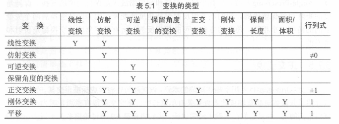
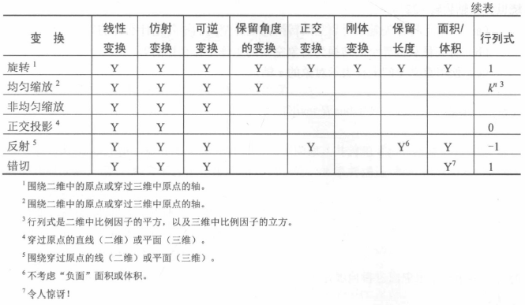

# 变换的分类

## 1. 线性变换

当以下公式成立时，映射就是线性的：

$$
F(a+b)=F(a)+F(b)
$$
且
$$
F(ka)=kF(b)
$$

可以通过矩阵乘法实现的任何变换都是线性变换。

线性变换不包含平移。

## 2. 仿射变换

仿射（Affine）变换是线性变换，然后是平移。因此仿射变换集是该组线性变换的超集：任何线性变换都是仿射变换，但并非所有仿射变换都是线性变换。

形式$\mathbf{v}'=\mathbf{v}\mathbf{M}+\mathbf{b}$的任何变换都是仿射变换。

## 3. 可逆变换

如果存在逆映射（Inverse Mapping），则映射是可逆的，使得
$$
F^{-1}(F(\mathbf{a}))=F(F^{-1}(\mathbf{a}))=\mathbf{a}
$$
存在非仿射的可逆变换，但我们暂时不会考虑它们。

除了投影之外的所有原始变换都是可逆的。

## 4. 保持角度的变换

如果两个矢量之间的角度在变换后大小或方向上没有改变，该变换就是保持角度（Angle-Preserving）的。只有平移、旋转和均匀缩放才是保持角度的变换。保持角度的矩阵也将保留比例。我们不考虑反射保持角度的变换，因为即使变换后两个矢量之间的角度大小相同，角度的方向也可能是相反的。所有保持角度的变换都是仿射和可逆的。

## 5. 正交变换

正交（Orthogonal）矩阵的行将形成标准正交基。正交变换很容易计算出它们的逆，并且它们在实践中经常出现。

平移、旋转和反射都只有正交变换，所有正交变换都是仿射和可逆的。正交矩阵将保留长度、角度、面积和体积的大小，但其符号可能不一样（反射变换）。

正交矩阵的行列式为±1。

## 6. 刚体变换

刚体变换（Rigid Body Transformation）是指改变对象的位置和方向但不改变其形状的变换。保留所有角度、长度、面积和体积。平移和旋转都是刚体变换，但仿射则不被认为是严格的刚体变换。

刚体变换也称为合适变换（Proper Transformation）。所有刚体变换都是正交的、保持角度的、可逆的和仿射的。刚体变换是本节讨论中最严格的变换类，但它们在实践中也非常常见。

任何刚体变换矩阵的行列式均为1。

