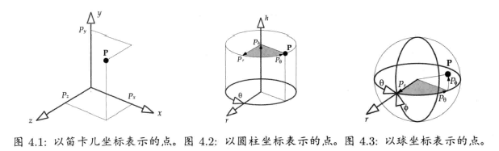
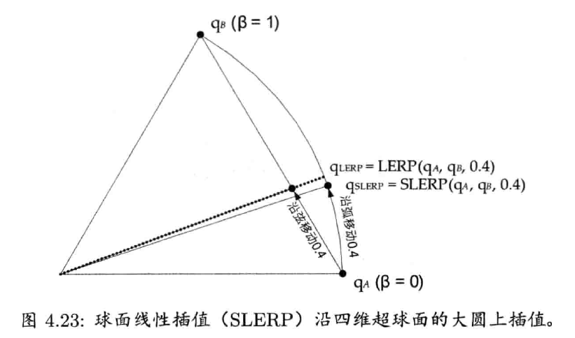

# 第四章 游戏所需的三维数学

## 1. 点和矢量

大部分现代3D游戏都是由虚拟世界里的三维物体组成的。游戏引擎需记录这些物体的位置（position）、定向（orientation）和比例（scale），不断改变这些属性以产生动画，并把这些属性变换（transform）至屏幕空间，使物体能渲染在屏幕上。在游戏中，三维物体几乎都是由三角形组成的，其中的三角形顶点（vertex）则以点（point）表示。

### (1) 点和笛卡尔坐标

笛卡尔坐标系（Cartesian coordinate system）是游戏程序员最常用的坐标系。$(P_x, P_y, P_z)$

其他一些常用的坐标系如下：

- **圆柱坐标系（cylindrical coordinate system）**：垂直高度轴$h$、从垂直轴发射出来的辐射轴$r$、yaw角度$\theta$。$(P_h, P_r, P_\theta)$
- **球坐标系（spherical coordinate system）**：俯仰角（pitch）phi($\phi$)、偏航角（yaw）theta($\theta$)和半径长度$r$。$(P_r, P_\phi, P_\theta)$

### (2) 左手坐标系与右手坐标系的比较

左右手坐标系相互转换只需要把其中一个轴反转，并保留另外两个轴不变即可。

数学法则在左手和右手坐标系里并不会改变，左手和右手的约定只应用在可视化过程中，并不影响底层里的数学。（利手/handedness对物理模拟中的叉积有影响，但在大部分游戏编程中可以忽略这些细微的地方。详情可参阅维基百科[Pseudovector-赝矢量](http://en.wikipedia.org/wiki/Pseudovector)）

三维图形程序员一般以左手坐标系工作，并以y轴向上、x轴向右、z轴向观察者里去。当三维图形以此坐标系渲染至二维屏幕时，z轴坐标增加意味着场景的**深度**增加。（此特性应用到z缓冲方案以解决深度遮挡。）

### (3) 矢量

**矢量（vector）**包含**模（magnitude）**和**方向**。**标量（scalar）**有模没有方向。

矢量也可以表示点，只要把其尾固定在坐标系的原点（origin）。这些矢量称为**位置矢量（position vector）**或矢径（radius vector）。

心中必须清晰区分点和矢量（即使数学程序库不做区分）。当把点和矢量转换成齐次坐标，与4×4矩阵一起操作时，点和矢量需以不同方式工作，所以混淆两者会导致出错。

#### a. 笛卡尔基矢量

按照笛卡尔坐标系的3个主轴去定义3个**正交单位矢量（orthogonal unit vector）**。矢量$\mathbf{i}$，$\mathbf{j}$，$\mathbf{k}$有时称为笛卡尔**基矢量（basis vector）**。

### (4) 矢量运算

#### a. 矢量和标量的乘法

#### b. 加法和减法

#### c. 模

模(magnitude)

#### d. 矢量运算的实际运用

可以对已知量使用加、减、缩放、模等运算产生新的数据。

- 显式欧拉法/explicit Euler method

- 球体对球体的相交测试

（当编写高效能软件时，不要计算非必需的平方根。）

#### e. 归一化和单位矢量

**单位矢量（unit vector）**即是模为1的矢量。

**归一化（normalization）**：
$$
\mathbf{u}=\frac{\mathbf{v}}{\vert \mathbf{v} \vert}=\frac{1}{v}\mathbf{v}
$$

#### f. 法矢量

某表面（surface）的**法矢量（normal vector）**是指矢量垂直于该表面。一个平面（plane）可用一点和一个法矢量来定义。在三维图形中，经常大量使用法矢量计算光线和材质表面之间的夹角。

法矢量一般为单位矢量，但非必要条件。

#### g. 点积和投影

**点积（dot product）**，又称为标量积（scalar product）或内积（inner product）。
$$
\mathbf{a}\cdot\mathbf{b}=\vert \mathbf{a} \vert\vert \mathbf{b} \vert \cos{\theta}
$$
##### (i) 矢量投影

若$\mathbf{u}$为单位矢量，则点积$\mathbf{a}\cdot\mathbf{u}$表示在$\mathbf{a}$在$\mathbf{u}$方向上的投影（production）长度。

##### 模作为点积

模的平方可以用矢量和自身的点积计算。
$$
{\vert \mathbf{a} \vert}^2 = \mathbf{a} \cdot \mathbf{a}
$$

##### (ii) 点积判定（dot product test）

点积非常适合判断两矢量是否互共线（collinear）或垂直，或测试两矢量是否大致在相同或相反反向。

- 共线：$(\mathbf{a}\cdot\mathbf{b})=\vert\mathbf{a}\vert\vert\mathbf{a}\vert=ab$
- 共线但相反方向：$(\mathbf{a}\cdot\mathbf{b})=-ab$
- 垂直：$(\mathbf{a}\cdot\mathbf{b})=0$
- 相同方向：$(\mathbf{a}\cdot\mathbf{b})>0$
- 相反方向：$(\mathbf{a}\cdot\mathbf{b})<0$

##### (iii) 其他点积的应用

点积可以应用在游戏编程中许多不同的问题上。

例如，要得悉某个敌人是在玩家的面前还是后面，先用减法找出由玩家位置$\mathbf{P}$至该敌人位置$\mathbf{E}$的矢量$\mathbf{v}=\mathbf{E}-\mathbf{P}$。再假设玩家面向的方向为矢量$\mathbf{f}$。那么点积$d=\mathbf{v}\cdot\mathbf{f}$可以用来测试敌人在玩家前面还是后面，前面则点积为正，后面则点积为负。

点积也可以用来计算任意一点在某平面上方或下方的高度。

#### h. 叉积

**叉积（cross product）**，又称为矢量积（vector product）或外积（outer product）。

两个矢量的叉积会产生另一个矢量，该矢量垂直于原来的两个相乘矢量。

##### (i) 叉积的模

$$
\vert\mathbf{a}\times\mathbf{b}\vert=\vert\mathbf{a}\vert\vert\mathbf{b}\vert\sin{\theta}
$$

##### (ii) 叉积的方向

当使用右手坐标系时，可以使用**右手法则（right-hand rule）**来表示叉积的方向。若使用左手坐标系，则叉积是用**左手法则（left-hand rule）**来定义。

##### (iii) 叉积的特性

叉积不符合**交换律**：
$$
\mathbf{a}\times\mathbf{b} \ne \mathbf{b}\times\mathbf{a}
$$
然而，叉积符合**反交换律**：
$$
\mathbf{a}\times\mathbf{b}=\mathbf{b}\times\mathbf{a}
$$

叉积在加法上符合分配律：
$$
\mathbf{a}\times(\mathbf{b} + \mathbf{c}) = (\mathbf{a}\times\mathbf{b}) + (\mathbf{a}\times\mathbf{c})
$$
叉积和标量乘法可如下结合：
$$
(s\mathbf{a})\times \mathbf{b} = \mathbf{a}\times (s\mathbf{b}) = s(\mathbf{a}\times \mathbf{b})
$$
笛卡尔基矢量之间有以下叉积关系：
$$
\begin{aligned}
\mathbf{i}\times\mathbf{j} &= -(\mathbf{j}\times\mathbf{i}) = \mathbf{k} \\
\mathbf{j}\times\mathbf{k} &= -(\mathbf{k}\times\mathbf{j}) = \mathbf{i} \\
\mathbf{k}\times\mathbf{i} &= -(\mathbf{i}\times\mathbf{k}) = \mathbf{j} \\
\end{aligned}
$$
这3个叉积定义了绕笛卡尔轴的**正旋（positive rotation）**方向。正旋自x到y（绕z轴）、自y到z（绕x轴）、自z到x（绕y轴）。注意绕y轴旋转时，是按“反向”字母顺序自z到x的。这可以用来解释为何绕y轴的旋转矩阵，相对绕x、z轴的旋转矩阵而言，是倒转（inverted）的。

##### (iv) 叉积的实际应用

最常见的是，用叉积来求垂直于两个矢量的矢量。

同样，叉积也可以用来求三角形表面或其他平面的法矢量。

叉积也可以应用在物理模拟中。

### (5) 点和矢量的线性插值

**线性插值（linear interpolation）**是一个简单的数学运算，用量计算两个已知点的中间点。此运算的名称统称简写成LERP，此运算定义如下：
$$
\begin{aligned}
\mathbf{L} &= \mathbf{LERP}(\mathbf{A}, \mathbf{B}, \beta)=(1-\beta)\mathbf{A}+\beta\mathbf{B} \\
	&= [(1-\beta)A_x+\beta B_x, (1-\beta)A_y+\beta B_y, (1-\beta)A_z+\beta B_z]
\end{aligned}
$$

数学上，LERP函数只是两矢量的**加权平均（weighted average）**。

## 2. 矩阵

我们可以视为3×3矩阵的行和列为三维矢量。若某3×3矩阵中的所有行及列矢量为单位矢量，则该矩阵称为**特殊正交矩阵（special orthogonal matrix）**、**各向同性矩阵（isotropic matrix）**或**标准正交矩阵（orthonormal matrix）**。这种矩阵表示纯旋转。

在某些条件下，4×4矩阵可表示任意三维**变换**，包括**平移**、**旋转**和**缩放**。这种矩阵称为变换矩阵。

**仿射矩阵（affine matrix）**是一种4×4变换矩阵，它能维持直线在变换前后的平行性以及相对的距离比，但是不一定维持直线在变换前后的绝对长度及角度。由平移、旋转、缩放及/或切变（shear）所组合而成的变换都是仿射矩阵。

### (1) 矩阵乘法

仅当两矩阵的**内维（inner dimension）**相等时（即$m_A=n_B$），两矩阵才可相乘。

矩阵乘法不符合交换律。

矩阵乘法有时称为**串接（concatenation）**，因为n个矩阵的积是一个矩阵，此矩阵把原来的变换按矩阵相乘的次序串接起来。

### (2) 以矩阵表示点和矢量

点和矢量都可表示为**行矩阵（row matrix）**或**列矩阵（column matrix）**。

- 要把行矢量乘以矩阵，矢量必须置于矩阵的左方（$\mathbf{v'}_{1\times n}=\mathbf{v}_{1\times n}\mathbf{M}_{n\times n}$）
- 要把列矢量乘以矩阵，矢量必须置于矩阵的右方（$\mathbf{v'}_{n\times 1}=\mathbf{M}_{n\times n}\mathbf{v}_{n\times 1}$）

### (3) 单位矩阵

**单位矩阵（identity matrix）**通常写作$\mathbf{I}$，它乘以任何其他矩阵都会得出和原来一样的矩阵。

### (4) 逆矩阵

矩阵$\mathbf{A}$的**逆矩阵（inverse matrix）**（写作$\mathbf{A}^{-1}$）能**还原**矩阵$\mathbf{A}$的变换。

并非所有矩阵都有逆矩阵，然而所有仿射矩阵（纯平移、旋转、缩放及切变的组合）都有逆矩阵。若矩阵的逆存在，则可用高斯消去法（Gaussian elimination）或LU分解（LU decomposition）求之。

矩阵串接后求逆，相当于反向串接各个矩阵的逆矩阵。例如：
$$
(\mathbf{ABC})^{-1}=\mathbf{C}^{-1}\mathbf{B}^{-1}\mathbf{A}^{-1}
$$

### (5) 转置矩阵

矩阵$\mathbf{M}$的**转置（transpose）**写作$\mathbf{M}^\text{T}$。转置矩阵就是把原来矩阵以主对角线（diagonal）为对称轴做反射。

转置矩阵很实用。首先，标准正交矩阵（纯旋转）的逆矩阵和转置矩阵是一样的；其次，对于基于行矢量的库和基于列矢量的库，两者的矩阵是转置关系。

矩阵串接的转置，为反向串接各个矩阵的转置。例如：
$$
(\mathbf{ABC})^\text{T}=\mathbf{C}^\text{T}\mathbf{B}^\text{T}\mathbf{A}^\text{T}
$$

### (6) 齐次坐标

当点或矢量从三维延伸至四维，变称为**齐次坐标（homogeneous coordinate）**，在游戏引擎中，大多数三维矩阵都采用4×4矩阵，与4元素的齐次坐标点或矢量进行运算。

4×4平移矩阵的样式：
$$
\begin{aligned}
\mathbf{r} + \mathbf{t} &=
	\begin{bmatrix} r_x &r_y &r_z &1 \end{bmatrix}
	\begin{bmatrix}
    	1 &0 &0 &0 \\
        0 &1 &0 &0 \\
        0 &0 &1 &0 \\
        t_x &t_y &t_z &1 \\
	\end{bmatrix} \\
	&= \begin{bmatrix} (r_x+t_x) &(r_y+t_y) &(r_z+t_z) &1 \end{bmatrix}
\end{aligned}
$$

#### a. 变换方向矢量

当用矩阵变换一个方向矢量时，就要忽略矩阵的平移效果。在齐次坐标中，可以把点的$w$分量设为1，而把方向矢量的w分量设为$\mathbf{0}$。
$$
\begin{bmatrix}\mathbf{v} &0\end{bmatrix} \begin{bmatrix}\mathbf{U} &0 \\ \mathbf{t} &1\end{bmatrix} = \begin{bmatrix}(\mathbf{v}\mathbf{U}+\mathbf{0}\mathbf{t}) &0\end{bmatrix} = \begin{bmatrix}\mathbf{v}\mathbf{U} &0\end{bmatrix}
$$
严格地说，（四维的）其次坐标转换为（三维的）非齐次坐标的方法是，把x、y、z分量除以w分量：
$$
\begin{bmatrix}x&y&z&w\end{bmatrix} \equiv \begin{bmatrix}\frac{x}{w}&\frac{y}{w}&\frac{z}{w}\end{bmatrix}
$$
此公式表明，可设点的w分量为1，方向矢量的w分量为0。矢量除以$w=1$，并不影响点的坐标；但矢量除以$w=0$则会产生无穷大。四维中无穷远的一点可以旋转但不可以平移。所以事实上，三维空间的纯方向矢量，在四维齐次空间是位于无穷远的点。

### (7) 基础变换矩阵

注意4×4变换矩阵可切割为4个组成部分：
$$
\begin{bmatrix} \mathbf{U}_{3\times3} &\mathbf{0}_{3\times1} \\ \mathbf{t}_{1\times3} &1 \\ \end{bmatrix}
$$

- 左上的$3\times3$矩阵$\mathbf{U}$代表旋转及/或缩放。
- 平移矢量$\mathbf{t}$
- 零矢量$\mathbf{0}=\begin{bmatrix}0&0&0\end{bmatrix}^\text{T}$
- 矩阵右下角的标量$1$

#### a. 平移

$$
\begin{bmatrix} \mathbf{r} &1 \end{bmatrix} \begin{bmatrix} \mathbf{I} &\mathbf{0} \\ \mathbf{t} &1 \\ \end{bmatrix} = \begin{bmatrix} (\mathbf{r} + \mathbf{t}) &1 \end{bmatrix}
$$

为求纯平移变换矩阵的逆矩阵，只需把$\mathbf{t}$求反（negate）（即分别反转$t_x$、$t_y$、$t_z$的正负号）。

#### b. 旋转

$$
\begin{bmatrix} \mathbf{r} &1 \end{bmatrix} \begin{bmatrix} \mathbf{R} &\mathbf{0} \\ \mathbf{0} &1 \\ \end{bmatrix} = \begin{bmatrix} (\mathbf{r}\mathbf{R}) &1 \end{bmatrix}
$$

绕x轴旋转：
$$
\text{rotate}_x(\mathbf{r}, \phi) = \begin{bmatrix}r_x&r_y&r_z&1\end{bmatrix} \begin{bmatrix}
1&0&0&0\\ 0&\cos\phi&\sin\phi&0\\ 0&-\sin\phi&\cos\phi&0\\ 0&0&0&1\\
\end{bmatrix}
$$
绕y轴旋转（注意，此矩阵是转置的——两个正负正弦是依主轴反射的）：
$$
\text{rotate}_y(\mathbf{r}, \theta) = \begin{bmatrix} r_x&r_y&r_z&1 \end{bmatrix} \begin{bmatrix}
\cos\theta&0&-\sin\theta&0\\ 0&1&0&0\\ \sin\theta&0&\cos\theta&0\\ 0&0&0&1\\
\end{bmatrix}
$$
绕z轴旋转：
$$
\text{rotate}_z(\mathbf{r}, \gamma) = \begin{bmatrix} r_x&r_y&r_z&1 \end{bmatrix} \begin{bmatrix}
\cos\gamma&\sin\gamma&0&0\\ -\sin\gamma&\cos\gamma&0&0\\ 0&0&1&0\\ 0&0&0&1\\ \end{bmatrix}
$$
纯旋转矩阵的逆矩阵，即是该旋转矩阵的转置矩阵。这是因为旋转的逆变换等同于用反向角度旋转，把角度求反就等于把两个正弦项求反，余弦项不变。

#### c. 缩放

$$
\begin{bmatrix} \mathbf{r} &1 \end{bmatrix} \begin{bmatrix} \mathbf{S}_{3\times3} &\mathbf{0} \\ \mathbf{0} &1 \\ \end{bmatrix} = \begin{bmatrix} \mathbf{r}\mathbf{S}_{3\times3} &1 \end{bmatrix}
$$

- 把矩阵求逆，只需把$s_x$、$s_y$、$s_z$用其倒数代替（即$1/s_x$、$1/s_y$、$1/s_z$）。

- 当三个轴的缩放因子相等，此变换称为**统一缩放（uniform scale）**。为了保证包围球（bounding sphere）检测的数学运算能够简单快捷，许多游戏引擎都加上限制，只容许对渲染用的几何物体和碰撞图元使用统一缩放。
- 当把一个统一缩放矩阵$\mathbf{S}_u$和一个旋转矩阵$\mathbf{R}$串接，相乘的次序并不重要（即$\mathbf{S}_u\mathbf{R}=\mathbf{R}\mathbf{S}_u$）。只有统一缩放才有这个特性。

### (8) 4×3矩阵

仿射矩阵的最右侧一列必然是一列$\begin{bmatrix}0&0&0&1\end{bmatrix}^\text{T}$的矢量，因此游戏程序员可以略去第4列，以节省内存。

### (9) 坐标空间

物理学上，一组坐标轴代表一个参考系（frame of reference），所以有时候又会称一组轴为**坐标系（coordinate frame，或简称为frame）**。游戏业界则会使用**坐标空间（coordinate space）**一词，或简称**空间（space）**，来表示一组坐标轴。

#### a. 模型空间

当使用Maya或3ds Max之类的工具建立三角形网格，三角形顶点的位置是相对于一个笛卡尔坐标系的，称此空间为**模型空间（model space）**，也可称为**物体空间（object space）**或**局部空间（local space）**。模型空间的原点可置于物体的中心位置，如物体的质心。对于人形及动物角色，可以把模型空间的原点置于足部和地面之间。

多数游戏对象都有先天的定向性。模型空间的轴通常会对准模型的自然方向，并会以直觉的标签为这些轴命名。

- 向前（front）：物体正常移动或朝向的方向，其轴称为前向轴。
- 向上（up）：物体向上的轴称向上轴。
- 向左或向右（left/right）：与物体的左边和右边对齐的轴分别称为向左轴和向右轴。使用那个轴取决于游戏引擎是采用左手还是右手坐标系的。

使用合乎直觉的轴名称可以减少混淆。比如，3个**欧拉角（Euler angle）**——俯仰角（pitch）、偏航角（yaw）、滚动角（roll）——经常用来表示飞机的定向。可以按照$(\mathbf{L,U,F})$基矢量去定义。

- 俯仰角（pitch）是绕**L**或**R**旋转的角度；
- 偏航角（yaw）是绕**U**旋转的角度；
- 滚动角（roll）是绕**F**旋转的角度。

#### b. 世界空间

**世界空间（world space）**是一个固定坐标空间。游戏世界中所有物体的位置、定向和缩放都会用此空间表示。此坐标空间把所有单个物体联系在一起，形成一个内聚的虚拟世界。

通常会把世界空间的原点置于接近可玩游戏空间的中心，因为当$(x,y,z)$的值非常大时，浮点小数会出现精度问题，这样设置原点可使精度问题降至最低程度。

#### c. 观察空间

**观察空间（view space）**又称为**摄像机空间（camera space）**，是固定于摄像机的坐标系。观察空间原点置于摄像机的焦点（focal point）（在计算机图形学中，通常采用眼睛/eye或视点/view point等术语表示观察空间的原点）。y轴向上、z轴顺着摄像机面对方向是最典型的，因为+z轴代表着屏幕的深度。

### (10) 基的变更

在游戏和计算机图形学里，经常把物体的位置、定向和缩放从某个坐标系转换至另一个坐标系。我们称此运算为**基的变更（change of basis）**。

#### a. 坐标空间的层次结构

坐标系是相对的。坐标空间会形成一个层阶结构。世界空间并无父，因为它是坐标空间树的根，其他坐标空间则直接或间接地相对于世界空间。

#### b. 构建改变基的矩阵

把点或方向从任何子坐标系$\text{C}$变换至其父坐标系$\text{P}$的矩阵，可写作$\mathbf{M}_{C\to P}$（读作“C至P”）。此下标表示矩阵把点或方向从子空间变换至父空间。一下等式可把任何子空间位置矢量$\mathbf{P}_C$变换至父空间位置矢量$\mathbf{P}_P$：
$$
\begin{aligned}
\mathbf{P}_P &= \mathbf{P}_C \mathbf{M}_{C\to P} \\
    \mathbf{M}_{C\to P} &= \begin{bmatrix}
        \mathbf{i}_C &0\\ \mathbf{j}_C &0\\ \mathbf{k}_C &0\\ \mathbf{t}_C &0\\
        \end{bmatrix} \\
	&= \begin{bmatrix}
        i_{C_x} &i_{C_y} &i_{C_z} &0\\
        j_{C_x} &j_{C_y} &j_{C_z} &0\\
        k_{C_x} &k_{C_y} &k_{C_z} &0\\
        t_{C_x} &t_{C_y} &t_{C_z} &0\\
        \end{bmatrix} \\
\end{aligned}
$$
以上方程中：

- $\mathbf{i}_C$为子空间$x$轴的单位基矢量，此矢量以父空间坐标表示。
- $\mathbf{j}_C$为子空间$y$轴的单位基矢量，此矢量以父空间坐标表示。
- $\mathbf{k}_C$为子空间$z$轴的单位基矢量，此矢量以父空间坐标表示。
- $\mathbf{t}_C$为子坐标系相对于父坐标系的平移。

##### (i) 缩放子轴

通过简单且恰当得缩放单位基矢量，便可以缩放子坐标系统。

#### c. 从矩阵中获取单位基矢量

给定任何4×4放射矩阵，都可以用反向思维，从恰当的矩阵行（若使用列矢量则为矩阵列）中获取子空间基矢量$\mathbf{i}_C$、$\mathbf{j}_C$、$\mathbf{k}_C$。

#### d. 变换坐标系还是矢量

可以把矩阵$\mathbf{M}_{C\to P}$想象为，把父坐标轴变换至子坐标轴。这是点和矢量变换的逆变换。换句话说，若某矩阵把矢量从子空间变换至父空间，那么该矩阵也同时把坐标轴从父空间变换至子空间。

对于某些问题，从矢量变换的角度去思考比较容易；而另一些问题，则适合用坐标轴变换。

### (11) 变换法矢量

法矢量是一种特殊的矢量，因为它除了是单位矢量（通常情况是）外，法矢量还有附加要求——维持与对应表面或平面垂直。

一般来说，若点（法矢量以外的）矢量可用3×3矩阵$\mathbf{M}_{A\to B}$将其从空间A旋转至空间B，则法矢量$\mathbf{n}$可使用该矩阵的**逆转置**矩阵$(\mathbf{M}^{-1}_{A\to B})^\text{T}$做变换。

然而，若矩阵$\mathbf{M}_{A\to B}$只含统一缩放而无切变，那么可以观察到，表面间和矢量间的夹角在A和B空间中是不变的。然而，若$\mathbf{M}_{A\to B}$含非统一缩放或切变（即$\mathbf{M}_{A\to B}$**非正交**），则表面间和矢量间的夹角，从A空间变换到B空间后会改变。在A空间垂直于某表面的矢量，在B空间则未必如此。

### (12) 内存中存储矩阵

用C/C++二维数组存储矩阵有下面两个选择。

1. 把矢量$(\mathbf{i}_C,\mathbf{j}_C,\mathbf{k}_C,\mathbf{t}_C)$**连续**置于内存中（即每行含一个矢量）。
2. 把矢量在内存中**分散对齐（stride）**（即每列含一个矢量）。

大多数游戏引擎都会使用方法1，即使用C/C++二维数组的每行去存储矢量（行矢量）。

要得知使用的引擎中采用哪种布局，其中一个方法是，寻找4×4平移矩阵生成函数。（每个优良的三维数学库都应有此函数。）之后查看源代码，找出$\mathbf{t}$矢量的元素是怎么储存的。若不能读取数学库的源代码（游戏业界里这种情况的可能性较小），则可以用容易辨认的平移矢量，如$(4,3,2)$，去调用该平移生成函数，再查看其传回的矩阵。

## 3. 四元数

矩阵并不总是理想的旋转表达形式，理由如下。

1. 矩阵需9个浮点值表示旋转，这显然是有冗余的，因为旋转只有3个自由度（degree of freedom, DOF）——偏航角、俯仰角、滚动角。
2. 用矢量矩阵乘法来旋转矩阵，需3个点积，即共9个乘数及6个加数。若有可能，我们希望找到一种旋转表示方式，能加快旋转运算。
3. 在游戏和计算机图形学中，经常需要计算在两个已知旋转之间进行插值。若以矩阵表示A和B的定向，要计算这些中间值是很困难的。

**四元数（quaternion）**的旋转表达形式可以克服以上3个问题。

四元数作为复数（complex number）的延伸，遵守一组规则，这些规则称为实数域上的**四维赋范可除代数（normed division algebra）**。**单位长度**的四元数能代表三维旋转。

### (1) 把单位四元数视为三维旋转

单位四元数和轴角（axis-angle）旋转表达方式很相似。然而，四元数在数学上比轴角更方便。

### (2) 四元数运算

两个四元数相加的和不能代表三维旋转，因为该四元数并不是单位长度的。因此，在游戏引擎中不会看见四元数的和，除非它们用某种方式缩放至符合单位长度的要求。

#### a. 四元数乘法

四元数乘法有几种，和三维旋转应用相关的乘法称为格拉斯曼积（Grassmann product）。

#### b. 共轭及逆四元数

通常计算逆四元数比计算3×3矩阵快得多，在某些情况下，我们可以利用这一特点优化引擎。

##### (i) 积的共轭及逆四元数

### (3) 以四元数旋转矢量

#### a. 四元数的串接

### (4) 等价的四元数和矩阵

任何三维旋转都可以从3×3矩阵表达方式和四元数表达方式之间自由转换。

### (5) 旋转性的线性插值

套用四维矢量的线性插值（LERP）至四元数。LERP运算是两个四元数的加权平均。注意插值后的四元数需要再归一。

#### a. 球面线性插值

LERP运算没考虑四元数其实是四维**超球（hypersphere）**上的点。LERP实际上是沿超球的**弦（chord）**上进行插值，而不是在超球面上插值。这样会导致，当$\beta$以恒定速改变时，旋转动画并非以恒定角速度进行。旋转在两端看似较慢，但在动画中间就会较快。

解决此问题的方法是，采用LERP运算的变体——**球面线性插值（spherical linear interpolation）**，简称SLERP。SLERP使用正弦和余弦在四维超球面的**大圆（great circle）**上进行插值，而不是沿弦上插值。当$\beta$以常数速率变化，插值结果便会以常数角速度变化。

#### b. SLERP还是不SLERP（现在仍是个问题）

在游戏引擎中是否应使用SLERP还未成定论。最好是先测试你的SLERP和LERP实现的效能，再做决定。如果你的SLERP真的慢（并且不能加快，或没时间去优化），通常用LERP取而代之还是可以的。

## 4. 比较各种旋转表达方式

### (1) 欧拉角

欧拉角由三个标量值组成：偏航角、俯仰角、滚动角。有时候会用矢量$\begin{bmatrix}\theta_\gamma &\theta_P &\theta_R\end{bmatrix}$表示这些量。

优势：

- 简单又小巧（3个浮点数）
- 直观——很容易把偏航角、俯仰角、滚动角视觉化。
- 围绕单轴的旋转很容易插值。

问题：

- 对于任意方向的旋转轴，欧拉角则不能轻易插值。

- 欧拉角会遭遇**万向节死锁（gimbal lock）**的状况。当旋转90°时，三主轴中的一个会与另一个主轴完全对齐，万向节死锁就会出现。

- 旋转的先后次序对结果是有差别的。欧拉角的旋转次序并无所有领域通用的标准。因此，旋转角度$\begin{bmatrix}\theta_\gamma &\theta_P &\theta_R\end{bmatrix}$并不能定义一个确定的旋转，必须指定旋转次序才能正确地诠释这些数字。

- 对于要旋转的物体，欧拉角依赖从x/y/z轴和前/左右/上方向的映射。例如，偏航角总是指绕向上轴的旋转。但若没有额外信息，就无法知道这是对应哪个轴。

### (2) 3×3矩阵

3×3矩阵是方便有效的旋转表达方式。

- 3×3矩阵不受万向节死锁影响，并可以独一无二地表达任意旋转。
- 矩阵可通过矩阵乘法（即一系列点积和加法），直接了当地施于点或矢量。
- 对于硬件加速点乘和矩阵乘法，多数CPU及所有GPU都有内建支持。
- 要反转方向的旋转，可求其逆矩阵，然而，纯旋转的转置矩阵即为逆矩阵，此乃非常简单的运算。
- 4×4矩阵更可以用来表示仿射变换（旋转、平移、缩放）。

缺点：

- 旋转矩阵不太直观。
- 旋转矩阵不容易插值。
- 相对欧拉角，旋转矩阵需要大量存储空间（9个浮点数）。

### (3) 轴角

一个以单位矢量定义的旋转轴，再加上一个标量定义的旋转角，也可用来表示旋转。这称为轴角（axis-angle）表达方式，有时会写成四维矢量形式$\begin{bmatrix}\mathbf{a} &\theta\end{bmatrix}$，其中$\mathbf{a}$是旋转轴，$\theta$为弧度单位的旋转角。在右手坐标系中，正旋的方向由右手法则定义，而在左手坐标系则采用左手法则。

轴角的表达方式优点在于比较直观，而且紧凑（4个浮点数）（轴角等价于另一种更简洁的表达方式——旋转矢量/rotation vector，矢量方向为旋转轴，模则是弧度单位的旋转角。旋转矢量只需要储存为3个浮点数。）

轴角的重要局限之一，是不能简单地进行插值。此外，轴角形式的旋转不能直接施于点或矢量，而须先把轴角转换为矩阵或四元数。

### (4) 四元数

单位长度的四元数可以表示旋转，其形式与轴角相似。主要区别在于，四元数的旋转轴矢量的长度为旋转半角的正弦，并且其第四分量不是旋转角，而是旋转半角的余弦。

对比轴角，四元数形式带来两个极大的好处：

1. 四元数乘法能串接旋转，并把旋转直接施于点和矢量。
2. 可轻易地用LERP或SLERP运算进行旋转插值。

四元数只需存储为4个浮点数，这也优于矩阵。

> 由于旋转用的四元数必为单位长度，基于此约束，存储四元数时可略去其中一个分量。例如，存储时略去$q_w$，然后读取时用$q'_w=\pm\sqrt{1-(q_x^2+q_y^2+q_z^2)}$重建原来的四元数。但我们还需要知道原本$q_w$的符号。利用四元数作为旋转时q等效于-q的特性，如果原本的$q_w<0$，我们就存储其等效的-q，那么重建时就可确定$q_w$为非负数了。
>
> 使用这个技巧后，旋转用的单位四元数仅需存储为3个浮点数，所需空间与欧拉角和旋转矢量相同。

### (5) SQT变换

单凭四元数只能表示旋转，而4×4矩阵则可表示任意仿射变换（旋转、平移、缩放）。当四元数结合**平移矢量**和**缩放因子**（对统一缩放而言是一个标量，对非统一缩放而言是一个矢量），就能得到一个4×4仿射矩阵的可行替代形式。我们有时候称之为**SQT变换**，因为其包含缩放（**s**cale）因子、表示旋转的四元数（**q**uaternion）和平移（**t**ranslation）矢量。
$$
\text{SQT} = \begin{bmatrix}s &\text{q} &\mathbf{t}\end{bmatrix} \ (统一缩放标量s)
$$
或
$$
\text{SQT} = \begin{bmatrix}\mathbf{s} &\text{q} &\mathbf{t}\end{bmatrix} \ (非统一缩放矢量\mathbf{s})
$$
SQT变换广泛地应用在计算机动画中，因为其体积较小（统一缩放需要8个浮点数，非统一缩放需要10个，相对4×3矩阵则需要12个），并且SQT变换容易插值。插值时，平移矢量和缩放因子采用LERP，四元数则可使用LERP和SLERP。

### (6) 对偶四元数

还有一个数学对象可以完整表示涉及旋转、平移、缩放的变化，称为**对偶四元数（dual quaternion）**。

对偶四元数和普通四元数很像，区别在于对偶四元数的4个分量是**对偶数（dual number）**。对偶数可以写成非对偶部（non-dual part）和对偶部（dual part）之和：$\hat{a}=a_0+\varepsilon a_\varepsilon$，其中$\epsilon$称为**对偶单位（dual unit）**，定义为$\varepsilon^2=0$。

因为每个对偶数都能表示为两个实数（非对偶部和对偶部），对偶四元数可表示为含8个元素的矢量。对偶四元数也可表示为两个普通四元数之和：$\hat{\text{q}}=\text{q}_0+\varepsilon\text{q}_\varepsilon$。

### (7) 旋转和自由度

**自由度（degree of freedom, DOF）**指物体有多少互相独立的可变状态。一个三维物体在平移上有3个DOF，在旋转上也有3个DOF，共计6个DOF。

各种表示法为何都能表示3个DOF的旋转？答案在于**约束（constraint）**。

所有三维旋转表达方式都有3个或以上的浮点参数，但一些表达方式也会对参数加上一个或一个以上的约束。这些约束标明参数间并非独立的。
$$
N_{DOF} = N_{参数} - N_{约束}
$$

- 欧拉角：3个参数 - 0个约束 = 3个DOF。
- 轴角：4个参数 - 1个约束 = 3个DOF。约束：轴矢量限制为单位长度。
- 四元数：4个参数 - 1个约束 = 3个DOF。约束：四元数限制为单位长度。
- 3×3矩阵：9个参数 - 6个约束 = 3个DOF。约束：3个行矢量和3个列矢量都限制为单位长度（每个都是三维矢量）。

## 5. 其他数学对象

### (1) 直线、光线及线段

一条无限长直线（line）可表示为直线上一点$\mathbf{P}_0$及沿直线方向的单位矢量$\mathbf{u}$。直线的**参数方程（parametric equation）**可从起点$\mathbf{P}_0$，沿单位矢量$\mathbf{u}$方向移动任意距离$t$，求出直线上的任何一点$\mathbf{P}$。无穷大的点集$\mathbf{P}$成为标量$t$的**矢量函数（vector function）**。
$$
\mathbf{P}(t)=\mathbf{P}_0+t\mathbf{u} \ \ \ \ (其中 -\infty < t < \infty)
$$
**光线（ray）**也是直线，但光线只沿一个方向延伸至无穷远。光线可表示为$\mathbf{P}(t)$加上约束$t\ge0$。

**线段（line segment）**受限于两个端点$\mathbf{P}_0$和$\mathbf{P}_1$。线段也可表示为$\mathbf{P}(t)$，配合一下两种形式之一（当中$\mathbf{L}=\mathbf{P}_1 - \mathbf{P}_0$，$L=\vert\mathbf{L}\vert$为线段长度）。

1. $\mathbf{P}(t)=\mathbf{P}_0+t\mathbf{u}$，其中 $0 \le t \le L$。
2. $\mathbf{P}(t)=\mathbf{P}_0+t\mathbf{L}$，其中 $0 \le t \le 1$。

第2种形式特别方便，因为参数$t$是正规化的。这意味着不需要把$L$存储为另一个浮点参数，$L$已经编码进矢量$\mathbf{L}=L\mathbf{u}$里（反正$\mathbf{L}$本身需要存储）。（这种线段参数方程式，其实等价于两点的线性插值。用两端点$\mathbf{P}_0$和$\mathbf{P}_1$，或是$\mathbf{P}_0$加上$\mathbf{L}$表示线段也是可行的。）

### (2) 球体

球体（sphere）通常定义为中心点$\mathbf{C}$加上半径$r$，这恰好能置于一个四元素矢量$\begin{bmatrix}C_x &C_y &C_z &r\end{bmatrix}$。稍后会看到，在SIMD矢量处理是，把数据打包为矢量有显著好处。

### (3) 平面

**平面（plane）**是三维空间中的二维表面。

平面方程可写成（一般式/general form）：
$$
Ax + By + Cz + D = 0
$$
平面也可以用平面上一点$\mathbf{P}_0$和其单位法矢量$\mathbf{n}$来表示。此表达方法有时候称为点法式（point-normal form）。

> 此外还有三点式（three point form）、参数式（parametric form）、截距式（intercept form）等。

传统平面方程参数A、B、C可诠释为三维矢量，此矢量沿平面的法线方向。若把$\begin{bmatrix}A&B&C\end{bmatrix}$归一化至单位长度，则单位矢量$\begin{bmatrix}a&b&c\end{bmatrix}=\mathbf{n}$，并且参数D正规化为$d=D/\sqrt{A^2+B^2+C^2}$后，$d$就是平面到原点的距离。若法矢量（$\mathbf{n}$）指向原点，则$d$为正数；相反，若法矢量原理原点方向，则$d$为负数。事实上，正规化后的$ax+by+cz+d=0$形式（海塞正规式/Hessian normal form）也可写成$\mathbf{n}\cdot\mathbf{P}=-d$，意味着当任何点$\mathbf{P}$投影在矢量$\mathbf{n}$方向时，投影距离为$-d$。

如同球体，平面也可包裹为四元素矢量。可使用单位法矢量和平面至原点的距离唯一地表示平面。四元素矢量$\mathbf{L}=\begin{bmatrix}\mathbf{n}&d\end{bmatrix}=\begin{bmatrix}a&b&c&d\end{bmatrix}$，是既紧凑又方便的表达和内存存储方式。注意，如果$\mathbf{P}$写成$w=1$的齐次坐标，方程$\mathbf{L}\cdot\mathbf{P}=0$其实等价于$\mathbf{n}\cdot\mathbf{P}=-d$。

用四元素矢量形式定义的平面可以很容易地从某个坐标系变换至另一个坐标系。给定矩阵$\mathbf{M}_{A\to B}$，能把点和（非法线）矢量从空间A变换至空间B。前文曾述，要变换法矢量，可使用该矩阵的逆转置矩阵$(\mathbf{M}^{-1}_{A\to B})^\text{T}$。把逆转置矩阵施于四元素平面矢量$\mathbf{L}$，实际上也能正确地把平面从空间A变换至空间B。

### (4) 轴对齐包围盒

轴对齐包围盒（axis-aligned bounding box, AABB）是三维**长方体**，其6个面都与某坐标系的正交轴对齐。因此，AABB可以用六元素矢量$\begin{bmatrix}x_\text{min}&x_\text{max}&y_\text{min}&y_\text{max}&z_{\text{min}}&z_\text{max}\end{bmatrix}$表示，即3个主轴上的最大值和最小值，又或以两点$\mathbf{P}_{\min}$和$\mathbf{P}_{\max}$表示。

此简单表达方式，可以用来简单检测一点$\mathbf{P}$是否在给定的AABB之内，检测时只需测试以下所有条件是否成立：
$$
\begin{aligned}
&P_x \ge x_\text{min}&P_x \le x_\text{max} \\
&P_y \ge y_\text{min} &P_y \le y_\text{max} \\
&P_z \ge z_\text{min} &P_z \le z_\text{max} \\
\end{aligned}
$$
因为AABB的交集测试这么高效，AABB常会用作碰撞检测的“早期淘汰”测试。

### (5) 定向包围盒

定向包围盒（oriented bounding box, OBB）也是三维**长方体**，但其定向与其包围的物体安装某逻辑方式对齐。通常OBB与物体的局部空间轴对齐。这样的OBB在局部空间中如同AABB。

有多种方法测试一点是否在OBB内，常见方法是把点变换至OBB的“对齐”坐标空间，在运用AABB相交测试。

### (6) 平截头体

**平截头体（frustrum）**由6个平面构成，以定义**截断头的四角锥形状**。

平截头体常见于三维渲染，因为透视投影由虚拟摄像机视点造成，所以其三维世界中的可视范围是一个平截头体。平截头体的上下左右四个面代表屏幕的4边，而前后两面则代表近/远剪切平面（near/far clipping plane）（即在观察空间里所有可视点的最小/最大z坐标）。

平截头体可方便地表示为6个平面的数组，而每个平面则以点法式表示（一般式也可以）。

要测试一个点是否在平截头体里有点复杂，但基本上是用点积测出该点是在每个平面的前面还是后面。若该点皆在6平面之内（须定义平面法线是向内还是向外），则该点在平截头体内。

有一个有用的技巧，把要测试的世界空间点，通过摄像机的透视投影变换至另一空间，此空间称为**齐次裁剪空间（homogeneous clip space）**。世界空间的平截头体在此空间中变成AABB。那么就可以更简单地进行内外测试。

### (7) 凸多面体区域

凸多面体区域（convex polyhedral region）有任意数量的平面集合定义，平面的法线全部向内（或全部向外）。测试一点是否在平面构成的体积内，方法与平截头体测试类似，只不过面的数量可能更多。

游戏中，凸多面体区域非常适合做任意形状（多个凸多面体区域的并集可表示凹多面体）的触发区域（trigger region）。

## 6. 硬件加速的SIMD运算

单指令多数据（single instruction multiple data, SIMD）是指，现代微处理器能用一个指令并行地对多个数据执行数学运算。SIMD广泛地应用在游戏引擎的数学库中，因为它能极迅速地执行常见的矢量运算。

## 7. 随机数

两个最常见的随机数产生器：线性同余产生器和梅森旋转算法。

随机数产生器的好坏，在于其产生多少个数字之后会重复。

### (1) 线性同余产生器

线性同余产生器（linear congruential generator, LCG）可以简捷地产生伪随机序列。

LCG并不能产生特别高质量的伪随机序列。LCG产生的序列并不符合一些广泛接受的准则，比如长周期、高低位有接近的长周期、产生的值在序列上和空间上都无关联性。

### (2) 梅森旋转算法

梅森旋转（Mersenne Twister, MT）伪随机产生器的算法是特别为改进LCG的众多问题而设计的。

优点：

1. MT设计成有庞大的周期：$2^{19937}-1$。在实际应用中，只有很少的情况下需要更长的周期，因为大部分应用都不需要$2^{19937}$个唯一组合。
2. MT具有非常高阶的均匀分布维度（dimensional equidistriution）。这是指，输出序列里的连续数字，其序列关联性微不足道。
3. MT通过了多个统计随机性测试，包括严格的Diehard测试。
4. MT很快。

### (3) 所有之母及Xorshift

因开发Diehard随机性测试组而闻名的计算机科学家和数学家George Marsaglia于1994年发表了一个伪随机数产生器算法，此算法比MT更易实现且运行更快。他声称此算法能产生的32位数列，其不重复周期为$2^{250}$设计者把此算法称为**所有伪随机数产生器之母（mother of all pseudo-random number generator）**。

之后，Marsaglia发布了另一个产生器Xorshift，其随机性介乎MT和所有之母之间，但速度稍快于所有之母。
