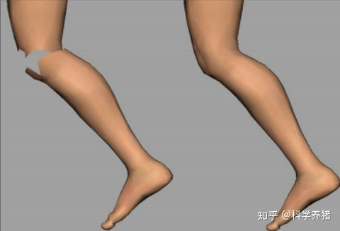
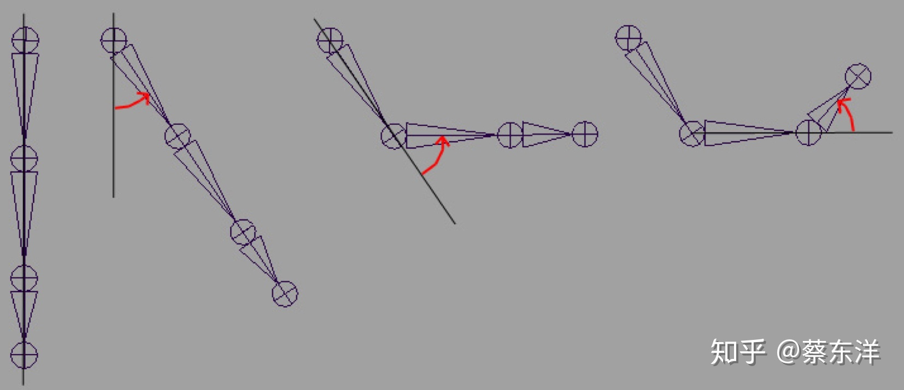
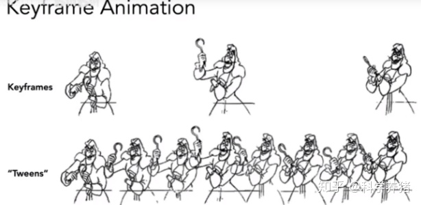
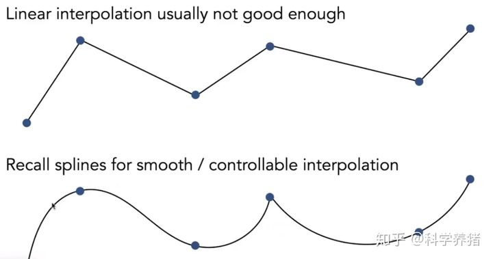
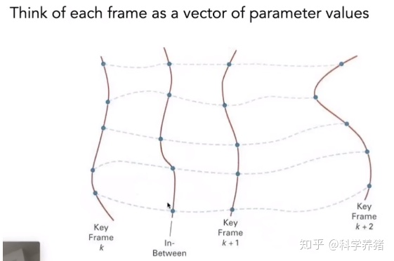

# 骨骼动画原理

### 游戏动画发展趋势

1. Animated Texture  （2d）

2. Rigid hierarchical animation （3d）

   前两种的表现完全不能满足现代游戏需求

3. Per-vertex animation

- 三维上动画最暴力的是逐顶点动画，蛮力的记录并还原每个顶点的逐帧位置，这是一种数据密集型技术。不适合游戏这种软实时。
- 通常用于面部动画。

4. Morph target animation

- 通过制作相对少量的extreme pose，在运行中对两个pose进行混合、线性插值来驱动动画。

5. Skinned animation

- 可以视为针对逐顶点动画的一种有损数据压缩方案

模型动画有2种：**顶点动画**和**骨骼动画**。

骨骼动画/蒙皮动画（Skinned Animation）/骨架动画（Skeleton Animation），是一种[计算机动画](https://zh.wikipedia.org/wiki/計算機動畫)技术，它将三维模型分为两部分：用于绘制模型的**蒙皮**（Skinned Mesh），以及用于控制动作的骨架。跟传统逐格动画相异，骨骼动画利用建立好的骨架套用到一张或多张图片，使之动作，比起一般一张一张绘出动作省了很多时间与精力，且能更生动的动作。骨骼动画包含了骨骼（Bone）和蒙皮（Skinned Mesh）两部分数据。

相互相连接的骨骼组成骨架结构，通过改变骨骼的朝向和位置来生成动画。

蒙皮则是这个技术的关键点。蒙皮的“皮”指的不是贴图，而是**Mesh**本身，蒙皮是指把**Mesh的顶点附着（绑定）在骨骼上**，并且每个顶点可以被多个骨骼控制，这样在关节处的顶点由于同时受到父子骨骼的拉扯而改变位置从而消除了缝隙。



顶点的**蒙皮信息**包含了**顶点受哪些骨骼影响**以及这些**骨骼影响该顶点的权重**。有了蒙皮信息，只要我们的骨骼正常运动，蒙皮便会跟着骨骼一起动起来。

### 常见概念

SkinnedMeshAnimation:

- 骨骼层次结构（BoneHierarchy、 也叫 articulated skeleton 铰链骨架）
  - Bone: 包含 BindPoses 信息
- 蒙皮 (SkinnedMesh)
- 骨骼的动画关键帧数据（AnimalClip）

SkinnedMesh:

- 网格 (Mesh) 数据
- 网格蒙皮数据 (SkinInfo)
  - 顶点对应的骨骼
  - 权重（weight）：记录在Mesh中，用一个数组存储。当然，weight 也可以记录在骨骼上，或者独立存储。

## 制作流程

首先绑定好骨骼，2足类一般使用的比较多的就是 T-Pose，并根据设计需要添加一些额外的骨骼（翅膀、飘带等），根据程序需要添加一些额外的虚拟体挂点（武器、装备等），这一步通常需要提前规划好，否则后续需求更改重新绑定骨骼会比较麻烦。一般会选择盆骨的位置作为根骨骼，但是这种情况下根骨骼与世界原点并不重合，通常会在骨骼空间选择两脚之间的中点作为原点（模型空间的原点）构建一根骨骼，让根骨骼 Bip01 作为这根骨骼唯一的子骨骼。绑定好骨骼以后，根据设计的动画方案，调整骨骼位置和朝向并K帧，最终导出动画文件。

当我们把模型放到世界坐标系中的时候，如果模型带有骨骼，骨骼会决定模型在世界坐标系中的位置和朝向，因为Mesh的顶点都是依附在骨骼上的。我们调整的是根骨骼的位置和朝向，子骨骼会根据骨骼层次结构中的父子关系计算得出。

在骨骼的层级结构里面，我们用基于关节为原点的坐标空间来进行描述，所有的子骨骼都是基于关节为原点进行平移、旋转和缩放的（通常都是旋转矩阵，骨骼之间通过旋转变换就可以有复杂的动作组合）。如下图所示，父骨骼的变换会影响到自身和所有子骨骼。



## 原理

### 空间变换

模型顶点需要从**模型空间**变换到所关联的骨骼自身的**骨骼空间（$\text{BoneOffsetMatrix}$）**，再通过骨骼的世界变换计算出世界坐标（$\text{BoneCombinedTransformMatrix}$）。

模型空间即模型师建模时的空间，如上所述，一般是模型两脚之间的中点，这时模型空间和世界空间是重合的，而根骨骼的Transform也是基于世界空间的。那如果想要得到子骨骼在世界空间的变化矩阵，我们要自下而上地通过一层层的矩阵变化。

有了蒙皮信息，完成了坐标空间的变换，下一个重要的步骤就是顶点混合。混合的意义是消除关节位置的缝隙，让动画更加自然。在蒙皮信息中的骨骼权重便是其中的关键数据，我们需要遍历影响该顶点的所有骨骼，计算出顶点的世界坐标，然后用骨骼权重进行加权平均。

### Bindpose 原理

**Skinning**

When a mesh is deformed by the skinning operation, the skinned position $P_{skinned}$ of a vertex is given by
$$
P_{skinned}=\sum^{n-1}_{i=0}w_iM_{k(i)}B^{-1}_{k(i)}T_{bind}P_{bind}
$$
where $P_{bind}$ is the bind-pose position of the vertex (having an implicit $w$ coordinate of one), $T_{bind}$ is the bind-pose transform of the skin given by the $\text{Transform}$ substructure (if present), and the other symbols have the following meanings:

- $n$ is the number of bones influencing the vertex, as given by the corresponding entry in the $\text{BoneCountArray}$ structure.
- The function $k(i)$ produces the absolute bone index for the i-th influence, as given by the i-th entry corresponding to the vertex in the $\text{BoneIndexArray}$ structure.
- $B_{k(i)}$ is the bind-pose transform of the i-th influence, as given by entry $k(i)$ in the $\text{Transform}$ substructure of the $\text{Skeleton}$ structure.
- $M_{k(i)}$ is the current transform of the i-th influence, equal to the transform of the bone node referenced by entry $k(i)$ in the $\text{BoneRefArray}$ substructure of the $\text{Skeleton}$ structure.
- $w_i$ is the weight of the i-th influence, as given by the i-th entry corresponding to the vertex in the $\text{BoneWeightArray}$ structure

### BoneHiearchy 骨架

定义骨头Bone之间的层级关系：

- 模型的Mesh根节点Body上绑定了SkinnedMeshRenderer，指向的bone根节点为Pelvis。从这个根节点往下是一个树状的层次结构，有Spine，Thigh等子孙节点，这些就是骨骼。

- Mesh根节点Body是这个mesh的原点，所有vertices都是基于这个原点。

但我们发现，指定bone后，旋转body，并不会再让模型旋转了。

**这就是骨骼动画模型跟静态模型的区别。**

静态模型没有骨骼，我们在世界坐标系中放置静态模型时，指定的是模型自身坐标系在世界坐标系中的位置和朝向。

渲染静态模型时，由于模型的顶点都是定义在模型坐标系中的，所以各顶点只要经过模型坐标系到世界坐标系的变换后就可进行渲染。

**静态模型渲染**：局部坐标------(LocalToWorldMatrix)------->世界坐标。

**骨骼动画**：在世界坐标系和局部坐标系中加入一层骨骼坐标系。

对于骨骼动画

1. 在骨骼动画中，不是把 Mesh 直接放到世界坐标系中， Mesh 只是作为 Skin 使用的，是依附于骨骼的，真正决定模型在世界坐标系中的位置和朝向的是骨骼。

2. 然后根据骨骼层次结构中父子骨骼之间的变换关系计算出各个骨骼的位置和朝向，

3. 然后根据骨骼对 Mesh 中顶点的绑定计算出顶点在世界坐标系中的坐标，从而对顶点进行渲染。

#### 骨骼的长度?

由于骨骼是坐标空间，没有真正的长度和宽度，我们看到的长度一方面是蒙皮后的结果，另一方面子骨骼的原点（也就是关节）的位置往往决定了视觉上父骨骼的长度。

最下层的骨骼，他们不能决定其他骨骼了，他们的作用只剩下控制 *Mesh* 顶点。我们看到的长度是由手指 Mesh 的顶点和蒙皮跟手腕关节的距离决定的。

#### 为什么要将骨骼组织成层次结构呢？

为了做动画方便。

通过组成一个层次结构，就可以通过父骨骼控制子骨骼的运动，改变某骨骼时并不需要设置其下子骨骼的位置，子骨骼的位置会通过计算自动得到。

### Linear Blend Skinning线性混合蒙皮

是指将Mesh中的顶点绑定在骨头之上，而且每个顶点可以被多个骨头所控制，常在一个顶点计算多个矩阵，并按照固定的权重进行加权平均运算，这样在关节处的顶点由于同时受到父子骨骼的拉扯而改变位置就消除了裂缝，也就是柔性连接。

一般是每个顶点计算4根骨骼，对于柔性要求并不高的模型可以使用2根，对于纯刚性连接的模型（如机械手臂），可以使用1根骨骼，放弃对柔性连接的支持。

### SkinInfo、权重、顶点混合（vertex blending）、muscle肌肉

上文说了，Skinned Mesh 中 Mesh Skinned Mesh 中 Mesh 是作为皮肤使用，蒙在骨骼之上的。

所以，我们需要有 Mesh 与骨骼的依赖关系，也就是蒙皮信息 SkinInfo。

Mesh 是由顶点构成的，每个顶点有自己的 SkinInfo：包含影响该顶点的骨骼数目，指向这些骨骼的指针，这些骨骼作用于该顶点的权重（Skin weight）。**各骨骼权重之和为1 。**

SkinInfo 的作用是使用各个骨骼的变换矩阵对顶点进行变换并乘以权重，这样某块骨骼只能对该顶点产生部分影响。

### BindPoses（在某些引擎里叫 Bone Offset Matrix）

是 T-Pose 阶段，SkinMesh 空间到某个骨骼空间的转换矩阵，用于将顶点从 SkinMesh 空间转到骨骼空间矩阵。

- 在 Unity 里是 bone.bindpose，是个 Matrix 4x4，包含平移、旋转、缩放，每个骨骼有自己的 BindPoses。

- 在 3DMax 中模型坐标系不一定与世界坐标系重合，所以 BindPoses 其实是一个复合的矩阵，包含【顶点从Skinmesh 空间变换到世界空间】 x 【从世界空间变换到某一个bone空间】。但在 3Dmax 制作过程中，在T-POSE 阶段，程序已经帮我们计算出来结果了，存储于模型里的骨骼信息。

每一块骨骼的位置都依赖于其父骨骼的位置，根骨骼的父节点就是世界坐标系。

**在 3DMAX 中建模时，我们就可以让 Skinmesh 的原点，与世界空间的原点重合。**

比如在 3d max 中的 创建的 *biped* 骨架时（视 xy 平面为地面， +z 朝上），可将模型两脚之间的中点作为 Mesh 空间的原点，并将其放置在世界原点（ 0 ， 0 ， 0 ），这样左脚上某一顶点坐标是（ 10 ， 10 ， 2 ），右脚上对称的一点坐标是（ -10 ，10 ，2 ），头顶上某一顶点的坐标是（ 0 ， 0 ， 170 ）。由于此时 Mesh 空间和世界空间重合，上述坐标既在 Mesh 空间也在世界空间，换句话说，此时实际是以世界空间作为 Mesh 空间了。

因为 BindPoses = 【顶点到世界的变换矩阵】 x【世界到该骨骼的变换矩阵】。

当 skinMesh 空间与世界空间重合时， BindPoses = 世界到该骨骼的变换矩阵。

**如果模型的旋转和原点跟世界坐标的旋转和原点不重合，那么需要一个转换矩阵。**

在微软 X 文件中，一般有一个Scene_Root 节点，他的变换矩阵为单位阵，表示他初始位于世界原点，而真正骨骼的根 Bip01 ，作为 Scene_root 的子骨骼，其变换矩阵表示相对于 root 的位置。

#### 为什么需要初始位置（比如T-Pose）？

1. 我们给定初始位置后，以后修改 mesh 节点的旋转位移等，都不会影响 skin 和动画了。因为矩阵固定了**。**这样就抛弃了 mesh，将顶点与骨骼挂钩了。

2. 我们还保留了顶点改变对 SkinMesh 产生影响的功能。

3. 另外，如果 AnimalClip 里存储的是动画里所有骨骼的世界绝对位置、旋转、平移。

   我们的 AnimalClip 里也确实默认情况下存储了位置、旋转、平移三条曲线。

   但其实，大部分动画只改变了骨骼自身的旋转。

   因为我们基于 T-POSE 制作，确定了骨骼之间的相对关系， 也就是说，如果动画不改变骨骼位置，那么我们不需要记录每帧的骨骼世界坐标了。

   这种情况我们就可以删除其他两条曲线，节约内存空间。

   这给了我们优化动画的灵活选择。

**既然 BindPoses 是基于 T-Pose 来记录，动画必然也需要基于与 T-Pose 的差值来记录。**

### 动画数据AnimalClip 、关节Joint、AnimalClip中的TransformMatrix

#### AnimalClip

骨骼控制蒙皮运动，而 AnimalClip 控制骨骼本身的运动。

每个关键帧中包含时间和骨骼运动信息，运动信息可以用一个矩阵 $\text{TransformMatrix}$ 直接表示骨骼新的变换，包含旋转、平移、缩放。

如果确定骨骼只是旋转，也可用四元数表示骨骼的旋转。

但有时候骨骼层次整体会在动画中进行平移，所以可能需要在动画帧中包含根骨骼的位置信息。

所以为了兼容，我们一般还是用 $\text{TransformMatrix}$ ，**除非确定根节点也没平移，才可以删除AnimalClip中的平移和缩放曲线**，减少内存。

我们在 Unity 里存储动画时，一般选择KeyFrame模式，只存储关键帧。

播放动画时，对于每块需要动画的 bone，根据当前播放时间找出该 bone 前后两个关键帧，根据时间差进行插值，对于四元数要使用四元数球面线性插值。







然后将插值得到的四元数转换成 Transform Matrix, 再调用 $\text{UpdateBoneMatrix}$ 更新计算整个骨骼层的 $\text{CombinedMatrix}$ 。

除了使用编辑设定好的动画帧数据，也可以使用物理计算对骨骼进行实时控制。

1. 根据当前帧的时间，根据 AnimalClip 中的运动曲线，读出所有骨骼的位置，并组成一个矩阵的数组，其中每个矩阵代表一个骨骼的位置信息。

2. 蒙皮中记录了每个顶点包含的骨骼索引和权重，每个顶点去读取几个骨骼的坐标矩阵，最终变换后的顶点位置是 由每个连接的关节变换的初始位置的加权平均值。

#### 关节Joint

将 **AnimalClip 的 $\text{TransformMatrix}$ **变换抽象为**关节 Joint。**

每个关节可理解为每个骨头 bone 坐标空间的原点。 所以我们可以说顶点是附加到骨头上，也可以说顶点是附加到关节上。

关节描述 bone 的位置，即骨头自己的坐标空间原点在其父 bone 空间中的位置。

绕关节旋转是指骨骼坐标空间（包括所有子空间）自身的旋转。

骨头就是坐标空间，骨头层次就是嵌套的坐标空间。

Bone 之间通过关节 joints 链接。这些 joints 的参数（角度）定义了 模型的姿势。动画就是通过改变这些 joint 的参数来实现的。

人体骨骼：人有206个骨头，3个 spine 脊椎， 但我们一般用3-4个。

### 计算过程总结

**骨骼蒙皮的坐标系转换则是：**

mesh vertex (defined in mesh space)---<**bindpose**>---> Bone space ---<$\text{BoneCombinedTransformMatrix}$>--->World

#### **1. mesh 中的 vertices 原始局部坐标通过bindpose转换为 BoneSpace 中的坐标。**（以某个骨骼为原点的坐标系）

```
bindpose = bone.worldtoBoneMatrix ∗ SkinMesh.MeshtoWorldmatrix (制作T-POSE时计算好了)
VerticeinBoneSpace = bindpose ∗ Verticeslocal
```

先使用 render.localtoworldmatrix，从 mesh 的 local 空间转换到世界空间，再使用bone.worldtolocalmatrix，从世界空间转换到骨骼空间。

比如Shader里，v.vertex 就是Verticeslocal

**2. 进行动画变换，计算每个骨骼的bone[i].verticeInBone2WorldTransform**

**注意，这里要从根节点往下计算比较方便。 这样可以一直复用上一层骨骼的计算结果，节约计算量。**

bone[root].bone2WorldTransform = root2World * bone[root].AnimalClipTrans;

// 我们之前说过了root2World 一般默认去掉。

bone[root].verticeInBone2WorldTransform = bone[root].bone2WorldTransform * bone[root].bindPose。

bone[root.child].bone2WorldTransform = bone[root].bone2WorldTransform * bone[root.child].AnimalClipTrans;

bone[root.child].verticeInBone2WorldTransform = bone[root.child].bone2WorldTransform * bone[root.child].bindPose。

//这样一直迭代下去。

计算出所有 bone的verticeInBone2WorldTransform 。

**3.根据Vertices在BoneSpace中的坐标计算出世界坐标**

unity中支持最多四根骨骼来控制一个 Vertice，每根骨骼根据 Vertice 在 BoneSpace 中的坐标算出一个Vertice的世界坐标，然后加权平均。

∑4i=1bone[i].verticeInBone2WorldTransform ∗ **VerticeinBoneSpace** ∗boneWeight[i]4
