# 树

- 二叉树
  - 特点
  - 实现
  - 遍历算法：先序遍历、后序遍历、中序遍历；层次遍历
- 搜索树
  - 二叉搜索树
  - 平衡二叉搜索树
  - AVL树
- 高级搜索树
  - 伸展树
  - B-树、B+树
  - 红黑树
  - kd-树

## (一) 二叉树

### 1. 特点

- 半线性结构

- 连通无环图：连通性、无环性

### 2. 实现

节点属性和定义

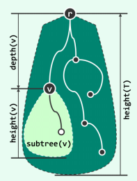

根节点 r

父节点

子节点：左孩子、右孩子

叶节点：无孩子的节点

子树 v

深度：从根节点出发途经的通路边数

高度：所有叶节点的最大深度

```python
class BinNode:
    def __init__(self, data, parent=None, lc=None, rc=None, color=RBColor.rb_red):
        self.data = data
        self.parent = parent
        self.lc = lc
        self.rc = rc
        self.height = 0
        self.npl = 1
        self.color = color
```

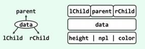

有序多叉树  等价于  二叉树

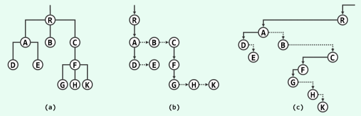

### 3. 遍历算法

#### (1) 先序遍历

```python
def trav_pre(x: BinNode, visit: callable):
    """先序遍历(迭代版)"""
    if not x:
        return
    visit(x)
    trav_pre(x.lc, visit)
    trav_pre(x.rc, visit)
```


#### (2) 后序遍历

```python
def trav_post(x: BinNode, visit: callable):
    """后序遍历"""
    if not x:
        return
    trav_pre(x.lc, visit)
    trav_pre(x.rc, visit)
    visit(x)
```


#### (3) 中序遍历

```python
def trav_in(x: BinNode, visit: callable):
    """中序遍历(迭代版)"""
    if not x:
        return
    trav_pre(x.lc, visit)
    visit(x)
    trav_pre(x.rc, visit)
```

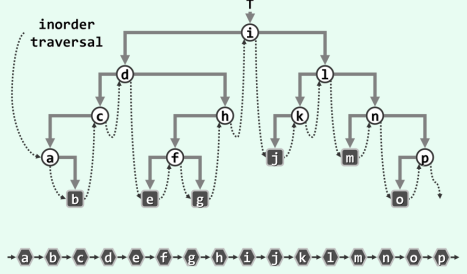

中序遍历的遍历序列与有序树定义的全局左右次序一致。

#### (d) 层次遍历

```python
def trav_level(x: BinNode, visit: callable):
    """层次遍历"""
    queue = deque()
    queue.appendleft(x)
    while queue:
        node = queue.pop()
        visit(node)
        if node.lc:
            queue.appendleft(node.lc)
        if node.rc:
            queue.appendleft(node.rc)
```

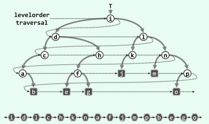

## (二) 搜索树

对于向量结构，二分查找时间复杂度O(logn)，插入和删除最坏情况下时间复杂度O(n)。

对于链表结构，查找时间复杂度O(n)。

目标：

高效率的动态修改和高效率的静态查找

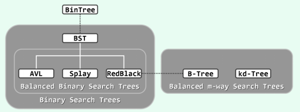

### 1.  二叉搜索树

#### 二叉搜索树的性质：

- 任一节点r的左（右）子树中，所有节点（若存在）均不大于（不小于）r
- 任何一棵二叉树是二叉搜索树，当且仅当其中序遍历序列单调非降

#### 二叉搜索树算法

查找：

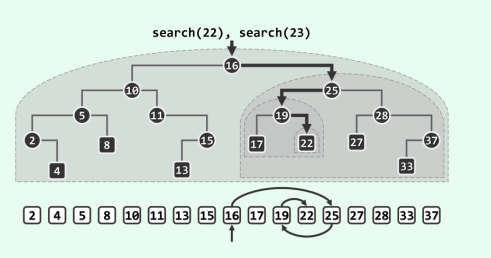

插入：

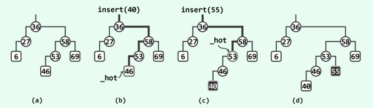

- 通过查找确定插入的位置
- 创建新节点
- 更新全树的规模，更新历代祖先的高度

删除：

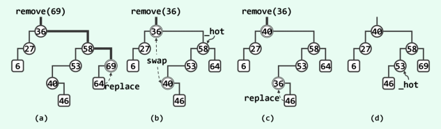

- 通过查找确定删除节点的位置
- 待删除节点没有子节点时：
  - 直接在当前位置删除
- 待删除节点只有一个孩子时：
  - 用孩子节点代替当前节点
- 待删除节点有两个孩子时：
  - 先找到它的直接后继，交换位置
  - 删除交换位置后的目标节点。由于直接后继必定没有左孩子，因此交换后至多只有一个孩子，可以用前面两种情况处理。

- 删除后，更新全树规模，更新祖先节点的高度。

### 2. 平衡二叉搜索树

二叉树的搜索、插入、删除的时间复杂度均取决于树的高度，最坏情况下，时间复杂度为O(n)。

因此在节点数目固定的前提下，应尽可能降低高度。即，尽可能使各子树高度彼此接近，全树尽可能平衡。

#### 平衡性

- 理想平衡：若树高恰好为 int(log2 n)，称为理想平衡树
- 适度平衡：在渐进意义下适当放松标准之后的平衡性

#### 等价变换

中序遍历序列相同的两棵二叉搜索树彼此等价。——"上下可变，左右不乱"

*左旋变换*

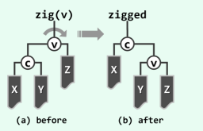

```python
c.parent = v.parent
if v.parent.is_lc(v):
    v.parent.lc = c
else:
    v.parent.rc = c

c.rc.parent = v
v.lc = c.rc

v.parent = c
c.rc = v
# TODO: 更新v,c的高度
```

*右旋变换*

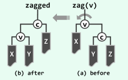

```python
c.parent = v.parent
if v.parent.is_lc(v):
	v.parent.lc = c
else:
    v.parent.rc = c

c.rc.parent = v
v.lc = c.rc

v.parent = c
c.rc = v
# TODO: 更新v,c的高度
```

> 变换后，树的中序遍历序列不变，深度变化幅度不超过一层。

#### AVL树

特点：在渐进意义下，其高度始终控制在O(log n)以内。从而保证每次查找、插入或删除操作的时间复杂度均不超过O(log n)。

平衡因子：左、右子树的高度差

>  AVL树各节点平衡因子绝对值不超过1

##### a) 失衡与重平衡

在经历插入、删除等动态修改操作后，节点的高度可能发生变化，不再满足AVL树的平衡条件，此时需要通过调整算法恢复树的平衡。

###### 单旋

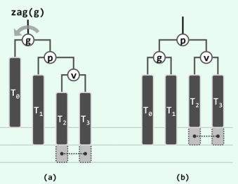

在v的某子树中插入节点使得g不再平衡。通过g节点的左旋操作，可以使树恢复平衡。

###### 双旋

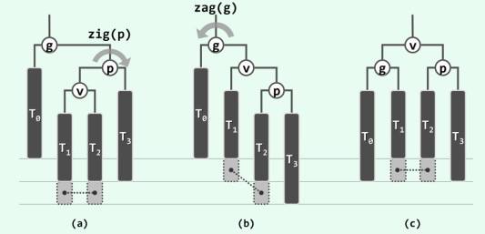

在子树v中插入的新节点使g不在平衡。先进行p节点的右旋操作，然后进行g节点的左旋操作，可以使树恢复平衡。

###### 高度复原

上述两种调整后，局部子树的高度也将复原，因此g以上所有祖先的平衡因子都将复原。

> 在AVL树中插入新节点后，最多仅需两次旋转就可以使整树恢复平衡

###### 统一平衡算法

可以观察得出，上述两种旋转方式，仅涉及局部的三个节点和四棵子树，它们的中序遍历序列为：

`{ T0, a, T1, b, T2, c, T3 }`

重新平衡后的局部结构是的相同，如下：

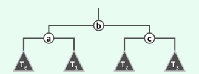

因此可以采用一种统一的"3+4"重构算法

```python
def connect34(a, b, c, T0, T1, T2, T3):
    a.lc = T0
    if T0:
        T0.parent = a
    a.rc = T1
    if T1:
        T1.parent = a
    update_height(a)
    
    c.lc = T2
    if T2:
        T2.parent = c
    c.rc = T3
    if T3:
        T3.parent = c
    update_height(c)
    
    b.lc = a
    a.parent = b
    b.rc = c
    c.parent = b
    update_height(b)
```

利用"3+4"重构算法，AVL树的重平衡算法可以实现如下：

```python
def rotate_at(v)
	p = v.parent
    g = p.parent
    # 按v, p, g的相对位置分四种情况
    relation = (v is p.lc, p is g.lc)
    if relation == (True, True):
        p.parent = g.parent
        connect34(v, p, g, v.lc, v. rc, p.rc, g.rc)
    elif relation == (False, True):
        v.parent = g.parent
        connect34(p, v, g, p.lc, v.lc, v.rc. g.rc)
    elif relation == (True, False):
        p.parent = g.parent
        connect34(g. p, v, g.lc, p.lc, v.lc, v.rc)
    else:
    	v.parent = g.parent
        connect34(g, v, p, g.lc, v.lc, v.rc, p.rc)
```

## （三） 高级搜索树

#### 1. 伸展树

##### a. 局部性原理

> 1）刚刚被访问过的元素， 极有可能在不久之后再次被访问到
> 2） 将被访问的下一元素， 极有可能就处于不久之前被访问过的某个元素的附近 

对二叉搜索树而言，局部性体现在：

> 1）刚刚被访问过的节点， 极有可能在不久之后再次被访问到
> 2）将被访问的下一节点， 极有可能就处于不久之前被访问过的某个节点的附近

##### b. 双层伸展

zig-zig

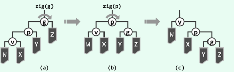

zig-zag

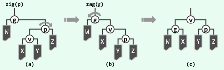

伸展后效果：

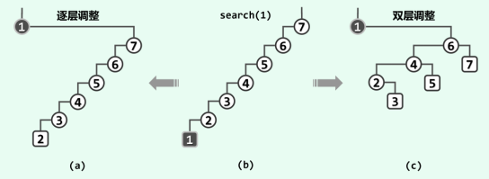

双层伸展策略可以“智能”地“折叠”被访问的子树分支，从而有效地避免对长分支的连续访问。

